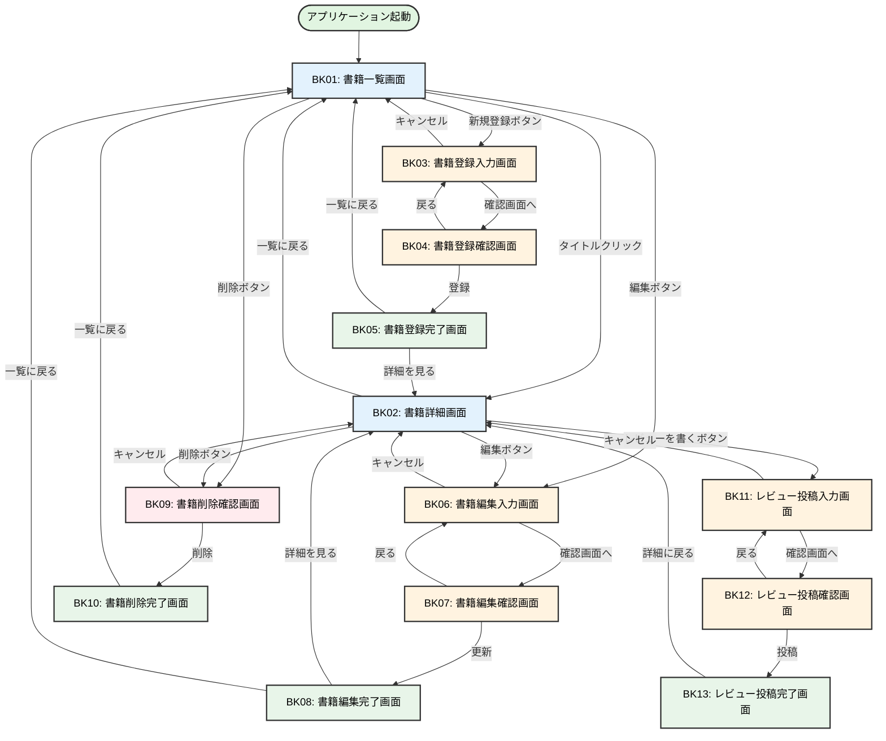

# 02. 画面遷移図
## training-bookshelf

---

## 1. 画面一覧

| 画面ID | 画面名 | 説明 |
|--------|--------|------|
| [BK01](05個別画面設計/05個別画面設計_BK01_書籍一覧画面.md) | 書籍一覧画面 | 登録された書籍の一覧を表示。検索・ソート機能を持つ |
| [BK02](05個別画面設計/05個別画面設計_BK02_書籍詳細画面.md) | 書籍詳細画面 | 書籍の詳細情報とレビュー一覧を表示 |
| [BK03](05個別画面設計/05個別画面設計_BK03_書籍登録入力画面.md) | 書籍登録入力画面 | 新規書籍情報の入力 |
| [BK04](05個別画面設計/05個別画面設計_BK04_書籍登録確認画面.md) | 書籍登録確認画面 | 入力内容の確認 |
| [BK05](05個別画面設計/05個別画面設計_BK05_書籍登録完了画面.md) | 書籍登録完了画面 | 登録完了メッセージの表示 |
| [BK06](05個別画面設計/05個別画面設計_BK06_書籍編集入力画面.md) | 書籍編集入力画面 | 既存書籍情報の編集 |
| [BK07](05個別画面設計/05個別画面設計_BK07_書籍編集確認画面.md) | 書籍編集確認画面 | 編集内容の確認 |
| [BK08](05個別画面設計/05個別画面設計_BK08_書籍編集完了画面.md) | 書籍編集完了画面 | 編集完了メッセージの表示 |
| [BK09](05個別画面設計/05個別画面設計_BK09_書籍削除確認画面.md) | 書籍削除確認画面 | 削除確認 |
| [BK10](05個別画面設計/05個別画面設計_BK10_書籍削除完了画面.md) | 書籍削除完了画面 | 削除完了メッセージの表示 |
| [BK11](05個別画面設計/05個別画面設計_BK11_レビュー投稿入力画面.md) | レビュー投稿入力画面 | レビュー情報（レビュアー名・評価・コメント）の入力 |
| [BK12](05個別画面設計/05個別画面設計_BK12_レビュー投稿確認画面.md) | レビュー投稿確認画面 | 入力内容の確認 |
| [BK13](05個別画面設計/05個別画面設計_BK13_レビュー投稿完了画面.md) | レビュー投稿完了画面 | 投稿完了メッセージの表示 |

---

## 2. 画面遷移図（Mermaid）



---

## 3. 主要な画面フロー

### 3.1 書籍登録フロー
```
BK01 (一覧) 
  → BK03 (入力) 
  → BK04 (確認) 
  → BK05 (完了) 
  → BK01 (一覧) or BK02 (詳細)
```

**特徴:**
- 入力→確認→完了の3画面構成
- 確認画面から入力画面に戻ることが可能（入力内容を保持）
- 完了画面から一覧または詳細画面へ遷移

---

### 3.2 書籍編集フロー
```
BK01 (一覧) or BK02 (詳細) 
  → BK06 (編集入力) 
  → BK07 (編集確認) 
  → BK08 (編集完了) 
  → BK01 (一覧) or BK02 (詳細)
```

**特徴:**
- 一覧画面または詳細画面から編集可能
- 登録フローと同様の3画面構成
- キャンセル時は詳細画面に戻る

---

### 3.3 書籍削除フロー
```
BK01 (一覧) or BK02 (詳細) 
  → BK09 (削除確認) 
  → BK10 (削除完了) 
  → BK01 (一覧)
```

**特徴:**
- 確認画面で削除をキャンセル可能
- 削除完了後は一覧画面へ遷移
- 削除対象の書籍情報を確認画面で表示

---

### 3.4 書籍閲覧フロー
```
BK01 (一覧) 
  → BK02 (詳細) 
  → BK01 (一覧)
```

**特徴:**
- 一覧画面のタイトルリンクから詳細画面へ遷移
- 詳細画面では書籍情報とレビュー一覧を表示
- 「一覧に戻る」ボタンで一覧画面へ戻る

---

### 3.5 レビュー投稿フロー
```
BK02 (詳細) 
  → BK11 (投稿入力) 
  → BK12 (投稿確認) 
  → BK13 (投稿完了) 
  → BK02 (詳細)
```

**特徴:**
- 詳細画面の「レビューを書く」ボタンからレビュー投稿画面へ遷移
- 書籍登録・編集フローと同様の3画面構成（入力→確認→完了）
- 入力項目: レビュアー名（必須）、評価（1〜5、必須）、コメント（任意）
- キャンセル時は詳細画面（BK02）に戻る
- 投稿完了後は詳細画面（BK02）へ遷移し、投稿したレビューを確認できる

---

## 4. セッション管理

### 4.1 入力データの保持
以下の画面遷移時、セッションに入力データを保持:

| 遷移元 | 遷移先 | 保持データ | 用途 |
|--------|--------|-----------|------|
| BK03 | BK04 | 登録入力内容 | 確認画面での表示 |
| BK04 | BK03 | 登録入力内容 | 戻る際の入力値復元 |
| BK06 | BK07 | 編集入力内容 | 確認画面での表示 |
| BK07 | BK06 | 編集入力内容 | 戻る際の入力値復元 |
| BK11 | BK12 | レビュー入力内容 | 確認画面での表示 |
| BK12 | BK11 | レビュー入力内容 | 戻る際の入力値復元 |

### 4.2 セッションクリア
以下のタイミングでセッションをクリア:

- 登録完了時（BK05表示後）
- 編集完了時（BK08表示後）
- レビュー投稿完了時（BK13表示後）
- キャンセルボタン押下時

---

## 5. パラメータ受け渡し

### 5.1 URLパラメータ

| パラメータ名 | 型 | 説明 | 使用画面 |
|-------------|-----|------|---------|
| bookId | Long | 書籍ID | BK02, BK06, BK09, BK11 |
| page | int | ページ番号（0始まり） | BK01 |
| sort | String | ソート項目 | BK01 |
| order | String | ソート順（asc/desc） | BK01 |

**例（Spring Boot）:**
```
書籍詳細画面: /book/detail/{bookId}
書籍一覧画面: /book/list?page=1&sort=title&order=asc
```

---

## 6. エラー時の画面遷移

### 6.1 バリデーションエラー
- 入力画面に留まる（BK03, BK06）
- エラーメッセージを表示
- 入力値を保持

### 6.2 データベースエラー
- システムエラー画面を表示
- エラー内容をログに記録

### 6.3 データ不存在エラー
- エラーメッセージを表示
- 3秒後に一覧画面（BK01）へ自動遷移

---

## 改訂履歴

| 版数 | 日付 | 改訂内容 | 作成者 |
|------|------|----------|--------|
| 1.0 | 2024-12-15 | 初版作成 | - |
| 1.1 | 2026-03-27 | レビュー投稿フロー追加（BK11〜BK13） | - |
