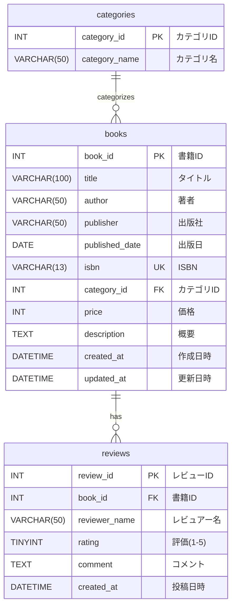
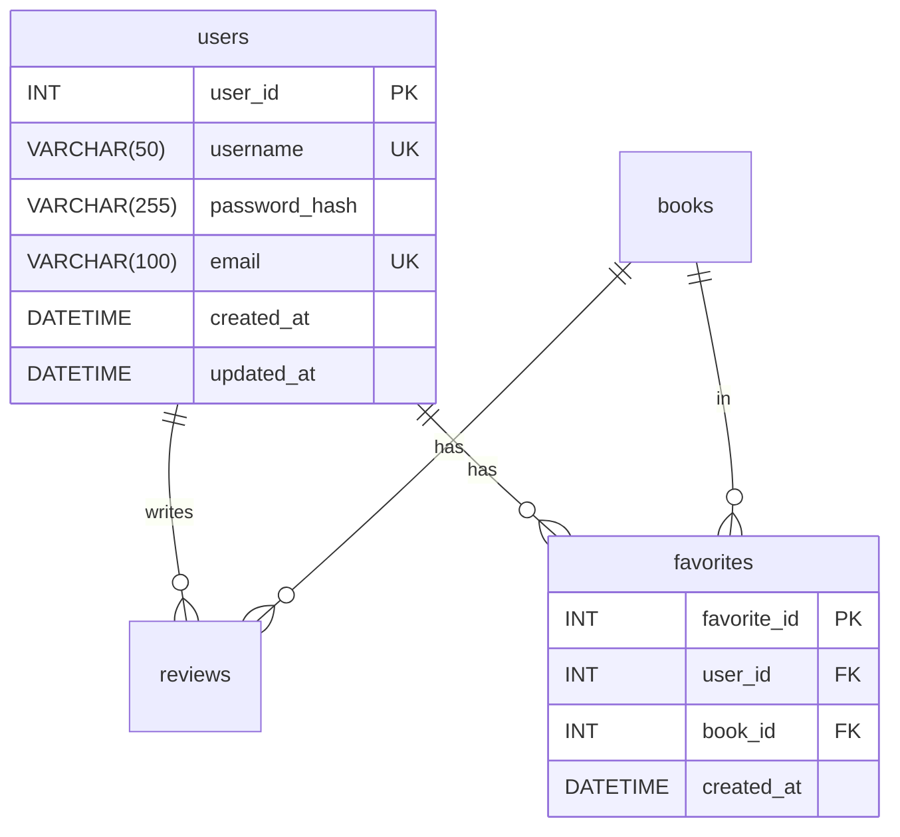
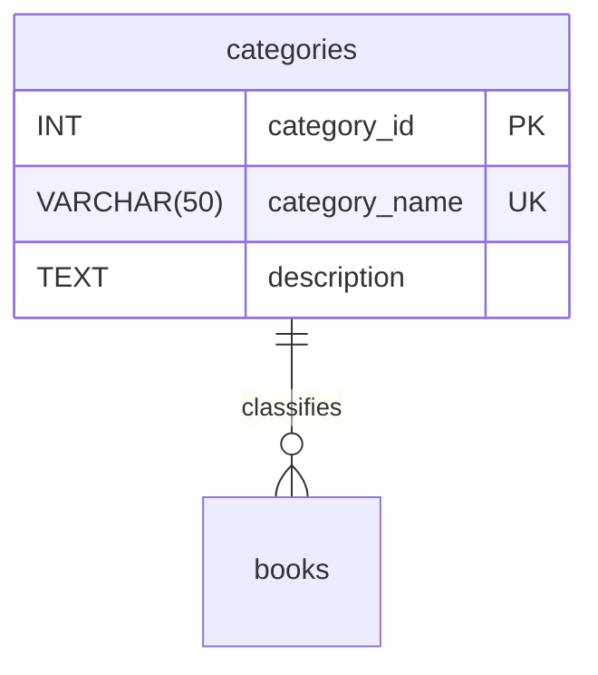

# 03. ER図
## training-bookshelf

---

## ER図（Entity Relationship Diagram）



---

## エンティティ説明

### categories（カテゴリマスタ）
書籍カテゴリの選択肢を管理するマスタテーブル

**主キー:** category_id  
**説明:** 書籍に紐づけるカテゴリの一覧を格納。プルダウン選択肢はこのテーブルから取得する

---

### books（書籍）
書籍の基本情報を管理するテーブル

**主キー:** book_id  
**ユニークキー:** isbn  
**外部キー:** category_id → categories.category_id  
**説明:** システムで管理する書籍の情報を格納

---

### reviews（レビュー）
書籍に対するレビュー情報を管理するテーブル

**主キー:** review_id  
**外部キー:** book_id → books.book_id  
**説明:** 各書籍に対するユーザーのレビューを格納

---

## リレーションシップ

### categories ←→ books（1対多）

**種類:** 1対多（One to Many）

**関係性:**
- 1つのカテゴリは複数の書籍に紐づく
- 1つの書籍は必ず1つのカテゴリに属する

**外部キー制約:**
```sql
FOREIGN KEY (category_id) REFERENCES categories(category_id)
```

---

### books ←→ reviews（1対多）

**種類:** 1対多（One to Many）

**関係性:**
- 1つの書籍は複数のレビューを持つことができる
- 1つのレビューは1つの書籍に紐づく

**外部キー制約:**
```sql
FOREIGN KEY (book_id) REFERENCES books(book_id) ON DELETE CASCADE
```

**カスケード削除:**
- 書籍が削除されると、紐づくレビューも全て削除される
- データの整合性を保つため

---

## カーディナリティ詳細

### categories → books

| 項目 | 内容 |
|------|------|
| 最小カーディナリティ | 0（そのカテゴリに属する書籍がない場合もあり得る） |
| 最大カーディナリティ | N（制限なし） |
| 参加 | 任意（Optional） |

### books → categories

| 項目 | 内容 |
|------|------|
| 最小カーディナリティ | 1（書籍は必ず1つのカテゴリに属する） |
| 最大カーディナリティ | 1 |
| 参加 | 必須（Mandatory） |

---

### books → reviews

| 項目 | 内容 |
|------|------|
| 最小カーディナリティ | 0（レビューがない書籍も存在可能） |
| 最大カーディナリティ | N（制限なし） |
| 参加 | 任意（Optional） |

### reviews → books

| 項目 | 内容 |
|------|------|
| 最小カーディナリティ | 1（レビューは必ず書籍に紐づく） |
| 最大カーディナリティ | 1 |
| 参加 | 必須（Mandatory） |

---

## インデックス設計

### categories テーブル

| インデックス名 | 種類 | カラム | 目的 |
|--------------|------|--------|------|
| PRIMARY | 主キー | category_id | 一意性保証 |

### books テーブル

| インデックス名 | 種類 | カラム | 目的 |
|--------------|------|--------|------|
| PRIMARY | 主キー | book_id | 一意性保証 |
| idx_isbn | ユニーク | isbn | ISBN検索、重複防止 |
| idx_title | 通常 | title | タイトル検索の高速化 |
| idx_author | 通常 | author | 著者検索の高速化 |
| idx_category_id | 通常 | category_id | カテゴリフィルタの高速化 |
| idx_published_date | 通常 | published_date | 出版日ソートの高速化 |

### reviews テーブル

| インデックス名 | 種類 | カラム | 目的 |
|--------------|------|--------|------|
| PRIMARY | 主キー | review_id | 一意性保証 |
| idx_book_id | 通常 | book_id | 書籍別レビュー取得の高速化 |
| idx_created_at | 通常 | created_at | 投稿日時ソートの高速化 |

---

## データ整合性

### 参照整合性
- reviews.book_id は必ず books.book_id に存在する値を参照
- 外部キー制約により保証

### カスケード削除
- 書籍削除時、関連するレビューを自動削除
- ON DELETE CASCADE により実現

### NULL制約
- 必須項目には NOT NULL 制約を設定
- データの完全性を保証

---

## 将来の拡張案

### Phase 2: ユーザー管理の追加



**追加されるリレーション:**
- users ← reviews（1対多）: ユーザーはレビューを投稿
- users ← favorites（1対多）: ユーザーはお気に入りを持つ
- books ← favorites（1対多）: 書籍はお気に入り登録される

---

### Phase 3: 在庫管理の追加

```mermaid
erDiagram
    books ||--|| inventories : has
    books ||--o{ lending_records : has
    users ||--o{ lending_records : borrows
    
    inventories {
        INT inventory_id PK
        INT book_id FK UK
        INT quantity
        INT available_quantity
        DATETIME updated_at
    }
    
    lending_records {
        INT lending_id PK
        INT book_id FK
        INT user_id FK
        DATE borrowed_date
        DATE due_date
        DATE returned_date
        VARCHAR(20) status
        DATETIME created_at
    }
```

**追加されるリレーション:**
- books ← inventories（1対1）: 書籍は在庫情報を持つ
- books ← lending_records（1対多）: 書籍は貸出記録を持つ
- users ← lending_records（1対多）: ユーザーは貸出記録を持つ

---

## 正規化について

### 現在の設計（第3正規形）

**books テーブル:**
- 全ての非キー属性が主キーに完全関数従属
- 推移的関数従属なし

**reviews テーブル:**
- 全ての非キー属性が主キーに完全関数従属
- 推移的関数従属なし

### カテゴリの正規化（将来検討）

現在はカテゴリを VARCHAR で保持していますが、将来的には以下のように正規化も検討:



**メリット:**
- カテゴリ名の一貫性が保たれる
- カテゴリの追加・変更が容易
- カテゴリ別の統計情報が取りやすい

**デメリット:**
- JOIN が増えてパフォーマンスが低下する可能性
- 初学者には複雑

現時点では学習の容易さを優先し、VARCHAR での管理としています。

---

## 改訂履歴

| 版数 | 日付 | 改訂内容 | 作成者 |
|------|------|----------|--------|
| 1.0 | 2024-12-15 | 初版作成（books・reviewsエンティティ定義） | - |
| 1.1 | 2026-03-27 | レビュー投稿画面（BK11〜BK13）追加に伴う記載整備 | - |
