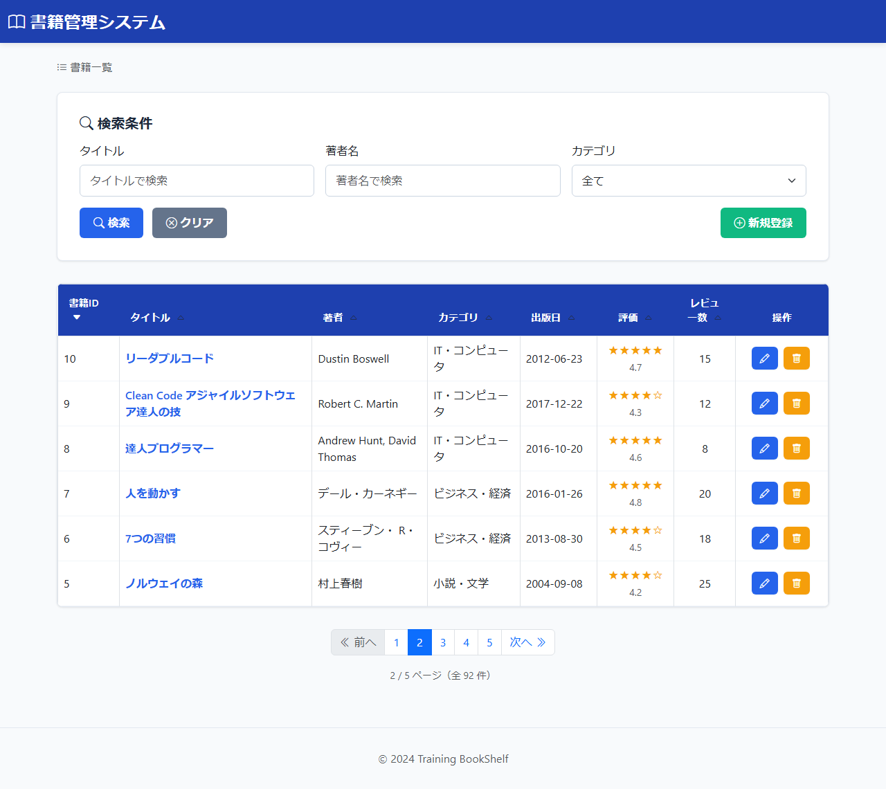

# BK01: 書籍一覧画面
## training-bookshelf

---

## 1. 画面概要

### 画面ID
BK01

### 画面名
書籍一覧画面

### 概要
登録された書籍の一覧を表示する画面。検索・ソート機能を持ち、書籍の新規登録、編集、削除のエントリーポイントとなる。

### URL
`/book/list`

---

## 2. 画面項目定義

### 画面イメージ


### 2.1 検索条件エリア

| 項目名 | 項目ID | 型 | 必須 | 最大長 | 初期値 | 備考 |
|--------|--------|-----|------|--------|--------|------|
| タイトル | searchTitle | text | - | 100 | - | 部分一致検索 |
| 著者名 | searchAuthor | text | - | 50 | - | 部分一致検索 |
| カテゴリ | searchCategory | select | - | - | 全て | プルダウン選択 |
| 検索ボタン | btnSearch | button | - | - | - | - |
| クリアボタン | btnClear | button | - | - | - | 検索条件をクリア |

**カテゴリ選択肢:**
- 全て（値: ""）
- 小説・文学（値: 1）
- ビジネス・経済（値: 2）
- IT・コンピュータ（値: 3）
- 科学・技術（値: 4）
- 歴史（値: 5）
- アート・デザイン（値: 6）
- 料理・グルメ（値: 7）
- 趣味・実用（値: 8）
- その他（値: 9）

**選択肢の取得元:** categoriesテーブルから全件取得（category_idの昇順）

---

### 2.2 一覧表示エリア

| 項目名 | 項目ID | 型 | ソート | 備考 |
|--------|--------|-----|--------|------|
| 書籍ID | bookId | number | ○ | - |
| タイトル | title | text | ○ | クリックで詳細画面へ遷移 |
| 著者 | author | text | ○ | - |
| カテゴリ | category | text | ○ | - |
| 出版日 | publishedDate | date | ○ | YYYY-MM-DD形式 |
| 平均評価 | avgRating | number | ○ | 星5段階、小数点1桁 |
| レビュー数 | reviewCount | number | ○ | - |
| 操作 | actions | - | - | 編集・削除ボタン |

**ソート機能:**
- 各列のヘッダーをクリックで昇順/降順を切り替え
- 現在のソート列とソート順を視覚的に表示（▲/▼アイコン）
- デフォルトソート: bookId 降順

---

### 2.3 その他

| 項目名 | 項目ID | 型 | 備考 |
|--------|--------|-----|------|
| 新規登録ボタン | btnCreate | button | 登録画面へ遷移 |
| ページネーション | pagination | - | 1ページ20件表示 |

**ページネーション仕様:**
- 表示形式: « 前へ | 1 2 3 4 5 | 次へ »
- 現在ページをハイライト表示
- 全ページ数と現在ページ位置を表示

---

## 3. 処理機能定義

### 3.1 初期表示処理

#### INPUT

| 項目名 | 取得元 | 備考 |
|--------|--------|------|
| (なし) | - | パラメータなし |

#### 処理内容

1. 書籍テーブルから全書籍データを取得し、レビューテーブルと外部結合して平均評価・レビュー数を集計する
2. categoriesテーブルからカテゴリ選択肢を全件取得し、プルダウンに設定する
3. デフォルトソート条件: 書籍ID 降順で並び替え
4. ページング処理を行い、1ページあたり20件を表示
5. 取得した書籍一覧データをビューに渡して表示

```sql
-- カテゴリ選択肢取得
SELECT category_id, category_name
FROM カテゴリテーブル
ORDER BY category_id

SELECT
    書籍テーブル.書籍ID,
    書籍テーブル.タイトル,
    書籍テーブル.著者,
    カテゴリテーブル.カテゴリ名,
    書籍テーブル.出版日,
    COALESCE(AVG(レビューテーブル.評価), 0) AS 平均評価,
    COUNT(レビューテーブル.レビューID) AS レビュー数
FROM 書籍テーブル
INNER JOIN カテゴリテーブル ON 書籍テーブル.カテゴリID = カテゴリテーブル.カテゴリID
LEFT JOIN レビューテーブル ON 書籍テーブル.書籍ID = レビューテーブル.書籍ID
GROUP BY
    書籍テーブル.書籍ID,
    書籍テーブル.タイトル,
    書籍テーブル.著者,
    カテゴリテーブル.カテゴリ名,
    書籍テーブル.出版日
ORDER BY 書籍テーブル.書籍ID DESC
LIMIT 20 OFFSET :オフセット
```

#### OUTPUT

| 項目名 | セット先 | 備考 |
|--------|--------|------|
| 書籍一覧 | DTO | 書籍ID, タイトル, 著者, カテゴリ名, 出版日, 平均評価, レビュー数 |
| カテゴリ選択肢 | DTO | 全カテゴリID・名称のリスト |
| ページ情報 | DTO | 総件数、現在ページ、総ページ数 |

---

### 3.2 検索ボタン押下時

#### INPUT

| 項目名 | 取得元 | 備考 |
|--------|--------|------|
| タイトル | リクエスト | 任意。部分一致 |
| 著者名 | リクエスト | 任意。部分一致 |
| カテゴリ | リクエスト | 任意。「全て」選択時は条件なし |

#### 処理内容

1. 入力された検索条件でタイトル・著者名は部分一致、カテゴリは完全一致で書籍テーブルを検索する
2. 検索結果を一覧形式で表示（1ページ20件）
3. 入力された検索条件をセッションに保存（画面遷移後も条件を保持するため）
4. 検索条件を入力フォームに表示して現在の検索状態を明示

```sql
SELECT
    書籍テーブル.書籍ID,
    書籍テーブル.タイトル,
    書籍テーブル.著者,
    書籍テーブル.カテゴリ,
    書籍テーブル.出版日,
    COALESCE(AVG(レビューテーブル.評価), 0) AS 平均評価,
    COUNT(レビューテーブル.レビューID) AS レビュー数
FROM 書籍テーブル
LEFT JOIN レビューテーブル ON 書籍テーブル.書籍ID = レビューテーブル.書籍ID
WHERE 書籍テーブル.タイトル LIKE :タイトル        -- 入力がある場合のみ
  AND 書籍テーブル.著者 LIKE :著者名              -- 入力がある場合のみ
  AND 書籍テーブル.カテゴリ = :カテゴリ            -- 「全て」以外が選択された場合のみ
GROUP BY
    書籍テーブル.書籍ID,
    書籍テーブル.タイトル,
    書籍テーブル.著者,
    書籍テーブル.カテゴリ,
    書籍テーブル.出版日
ORDER BY 書籍テーブル.書籍ID DESC
LIMIT 20 OFFSET :オフセット
```
#### OUTPUT

| 項目名 | セット先 | 備考 |
|--------|--------|------|
| 書籍一覧 | DTO | 検索条件に合致した書籍一覧 |
| カテゴリ選択肢 | DTO | 全カテゴリID・名称のリスト |
| ページ情報 | DTO | 総件数、現在ページ、総ページ数 |
| 検索条件（タイトル） | セッション | - |
| 検索条件（著者名） | セッション | - |
| 検索条件（カテゴリID） | セッション | - |
---

### 3.3 クリアボタン押下時

#### INPUT

| 項目名 | 取得元 | 備考 |
|--------|--------|------|
| (なし) | - | - |

#### 処理内容

1. 検索条件入力欄をクリア
2. セッションに保存されている検索条件を削除
3. 一覧画面にリダイレクトして全書籍データを再表示

#### OUTPUT

セッション（検索条件）を削除し、リダイレクト: BK01（`/book/list`）

---

### 3.4 ソートリンク押下時

#### INPUT

| 項目名 | 取得元 | 備考 |
|--------|--------|------|
| ソート列 | リクエスト | 押下されたヘッダーの列名 |
| ソート順 | リクエスト | ASC / DESC |

#### 処理内容

1. 押下された列でソート（同列押下時は昇順/降順を切り替え）
2. 現在の検索条件を維持したまま、3.1または3.2と同じSQLに `ORDER BY :ソート列 :ソート順` を適用して再取得する
3. URLパラメータにソート列とソート順を含めて処理

#### OUTPUT

| 項目名 | セット先 | 備考 |
|--------|--------|------|
| 書籍一覧 | DTO | 指定ソート順の書籍一覧 |
| カテゴリ選択肢 | DTO | 全カテゴリID・名称のリスト |
| ページ情報 | DTO | 総件数、現在ページ、総ページ数 |
| 現在のソート列 | DTO | URLパラメータから取得 |
| 現在のソート順 | DTO | ASC / DESC |

---

### 3.5 タイトルリンク押下時

#### INPUT

| 項目名 | 取得元 | 備考 |
|--------|--------|------|
| 書籍ID | リクエスト | 一覧行の書籍ID |

#### 処理内容

1. 該当書籍IDを取得
2. 詳細画面(BK02)へ遷移

---

### 3.6 編集ボタン押下時

#### INPUT

| 項目名 | 取得元 | 備考 |
|--------|--------|------|
| 書籍ID | リクエスト | 一覧行の書籍ID |

#### 処理内容

1. 該当書籍IDを取得
2. 編集入力画面(BK06)へ遷移

---

### 3.7 削除ボタン押下時

#### INPUT

| 項目名 | 取得元 | 備考 |
|--------|--------|------|
| 書籍ID | リクエスト | 一覧行の書籍ID |

#### 処理内容

1. 該当書籍IDを取得
2. 削除確認画面(BK09)へ遷移

---

### 3.8 新規登録ボタン押下時

#### INPUT

| 項目名 | 取得元 | 備考 |
|--------|--------|------|
| (なし) | - | - |

#### 処理内容

1. 登録入力画面(BK03)へ遷移

---

### 3.9 ページネーション押下時

#### INPUT

| 項目名 | 取得元 | 備考 |
|--------|--------|------|
| ページ番号 | リクエスト | 遷移先ページ番号 |
| ソート列 | リクエスト | 現在のソート列 |
| ソート順 | リクエスト | 現在のソート順（ASC / DESC） |

#### 処理内容

1. 3.1または3.2と同じSQLの `OFFSET` に指定ページのオフセット値を設定して再取得する
2. 現在の検索条件・ソート条件を維持
3. URLパラメータにページ番号、ソート列、ソート順を含めて処理

---

## 4. バリデーション

### 入力値バリデーション
- 検索条件は任意入力のためバリデーション不要
- ただし、SQLインジェクション対策として、全ての入力値はバインド変数を使用

---

## 6. メッセージ

### 画面表示メッセージ

| メッセージ本文 | 表示タイミング |
|--------------|---------------|
| メッセージID: `bk01.message.nodata`<br>書籍が登録されていません | 書籍データが0件の場合 |
| メッセージID: `bk01.message.searchresult`<br>{0}件の書籍が見つかりました | 検索実行後 |

### カテゴリ選択肢

| メッセージ本文 |
|---------------|
| メッセージID: `category.all`<br>全て |
| メッセージID: `category.fiction`<br>小説・文学 |
| メッセージID: `category.business`<br>ビジネス・経済 |
| メッセージID: `category.technology`<br>IT・コンピュータ |
| メッセージID: `category.science`<br>科学・技術 |
| メッセージID: `category.history`<br>歴史 |
| メッセージID: `category.art`<br>アート・デザイン |
| メッセージID: `category.cooking`<br>料理・グルメ |
| メッセージID: `category.hobby`<br>趣味・実用 |
| メッセージID: `category.other`<br>その他 |

---

## 7. エラーハンドリング

### データベースエラー
- システムエラー画面を表示
- ログに記録

### データ取得件数0件
- `bk01.message.nodata` を表示
- エラーではなく正常な結果として扱う

---

## 8. 改訂履歴

| 版数 | 日付 | 改訂内容 | 作成者 |
|------|------|----------|--------|
| 1.0 | 2024-12-15 | 初版作成 | - |
