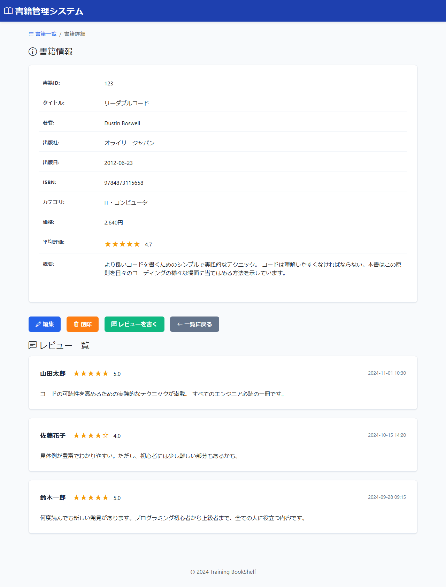

# BK02: 書籍詳細画面
## training-bookshelf

---

## 1. 画面概要

### 画面ID
BK02

### 画面名
書籍詳細画面

### 概要
書籍の詳細情報とレビュー一覧を表示する画面。書籍の編集・削除のエントリーポイントともなる。

### URL
`/book/detail/{bookId}`

---

## 2. 画面項目定義

### 画面イメージ


### 2.1 書籍情報エリア

| 項目名 | 項目ID | 型 | 備考 |
|--------|--------|-----|------|
| 書籍ID | bookId | number | 表示のみ |
| タイトル | title | text | 表示のみ |
| 著者 | author | text | 表示のみ |
| 出版社 | publisher | text | 表示のみ |
| 出版日 | publishedDate | date | 表示のみ、YYYY-MM-DD形式 |
| ISBN | isbn | text | 表示のみ |
| カテゴリ | category | text | 表示のみ |
| 価格 | price | number | 表示のみ、円表記 |
| 概要 | description | textarea | 表示のみ |
| 平均評価 | avgRating | number | 星5段階、小数点1桁 |
| 編集ボタン | btnEdit | button | 編集画面へ遷移 |
| 削除ボタン | btnDelete | button | 削除確認画面へ遷移 |
| 一覧に戻るボタン | btnBack | button | 一覧画面へ遷移 |

---

### 2.2 レビュー一覧エリア

| 項目名 | 項目ID | 型 | 備考 |
|--------|--------|-----|------|
| レビューID | reviewId | number | 非表示 |
| ユーザー名 | reviewerName | text | 表示のみ |
| 評価 | rating | number | 星5段階 |
| コメント | comment | textarea | 表示のみ |
| 投稿日時 | createdAt | datetime | YYYY-MM-DD HH:MM形式 |

**レビューの表示順:**
- 投稿日時の降順（新しいものから表示）

---

## 3. 処理機能定義

### 3.1 初期表示処理

#### INPUT

| 項目名 | 取得元 | 備考 |
|--------|--------|------|
| 書籍ID | リクエスト | URLパラメータ |

#### 処理内容

1. URLパラメータから書籍IDを取得
2. 書籍テーブルから指定された書籍IDに一致する書籍データを取得する
3. レビューテーブルから該当書籍IDに紐づくレビューデータを全件取得する（投稿日時の降順）
4. 取得したレビューデータから平均評価を計算する（小数点1位で四捨五入、レビューなしの場合は0）
5. 書籍情報・レビュー一覧・平均評価をビューに渡して表示する

```sql
-- 書籍情報取得（カテゴリ名をJOINして取得）
SELECT
    書籍テーブル.書籍ID, 書籍テーブル.タイトル, 書籍テーブル.著者,
    書籍テーブル.出版社, 書籍テーブル.出版日, 書籍テーブル.ISBN,
    カテゴリテーブル.カテゴリ名, 書籍テーブル.価格, 書籍テーブル.概要
FROM 書籍テーブル
INNER JOIN カテゴリテーブル ON 書籍テーブル.カテゴリID = カテゴリテーブル.カテゴリID
WHERE 書籍テーブル.書籍ID = :書籍ID

-- レビュー一覧取得
SELECT
    レビューID, レビュアー名, 評価, コメント, 投稿日時
FROM レビューテーブル
WHERE 書籍ID = :書籍ID
ORDER BY 投稿日時 DESC
```

#### OUTPUT

| 項目名 | セット先 | 備考 |
|--------|--------|------|
| 書籍情報 | DTO | 書籍ID, タイトル, 著者, 出版社, 出版日, ISBN, カテゴリ名, 価格, 概要 |
| 平均評価 | DTO | レビューから算出（小数点1桁） |
| レビュー一覧 | DTO | レビューID, レビュアー名, 評価, コメント, 投稿日時 |

---

### 3.2 編集ボタン押下時

#### INPUT

| 項目名 | 取得元 | 備考 |
|--------|--------|------|
| 書籍ID | リクエスト | 表示中の書籍ID |

#### 処理内容

1. 現在表示中の書籍IDを取得
2. 編集入力画面(BK06)へ遷移

#### OUTPUT

リダイレクト: BK06（`/book/edit/{bookId}`）

---

### 3.3 削除ボタン押下時

#### INPUT

| 項目名 | 取得元 | 備考 |
|--------|--------|------|
| 書籍ID | リクエスト | 表示中の書籍ID |

#### 処理内容

1. 現在表示中の書籍IDを取得
2. 削除確認画面(BK09)へ遷移

#### OUTPUT

リダイレクト: BK09（`/book/delete/confirm/{bookId}`）

---

### 3.4 一覧に戻るボタン押下時

#### INPUT

| 項目名 | 取得元 | 備考 |
|--------|--------|------|
| タイトル | session | 前回の検索条件（任意） |
| 著者名 | session | 前回の検索条件（任意） |
| カテゴリ | session | 前回の検索条件（任意） |

#### 処理内容

1. セッションから前回の検索条件を取得（タイトル、著者名、カテゴリ）
2. 検索条件をURLパラメータとして付加して一覧画面(BK01)へリダイレクト
3. 一覧画面で前回の検索結果が復元される

#### OUTPUT

リダイレクト: BK01（`/book/list`、前回の検索条件をURLパラメータとして付与）

---

## 4. バリデーション

### パラメータバリデーション
- bookId: 必須、数値、正の整数

---

## 6. エラーハンドリング

### 書籍が存在しない場合
- エラーメッセージ: 「指定された書籍が見つかりません」
- 3秒後に一覧画面へ自動遷移
- 例外ハンドラーでエラー画面を表示

### データベースエラー
- システムエラー画面を表示
- ログに記録

---

## 7. 表示形式

### 価格表示
- カンマ区切りで表示: 2,640円

### 日付表示
- YYYY-MM-DD形式で表示

### 日時表示（レビュー）
- YYYY-MM-DD HH:MM形式で表示

### 評価表示
- 星アイコンと数値で表示
- 星1つから5つまでのアイコン表示

---

## 8. 改訂履歴

| 版数 | 日付 | 改訂内容 | 作成者 |
|------|------|----------|--------|
| 1.0 | 2024-12-15 | 初版作成 | - |
