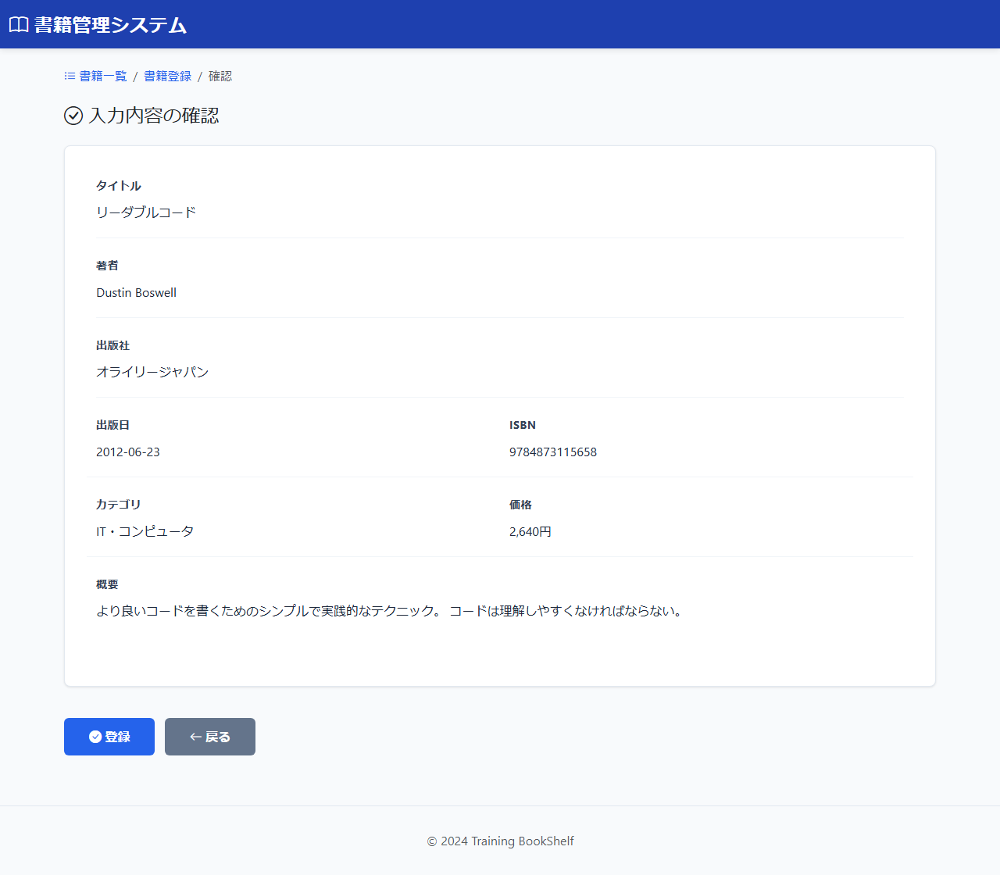

# BK04: 書籍登録確認画面
## training-bookshelf

---

## 1. 画面概要

### 画面ID
BK04

### 画面名
書籍登録確認画面

### 概要
入力された書籍情報を確認する画面。登録実行または入力画面へ戻ることができる。

### URL
`/book/create/confirm`

---

## 2. 画面項目定義

### 画面イメージ


| 項目名 | 項目ID | 型 | 備考 |
|--------|--------|-----|------|
| タイトル | title | text | 表示のみ |
| 著者 | author | text | 表示のみ |
| 出版社 | publisher | text | 表示のみ |
| 出版日 | publishedDate | date | 表示のみ |
| ISBN | isbn | text | 表示のみ |
| カテゴリ | category | text | 表示のみ |
| 価格 | price | number | 表示のみ、円表記 |
| 概要 | description | textarea | 表示のみ |
| 登録ボタン | btnRegister | button | DB登録実行 |
| 戻るボタン | btnBack | button | 入力画面へ遷移（入力内容保持） |

---

## 3. 処理機能定義

### 3.1 初期表示処理

#### INPUT

| 項目名 | 取得元 | 備考 |
|--------|--------|------|
| タイトル | session | なければBK03へリダイレクト |
| 著者 | session | なければBK03へリダイレクト |
| 出版社 | session | なければBK03へリダイレクト |
| 出版日 | session | なければBK03へリダイレクト |
| ISBN | session | なければBK03へリダイレクト |
| カテゴリID | session | なければBK03へリダイレクト |
| 価格 | session | なければBK03へリダイレクト |
| 概要 | session | なければBK03へリダイレクト |

#### 処理内容

1. セッションから入力値（カテゴリIDを含む）を取得する
2. セッションに値がない場合は入力画面(BK03)へリダイレクトする
3. カテゴリIDをもとのcategoriesテーブルからカテゴリ名を取得する
4. セッションの入力値を確認内容として画面に表示する（カテゴリはカテゴリ名で表示）

#### OUTPUT

| 項目名 | セット先 | 備考 |
|--------|--------|------|
| タイトル | DTO | セッションから取得 |
| 著者 | DTO | セッションから取得 |
| 出版社 | DTO | セッションから取得 |
| 出版日 | DTO | セッションから取得 |
| ISBN | DTO | セッションから取得 |
| カテゴリ名 | DTO | カテゴリIDをもとのcategoriesテーブルから取得 |
| 価格 | DTO | セッションから取得 |
| 概要 | DTO | セッションから取得 |

---

### 3.2 登録ボタン押下時

#### INPUT

| 項目名 | 取得元 | 備考 |
|--------|--------|------|
| タイトル | session | - |
| 著者 | session | - |
| 出版社 | session | - |
| 出版日 | session | - |
| ISBN | session | - |
| カテゴリID | session | - |
| 価格 | session | - |
| 概要 | session | - |

#### 処理内容

1. セッションから入力値を取得する
2. トランザクション開始
3. ISBN重複チェックを行う
4. 書籍テーブルにINSERTする（登録日時・更新日時に現在日時を設定）
5. 登録成功時はコミット・セッション削除後、登録完了画面(BK05)へ遷移する（書籍IDをパラメータで渡す）
6. 登録失敗時はロールバックしてエラーメッセージを表示する

```sql
-- ISBN重複チェック
SELECT COUNT(*) AS 件数
FROM 書籍テーブル
WHERE ISBN = :ISBN

-- 書籍登録
INSERT INTO 書籍テーブル (
    タイトル, 著者, 出版社, 出版日, ISBN, カテゴリID, 価格, 概要, 登録日時, 更新日時
) VALUES (
    :タイトル, :著者, :出版社, :出版日, :ISBN, :カテゴリID, :価格, :概要, :現在日時, :現在日時
)
```

#### OUTPUT（正常時）

セッション（入力値）を削除し、リダイレクト: BK05（`/book/create/complete?bookId={bookId}`）

#### OUTPUT（エラー時）

| 項目名 | セット先 | 備考 |
|--------|--------|------|
| エラーメッセージ | DTO | ISBN重複エラーまたはDB登録失敗のエラー内容 |

---

### 3.3 戻るボタン押下時

#### INPUT

| 項目名 | 取得元 | 備考 |
|--------|--------|------|
| (なし) | - | - |

#### 処理内容

1. 入力画面(BK03)へ遷移する
2. セッションの入力値は保持する

#### OUTPUT

リダイレクト: BK03（`/book/create`、セッションは保持）

---

## 4. バリデーション

### セッションチェック
- セッションに入力値が存在しない場合は入力画面へリダイレクト

---

## 5. メッセージ

### 画面表示メッセージ

| メッセージ本文 | 表示タイミング |
|--------------|---------------|
| メッセージID: `bk04.message.confirm`<br>以下の内容で登録します。よろしいですか? | 初期表示時 |

### エラーメッセージ

| メッセージ本文 | 表示タイミング |
|--------------|---------------|
| メッセージID: `common.session.timeout`<br>セッションが切れました。最初からやり直してください。 | セッション切れ時 |
| メッセージID: `db.error.insert`<br>データの登録に失敗しました | DB登録失敗時 |
| メッセージID: `validation.duplicate.isbn`<br>このISBNは既に登録されています | ISBN重複時 |

---

## 6. エラーハンドリング

### セッション切れ
- 入力画面(BK03)へリダイレクト
- エラーメッセージ: `common.session.timeout`

### データベースエラー
- 確認画面に留まる
- エラーメッセージ: `db.error.insert`
- ログに記録

### ISBN重複エラー
- 確認画面に留まる
- エラーメッセージ: `validation.duplicate.isbn`

---

## 7. 表示形式

### 価格表示
- カンマ区切り + 円表記: 2,640円

### 日付表示
- YYYY-MM-DD形式

### カテゴリ表示
- categoriesテーブルから取得した category_name で表示（セッションの category_id と照合）

---

## 8. 改訂履歴

| 版数 | 日付 | 改訂内容 | 作成者 |
|------|------|----------|--------|
| 1.0 | 2024-12-15 | 初版作成 | - |
