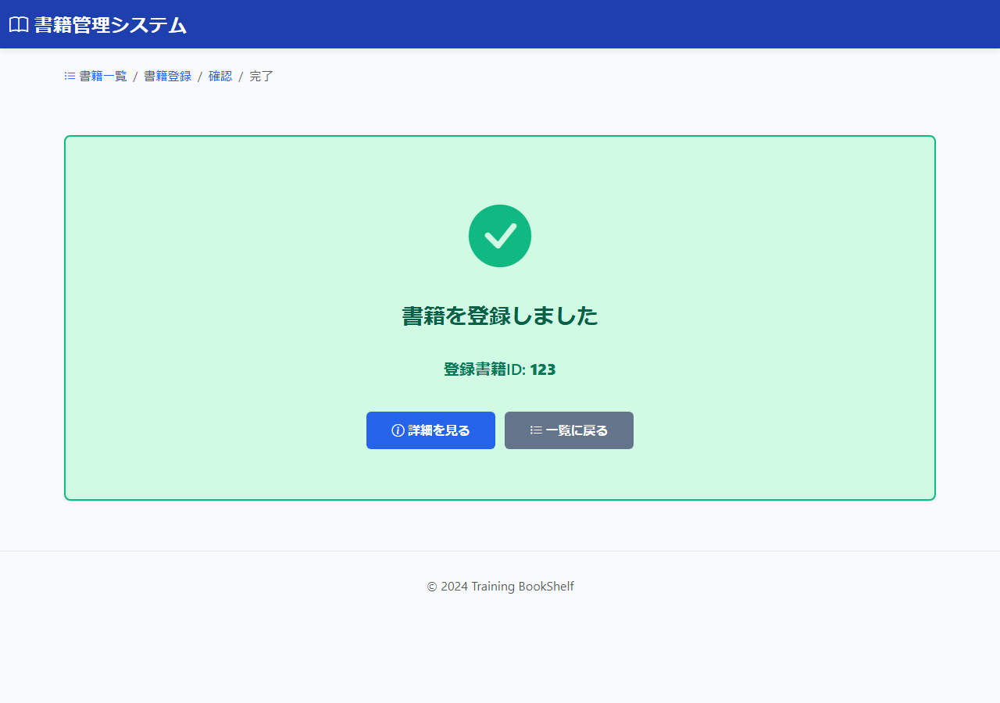

# BK05: 書籍登録完了画面
## training-bookshelf

---

## 1. 画面概要

### 画面ID
BK05

### 画面名
書籍登録完了画面

### 概要
書籍の登録が完了したことを表示する画面。登録した書籍の詳細画面または一覧画面へ遷移できる。

### URL
`/book/create/complete?bookId={bookId}`

---

## 2. 画面項目定義

### 画面イメージ

| 項目名 | 項目ID | 型 | 備考 |
|--------|--------|-----|------|
| 完了メッセージ | message | text | "書籍を登録しました" |
| 登録書籍ID | bookId | number | 表示のみ |
| 詳細を見るボタン | btnDetail | button | 詳細画面へ遷移 |
| 一覧に戻るボタン | btnList | button | 一覧画面へ遷移 |

---

## 3. 処理機能定義

### 3.1 初期表示処理

#### INPUT

| 項目名 | 取得元 | 備考 |
|--------|--------|------|
| 書籍ID | リクエスト | URLパラメータ |

#### 処理内容

1. URLパラメータから書籍IDを取得する
2. 完了メッセージと登録書籍IDを表示する

#### OUTPUT

| 項目名 | セット先 | 備考 |
|--------|--------|------|
| 書籍ID | DTO | URLパラメータから取得 |

---

### 3.2 詳細を見るボタン押下時

#### INPUT

| 項目名 | 取得元 | 備考 |
|--------|--------|------|
| 書籍ID | リクエスト | URLパラメータ |

#### 処理内容

1. 登録された書籍IDを取得する
2. 詳細画面(BK02)へ遷移する

#### OUTPUT

リダイレクト: BK02（`/book/detail/{bookId}`）

---

### 3.3 一覧に戻るボタン押下時

#### INPUT

| 項目名 | 取得元 | 備考 |
|--------|--------|------|
| (なし) | - | - |

#### 処理内容

1. 一覧画面(BK01)へ遷移する

#### OUTPUT

リダイレクト: BK01（`/book/list`）

---

## 4. バリデーション

### パラメータチェック
- bookId: 必須、数値、正の整数

---

## 5. メッセージ

### 画面表示メッセージ

| メッセージ本文 | 表示タイミング |
|--------------|---------------|
| メッセージID: `bk05.message.success` 書籍の登録が完了しました | 初期表示時 |

---

## 6. エラーハンドリング

### bookIdが不正な場合
- 一覧画面へリダイレクト
- エラーメッセージ: 「不正なリクエストです」

---

## 7. 改訂履歴

| 版数 | 日付 | 改訂内容 | 作成者 |
|------|------|----------|--------|
| 1.0 | 2024-12-15 | 初版作成 | - |
