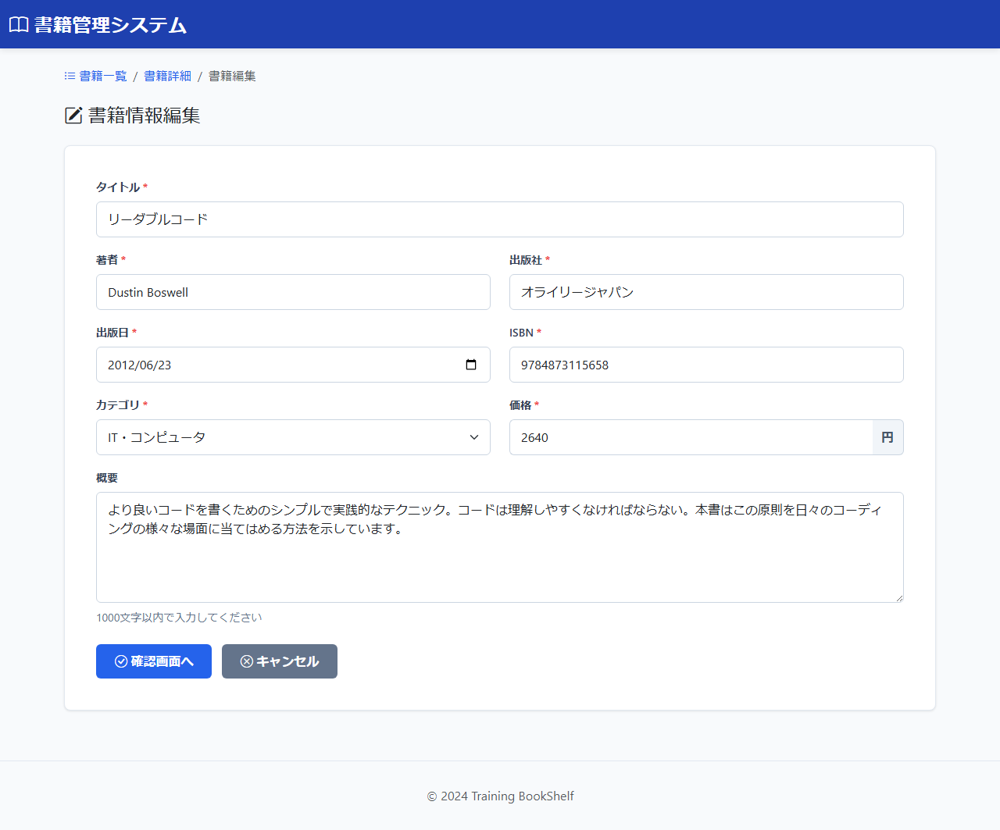

# BK06: 書籍編集入力画面
## training-bookshelf

---

## 1. 画面概要

### 画面ID
BK06

### 画面名
書籍編集入力画面

### 概要
既存の書籍情報を編集する画面。入力後、確認画面へ遷移する。

### URL
`/book/edit/{bookId}`

---

## 2. 画面項目定義

### 画面イメージ


**※項目定義は BK03（書籍登録入力画面）と同じ**

| 項目名 | 項目ID | 型 | 必須 | 最大長 | 初期値 | バリデーション |
|--------|--------|-----|------|--------|--------|----------------|
| タイトル | title | text | ○ | 100 | 既存値 | 1文字以上100文字以内 |
| 著者 | author | text | ○ | 50 | 既存値 | 1文字以上50文字以内 |
| 出版社 | publisher | text | ○ | 50 | 既存値 | 1文字以上50文字以内 |
| 出版日 | publishedDate | date | ○ | - | 既存値 | YYYY-MM-DD形式、未来日付不可 |
| ISBN | isbn | text | ○ | 13 | 既存値 | 10桁または13桁の数字 |
| カテゴリ | category | select | ○ | - | 既存値 | プルダウン選択 |
| 価格 | price | number | ○ | - | 既存値 | 0以上の整数 |
| 概要 | description | textarea | - | 1000 | 既存値 | 1000文字以内 |
| 確認画面へボタン | btnConfirm | button | - | - | - | バリデーション実行後遷移 |
| キャンセルボタン | btnCancel | button | - | - | - | 詳細画面へ遷移 |

**カテゴリ選択肢:**
- 小説・文学（値: 1）
- ビジネス・経済（値: 2）
- IT・コンピュータ（値: 3）
- 科学・技術（値: 4）
- 歴史（値: 5）
- アート・デザイン（値: 6）
- 料理・グルメ（値: 7）
- 趣味・実用（値: 8）
- その他（値: 9）

**選択肢の取得元:** categoriesテーブルから全件取得（値 = category_id、表示 = category_name）

**登録画面との違い:**
- 初期値として既存データを表示
- キャンセル時の遷移先が詳細画面(BK02)

**プレースホルダー（入力ヒント）:**
※BK03（書籍登録入力画面）と同じ
- タイトル: `書籍のタイトルを入力してください`
- 著者: `著者名を入力してください`
- 出版社: `出版社名を入力してください`
- ISBN: `10桁または13桁の数字を入力してください`
- 価格: `価格を入力してください`
- 概要: `書籍の概要を入力してください(任意)`

---

## 3. 処理機能定義

### 3.1 初期表示処理

#### INPUT

| 項目名 | 取得元 | 備考 |
|--------|--------|------|
| 書籍ID | リクエスト | URLパラメータ |
| 編集入力値（各項目） | session | 確認画面から戻った場合のみ。存在する場傈はセッション値を優先 |

#### 処理内容

1. URLパラメータから書籍IDを取得する
2. 書籍テーブルから該当書籍データを取得する
3. categoriesテーブルからカテゴリ選択肢を全件取得し、プルダウンに設定する
4. セッションに編集値がある場合はそちらを優先して入力フォームに表示する
5. 該当書籍が存在しない場合はエラーメッセージを表示する

```sql
-- カテゴリ選択肢取得
SELECT category_id, category_name
FROM カテゴリテーブル
ORDER BY category_id

SELECT
    書籍ID, タイトル, 著者, 出版社, 出版日, ISBN, カテゴリID, 価格, 概要, 更新日時
FROM 書籍テーブル
WHERE 書籍ID = :書籍ID
```

#### OUTPUT

| 項目名 | セット先 | 備考 |
|--------|--------|------|
| タイトル | DTO | セッション優先、なければDBの既存値 |
| 著者 | DTO | セッション優先、なければDBの既存値 |
| 出版社 | DTO | セッション優先、なければDBの既存値 |
| 出版日 | DTO | セッション優先、なければDBの既存値 |
| ISBN | DTO | セッション優先、なければDBの既存値 |
| カテゴリID | DTO | セッション優先、なければDBの既存値 |
| 価格 | DTO | セッション優先、なければDBの既存値 |
| 概要 | DTO | セッション優先、なければDBの既存値 |
| 更新日時 | DTO | DBの既存値（楽観的ロック用） |
| カテゴリ選択肢 | DTO | 全カテゴリID・名称のリスト |

---

### 3.2 確認画面へボタン押下時

#### INPUT

| 項目名 | 取得元 | 備考 |
|--------|--------|------|
| 書籍ID | リクエスト | - |
| タイトル | リクエスト | 必須 |
| 著者 | リクエスト | 必須 |
| 出版社 | リクエスト | 必須 |
| 出版日 | リクエスト | 必須。YYYY-MM-DD形式 |
| ISBN | リクエスト | 必須。10桁または13桁の数字 |
| カテゴリ | リクエスト | 必須 |
| 価格 | リクエスト | 必須。0以上の整数 |
| 概要 | リクエスト | 任意。1000文字以内 |

#### 処理内容

1. 入力値に対してBK03と同様のバリデーションを実行する
2. バリデーションエラーがある場合は編集画面に留まりエラーメッセージを表示する（入力値保持）
3. バリデーション正常の場傈は入力値をセッションに保存して編集確認画面(BK07)へ遷移する
#### OUTPUT（バリデーションエラー時）

| 項目名 | セット先 | 備考 |
|--------|--------|------|
| 入力値（各項目） | DTO | 入力値保持のため |
| カテゴリ選択肢 | DTO | 全カテゴリID・名称のリスト |
| エラーメッセージ | DTO | 各項目のバリデーションエラー内容 |

#### OUTPUT（正常時）

| 項目名 | セット先 | 備考 |
|--------|--------|------|
| 書籍ID | セッション | - |
| タイトル | セッション | - |
| 著者 | セッション | - |
| 出版社 | セッション | - |
| 出版日 | セッション | - |
| ISBN | セッション | - |
| カテゴリID | セッション | - |
| 価格 | セッション | - |
| 概要 | セッション | - |
| 更新日時 | セッション | 楽観的ロック用 |

リダイレクト: BK07（`/book/edit/{bookId}/confirm`）
---

### 3.3 キャンセルボタン押下時

#### INPUT

| 項目名 | 取得元 | 備考 |
|--------|--------|------|
| (なし) | - | - |

#### 処理内容

1. セッションの編集値を削除する
2. 詳細画面(BK02)へ遷移する

#### OUTPUT

セッション（編集値）を削除し、リダイレクト: BK02（`/book/detail/{bookId}`）

---

## 4. バリデーション

**※BK03（書籍登録入力画面）と同じ**

### 追加のバリデーション

#### 楽観的ロックチェック（更新時）
- updated_at の値を hidden フィールドで保持
- 更新時に DB の updated_at と比較
- 異なる場合は同時更新エラー

---

## 6. エラーハンドリング

### 書籍が存在しない場合
- エラーメッセージ: 「指定された書籍が見つかりません」
- 3秒後に一覧画面へ自動遷移

### バリデーションエラー
- 編集画面に留まる
- エラーメッセージを表示
- 入力値を保持

---

## 7. 改訂履歴

| 版数 | 日付 | 改訂内容 | 作成者 |
|------|------|----------|--------|
| 1.0 | 2024-12-15 | 初版作成 | - |
