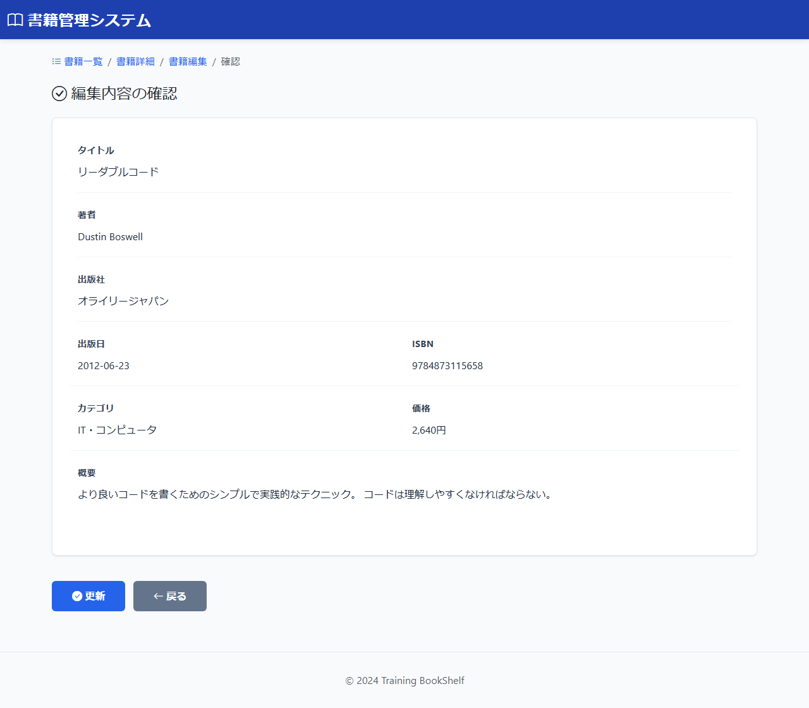

# BK07: 書籍編集確認画面
## training-bookshelf

---

## 1. 画面概要

### 画面ID
BK07

### 画面名
書籍編集確認画面

### 概要
編集された書籍情報を確認する画面。更新実行または入力画面へ戻ることができる。

### URL
`/book/edit/{bookId}/confirm`

---

## 2. 画面項目定義

### 画面イメージ


**※項目定義は BK04（書籍登録確認画面）と同じ**

| 項目名 | 項目ID | 型 | 備考 |
|--------|--------|-----|------|
| タイトル | title | text | 表示のみ |
| 著者 | author | text | 表示のみ |
| 出版社 | publisher | text | 表示のみ |
| 出版日 | publishedDate | date | 表示のみ |
| ISBN | isbn | text | 表示のみ |
| カテゴリ | category | text | 表示のみ |
| 価格 | price | number | 表示のみ、円表記 |
| 概要 | description | textarea | 表示のみ |
| 更新ボタン | btnUpdate | button | DB更新実行 |
| 戻るボタン | btnBack | button | 入力画面へ遷移（入力内容保持） |

**登録確認画面との違い:**
- ボタンが「登録」から「更新」に変更
- 処理内容がINSERTからUPDATEに変更

---

## 3. 処理機能定義

### 3.1 初期表示処理

#### INPUT

| 項目名 | 取得元 | 備考 |
|--------|--------|------|
| 書籍ID | session | なければBK06へリダイレクト |
| タイトル | session | なければBK06へリダイレクト |
| 著者 | session | なければBK06へリダイレクト |
| 出版社 | session | なければBK06へリダイレクト |
| 出版日 | session | なければBK06へリダイレクト |
| ISBN | session | なければBK06へリダイレクト |
| カテゴリID | session | なければBK06へリダイレクト |
| 価格 | session | なければBK06へリダイレクト |
| 概要 | session | なければBK06へリダイレクト |
| 更新日時 | session | なければBK06へリダイレクト、楽観的ロック用 |

#### 処理内容

1. セッションから編集値を取得する
2. セッションに値がない場合は編集画面(BK06)へリダイレクトする
3. カテゴリIDをもとのcategoriesテーブルからカテゴリ名を取得する
4. セッションの編集値を確認内容として表示する（カテゴリはカテゴリ名で表示）

#### OUTPUT

| 項目名 | セット先 | 備考 |
|--------|--------|------|
| 書籍ID | DTO | セッションから取得 |
| タイトル | DTO | セッションから取得 |
| 著者 | DTO | セッションから取得 |
| 出版社 | DTO | セッションから取得 |
| 出版日 | DTO | セッションから取得 |
| ISBN | DTO | セッションから取得 |
| カテゴリ名 | DTO | カテゴリIDをもとのcategoriesテーブルから取得 |
| 価格 | DTO | セッションから取得 |
| 概要 | DTO | セッションから取得 |

---

### 3.2 更新ボタン押下時

#### INPUT

| 項目名 | 取得元 | 備考 |
|--------|--------|------|
| 書籍ID | session | - |
| タイトル | session | - |
| 著者 | session | - |
| 出版社 | session | - |
| 出版日 | session | - |
| ISBN | session | - |
| カテゴリID | session | - |
| 価格 | session | - |
| 概要 | session | - |
| 更新日時 | session | 楽観的ロック用 |

#### 処理内容

1. セッションから編集値を取得する
2. トランザクション開始
3. ISBN重複チェックを行う（自分自身のISBNは除外）
4. 書籍テーブルにUPDATEする（楽観的ロック適用）
5. 更新成功時はコミット・セッション削除後、編集完了画面(BK08)へ遷移する
6. 更新失敗時はロールバックしエラーメッセージを表示する

```sql
-- ISBN重複チェック（自分自身のISBNは除外）
SELECT COUNT(*) AS 件数
FROM 書籍テーブル
WHERE ISBN = :ISBN
  AND 書籍ID <> :書籍ID

-- 書籍更新
UPDATE 書籍テーブル
SET
    タイトル = :タイトル,
    著者 = :著者,
    出版社 = :出版社,
    出版日 = :出版日,
    ISBN = :ISBN,
    カテゴリID = :カテゴリID,
    価格 = :価格,
    概要 = :概要,
    更新日時 = :現在日時
WHERE 書籍ID = :書籍ID
  AND 更新日時 = :更新日時  -- 楽観的ロック
```

#### OUTPUT（正常時）

セッション（編集値）を削除し、リダイレクト: BK08（`/book/edit/complete?bookId={bookId}`）

#### OUTPUT（エラー時）

| 項目名 | セット先 | 備考 |
|--------|--------|------|
| エラーメッセージ | DTO | ISBN重複エラー、楽観的ロックエラー、またはDB更新失敗のエラー内容 |

---

### 3.3 戻るボタン押下時

#### INPUT

| 項目名 | 取得元 | 備考 |
|--------|--------|------|
| (なし) | - | - |

#### 処理内容

1. 編集入力画面(BK06)へ遷移する
2. セッションの編集値は保持する

#### OUTPUT

リダイレクト: BK06（`/book/edit/{bookId}`、セッションは保持）

---

## 4. バリデーション

### セッションチェック
- セッションに編集値が存在しない場合は編集画面へリダイレクト
- セッションの書籍IDとURLパラメータの書籍IDが一致しない場合はエラー

---

## 5. メッセージ

### 画面表示メッセージ

| メッセージ本文 | 表示タイミング |
|--------------|---------------|
| メッセージID: `bk07.message.confirm`<br>以下の内容で更新します。よろしいですか? | 初期表示時 |

### エラーメッセージ

| メッセージ本文 | 表示タイミング |
|--------------|---------------|
| メッセージID: `common.session.timeout`<br>セッションが切れました。最初からやり直してください。 | セッション切れ時 |
| メッセージID: `error.concurrent.update`<br>他のユーザーによって更新されています。最新のデータを取得してください。 | 楽観的ロックエラー時 |
| メッセージID: `validation.duplicate.isbn`<br>このISBNは既に登録されています | ISBN重複時 |
| メッセージID: `db.error.update`<br>データの更新に失敗しました | DB更新失敗時 |

---

## 6. エラーハンドリング

### セッション切れ
- 編集画面(BK06)へリダイレクト
- エラーメッセージ: `common.session.timeout`

### 楽観的ロックエラー
- 詳細画面(BK02)へリダイレクト
- エラーメッセージ: `error.concurrent.update`

### ISBN重複エラー
- 確認画面に留まる
- エラーメッセージ: `validation.duplicate.isbn`

### データベースエラー
- 確認画面に留まる
- エラーメッセージ: `db.error.update`
- ログに記録

---

## 7. 表示形式

**※BK04（書籍登録確認画面）と同じ**

### 価格表示
- カンマ区切り + 円表記: 2,640円

### 日付表示
- YYYY-MM-DD形式

### カテゴリ表示
- categoriesテーブルから取得した category_name で表示（セッションの category_id と照合）

---

## 8. 改訂履歴

| 版数 | 日付 | 改訂内容 | 作成者 |
|------|------|----------|--------|
| 1.0 | 2024-12-15 | 初版作成 | - |
