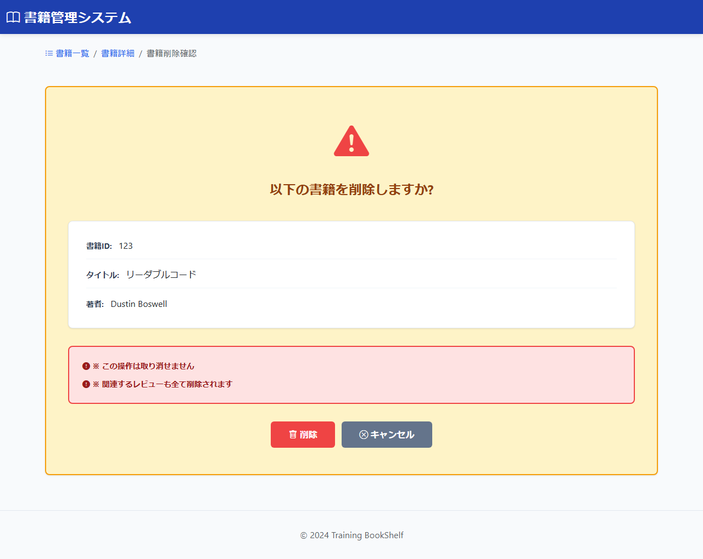

# BK09: 書籍削除確認画面
## training-bookshelf

---

## 1. 画面概要

### 画面ID
BK09

### 画面名
書籍削除確認画面

### 概要
書籍を削除する前に確認を行う画面。削除対象の書籍情報を表示し、削除を実行またはキャンセルできる。

### URL
`/book/delete/confirm/{bookId}`

---

## 2. 画面項目定義

### 画面イメージ


| 項目名 | 項目ID | 型 | 備考 |
|--------|--------|-----|------|
| 確認メッセージ | message | text | "以下の書籍を削除しますか?" |
| 書籍ID | bookId | number | 表示のみ |
| タイトル | title | text | 表示のみ |
| 著者 | author | text | 表示のみ |
| 削除ボタン | btnDelete | button | DB削除実行 |
| キャンセルボタン | btnCancel | button | 詳細画面へ遷移 |

---

## 3. 処理機能定義

### 3.1 初期表示処理

#### INPUT

| 項目名 | 取得元 | 備考 |
|--------|--------|------|
| 書籍ID | リクエスト | URLパラメータ |

#### 処理内容

1. URLパラメータから書籍IDを取得する
2. 書籍テーブルから該当書籍データを取得する
3. 書籍情報を表示する
4. 該当書籍が存在しない場合はエラーメッセージを表示する

```sql
SELECT 書籍ID, タイトル, 著者
FROM 書籍テーブル
WHERE 書籍ID = :書籍ID
```

#### OUTPUT

| 項目名 | セット先 | 備考 |
|--------|--------|------|
| 書籍ID | DTO | DBから取得 |
| タイトル | DTO | DBから取得 |
| 著者 | DTO | DBから取得 |

---

### 3.2 削除ボタン押下時

#### INPUT

| 項目名 | 取得元 | 備考 |
|--------|--------|------|
| 書籍ID | リクエスト | - |

#### 処理内容

1. トランザクション開始
2. 書籍テーブルから該当書籍を削除する（外部キー制約 ON DELETE CASCADE によりレビューテーブルも自動削除）
3. 削除成功時はコミットして削除完了画面(BK10)へ遷移する
4. 削除失敗時はロールバックしてエラーメッセージを表示する

```sql
-- 書籍削除（レビューテーブルはカスケード削除で自動創除）
DELETE FROM 書籍テーブル
WHERE 書籍ID = :書籍ID
```

#### OUTPUT（正常時）

リダイレクト: BK10（`/book/delete/complete`）

#### OUTPUT（エラー時）

| 項目名 | セット先 | 備考 |
|--------|--------|------|
| エラーメッセージ | DTO | DB削除失敗のエラー内容 |

---

### 3.3 キャンセルボタン押下時

#### INPUT

| 項目名 | 取得元 | 備考 |
|--------|--------|------|
| (なし) | - | - |

#### 処理内容

1. 詳細画面(BK02)へ遷移する

#### OUTPUT

リダイレクト: BK02（`/book/detail/{bookId}`）

---

## 4. バリデーション

### パラメータバリデーション
- bookId: 必須、数値、正の整数

---

## 5. メッセージ

### 画面表示メッセージ

| メッセージ本文 | 表示タイミング |
|--------------|---------------|
| メッセージID: `bk09.message.confirm`<br>以下の書籍を削除しますか? | 初期表示時 |
| メッセージID: `bk09.message.warning`<br>※この操作は取り消せません。関連するレビューも全て削除されます。 | 初期表示時 |

### エラーメッセージ

| メッセージ本文 | 表示タイミング |
|--------------|---------------|
| メッセージID: `error.notfound.book`<br>指定された書籍が見つかりません | 書籍が存在しない場合 |
| メッセージID: `db.error.delete`<br>データの削除に失敗しました | DB削除失敗時 |

---

## 6. エラーハンドリング

### 書籍が存在しない場合
- エラーメッセージ: `error.notfound.book`
- 一覧画面へリダイレクト

### データベースエラー
- 確認画面に留まる
- エラーメッセージ: `db.error.delete`
- ログに記録

---

## 7. 補足事項

### カスケード削除
外部キー制約 `ON DELETE CASCADE` により、書籍を削除すると以下のデータも自動的に削除されます:
- 該当書籍のレビュー（reviewsテーブル）

この仕様により、データの整合性が保たれます。

### 削除の取り消し
一度削除した書籍は復元できません。確認画面で警告メッセージを表示し、ユーザーに注意を促します。

---

## 8. 改訂履歴

| 版数 | 日付 | 改訂内容 | 作成者 |
|------|------|----------|--------|
| 1.0 | 2024-12-15 | 初版作成 | - |
