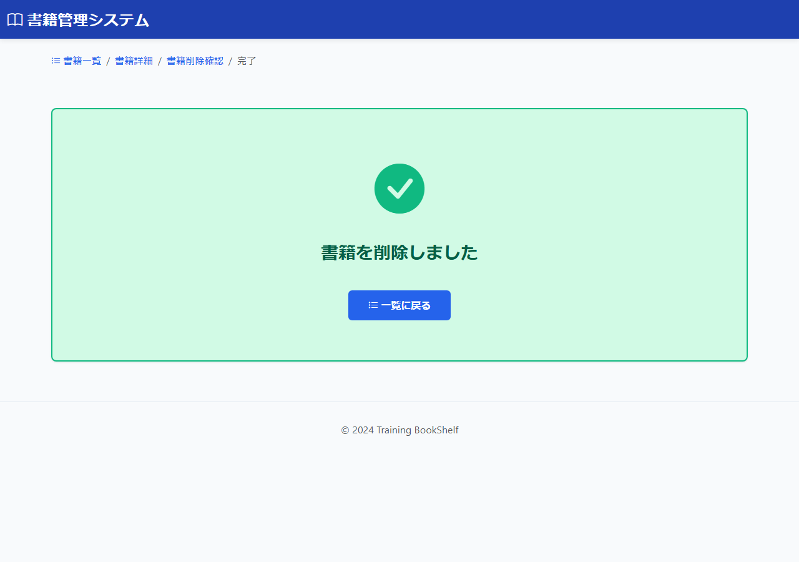

# BK10: 書籍削除完了画面
## training-bookshelf

---

## 1. 画面概要

### 画面ID
BK10

### 画面名
書籍削除完了画面

### 概要
書籍の削除が完了したことを表示する画面。一覧画面へ遷移できる。

### URL
`/book/delete/complete`

---

## 2. 画面項目定義

### 画面イメージ

| 項目名 | 項目ID | 型 | 備考 |
|--------|--------|-----|------|
| 完了メッセージ | message | text | "書籍を削除しました" |
| 一覧に戻るボタン | btnList | button | 一覧画面へ遷移 |

---

## 3. 処理機能定義

### 3.1 初期表示処理

#### INPUT

| 項目名 | 取得元 | 備考 |
|--------|--------|------|
| (なし) | - | パラメータなし |

#### 処理内容

1. 完了メッセージを表示する

#### OUTPUT

| 項目名 | セット先 | 備考 |
|--------|--------|------|
| (なし) | - | 完了メッセージはテンプレートに固定 |

---

### 3.2 一覧に戻るボタン押下時

#### INPUT

| 項目名 | 取得元 | 備考 |
|--------|--------|------|
| (なし) | - | - |

#### 処理内容

1. 一覧画面(BK01)へ遷移する

#### OUTPUT

リダイレクト: BK01（`/book/list`）

---

## 4. バリデーション

特になし（パラメータを受け取らないため）

---

## 5. メッセージ

### 画面表示メッセージ

| メッセージ本文 | 表示タイミング |
|--------------|---------------|
| メッセージID: `bk10.message.success` 書籍の削除が完了しました | 初期表示時 |

---

## 6. エラーハンドリング

特になし（表示のみの画面のため）

---

## 7. 補足事項

### 削除の完了確認
削除が正常に完了した場合のみこの画面が表示されます。削除処理中にエラーが発生した場合は、削除確認画面または一覧画面にリダイレクトされます。

### 削除されたデータ
以下のデータが削除されています:
- 書籍情報（booksテーブル）
- 関連するレビュー（reviewsテーブル - カスケード削除）

---

## 8. 改訂履歴

| 版数 | 日付 | 改訂内容 | 作成者 |
|------|------|----------|--------|
| 1.0 | 2024-12-15 | 初版作成 | - |
