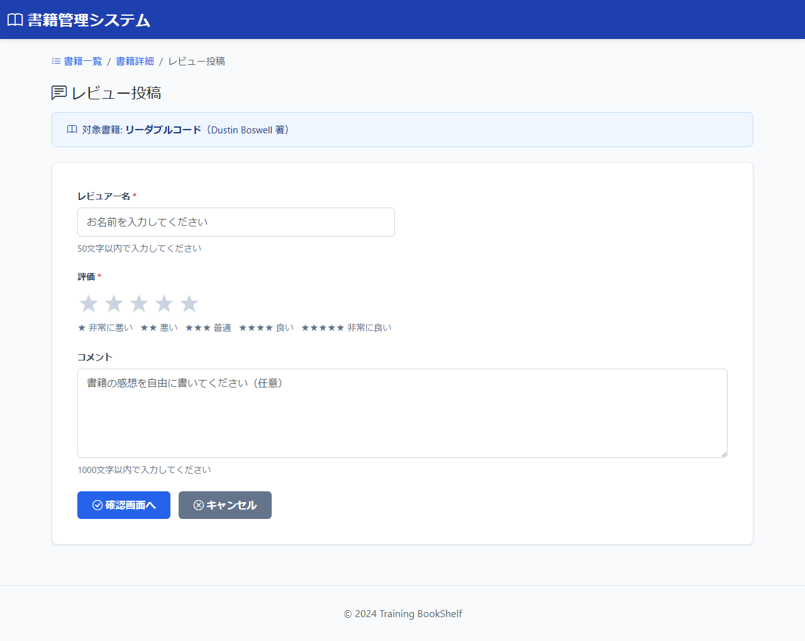

# BK11: レビュー投稿入力画面
## training-bookshelf

---

## 1. 画面概要

### 画面ID
BK11

### 画面名
レビュー投稿入力画面

### 概要
指定した書籍に対するレビュー（評価・コメント）を入力する画面。入力後は確認画面へ遷移する。

### URL
`/books/{bookId}/reviews/new`

---

## 2. 画面項目定義

### 画面イメージ


### 2.1 書籍サマリエリア

| 項目名 | 項目ID | 型 | 備考 |
|--------|--------|-----|------|
| 対象書籍タイトル | bookTitle | text | 表示のみ |
| 対象書籍著者 | bookAuthor | text | 表示のみ |

---

### 2.2 入力フォームエリア

| 項目名 | 項目ID | 型 | 必須 | 最大長 | 備考 |
|--------|--------|-----|------|--------|------|
| レビュアー名 | reviewerName | text | ○ | 50 | 50文字以内 |
| 評価 | rating | radio | ○ | - | 1〜5の整数（星評価） |
| コメント | comment | textarea | - | 1000 | 任意入力、1000文字以内 |

**評価選択肢:**
- ★（1: 非常に悪い）
- ★★（2: 悪い）
- ★★★（3: 普通）
- ★★★★（4: 良い）
- ★★★★★（5: 非常に良い）

---

### 2.3 ボタンエリア

| 項目名 | 項目ID | 型 | 備考 |
|--------|--------|-----|------|
| 確認画面へボタン | btnConfirm | button | 確認画面(BK12)へ遷移 |
| キャンセルボタン | btnCancel | button | 書籍詳細画面(BK02)へ遷移 |

---

## 3. 処理機能定義

### 3.1 初期表示処理

#### INPUT

| 項目名 | 取得元 | 備考 |
|--------|--------|------|
| 書籍ID | リクエスト | URLパラメータ |
| レビュー入力値（各項目） | session | 確認画面から戻った場合のみ復元 |

#### 処理内容

1. URLパラメータから書籍IDを取得する
2. 書籍テーブルから書籍情報を取得する
3. 書籍が存在しない場傈はエラー処理を行う
4. 書籍サマリエリアにタイトル・著者を表示する
5. セッションに入力値があれば復元してフォームに表示する（確認画面から戻った場傈）

```sql
SELECT 書籍ID, タイトル, 著者
FROM 書籍テーブル
WHERE 書籍ID = :書籍ID
```

#### OUTPUT

| 項目名 | セット先 | 備考 |
|--------|--------|------|
| 書籍タイトル | DTO | DBから取得 |
| 書籍著者 | DTO | DBから取得 |
| レビュアー名 | DTO | セッション値（確認画面から戻った場合のみ、なければ空） |
| 評価 | DTO | セッション値（確認画面から戻った場合のみ、なければ空） |
| コメント | DTO | セッション値（確認画面から戻った場合のみ、なければ空） |

---

### 3.2 確認画面へボタン押下時

#### INPUT

| 項目名 | 取得元 | 備考 |
|--------|--------|------|
| 書籍ID | リクエスト | URLパラメータ |
| レビュアー名 | リクエスト | 必須。50文字以内 |
| 評価 | リクエスト | 必須、1〜5の整数 |
| コメント | リクエスト | 任意、1000文字以内 |

#### 処理内容

1. 入力値に対してバリデーションを実行する
2. バリデーションエラーの場傈は入力画面に留まりエラーメッセージを表示する（入力値保持）
3. バリデーション正常の場傈は入力値をセッションに保存して確認画面(BK12)へ遷移する
#### OUTPUT（バリデーションエラー時）

| 項目名 | セット先 | 備考 |
|--------|--------|------|
| 書籍タイトル | DTO | DBから取得 |
| 書籍著者 | DTO | DBから取得 |
| 入力値（各項目） | DTO | 入力値保持のため（レビュアー名・評価・コメント） |
| エラーメッセージ | DTO | 各項目のバリデーションエラー内容 |

#### OUTPUT（正常時）

| 項目名 | セット先 | 備考 |
|--------|--------|------|
| 書籍ID | セッション | - |
| レビュアー名 | セッション | - |
| 評価 | セッション | - |
| コメント | セッション | - |

リダイレクト: BK12（`/books/{bookId}/reviews/confirm`）
---

### 3.3 キャンセルボタン押下時

#### INPUT

| 項目名 | 取得元 | 備考 |
|--------|--------|------|
| (なし) | - | - |

#### 処理内容

1. セッションのレビュー入力値を削除する
2. 書籍詳細画面(BK02)へ遷移する

#### OUTPUT

セッション（レビュー入力値）を削除し、リダイレクト: BK02（`/book/detail/{bookId}`）

---

## 4. バリデーション

| 項目名 | バリデーション内容 | エラーメッセージID |
|--------|------------------|--------------------|
| レビュアー名 | 必須 | `validation.required` |
| レビュアー名 | 50文字以内 | `validation.maxlength` |
| 評価 | 必須 | `validation.required` |
| 評価 | 1〜5の整数 | `validation.range` |

---

## 5. メッセージ

### エラーメッセージ

| メッセージ本文 | 表示タイミング |
|--------------|---------------|
| メッセージID: `validation.required`<br>{0}を入力してください | 必須項目未入力時 |
| メッセージID: `validation.maxlength`<br>{0}は{1}文字以内で入力してください | 最大文字数超過時 |
| メッセージID: `validation.range`<br>{0}は{1}〜{2}の範囲で入力してください | 評価値不正時 |

---

## 6. エラーハンドリング

### 書籍が存在しない場合
- 一覧画面(BK01)へリダイレクト
- エラーメッセージ: `common.system.error`

---

## 7. 改訂履歴

| 版数 | 日付 | 改訂内容 | 作成者 |
|------|------|----------|--------|
| 1.0 | 2024-12-15 | 初版作成 | - |
