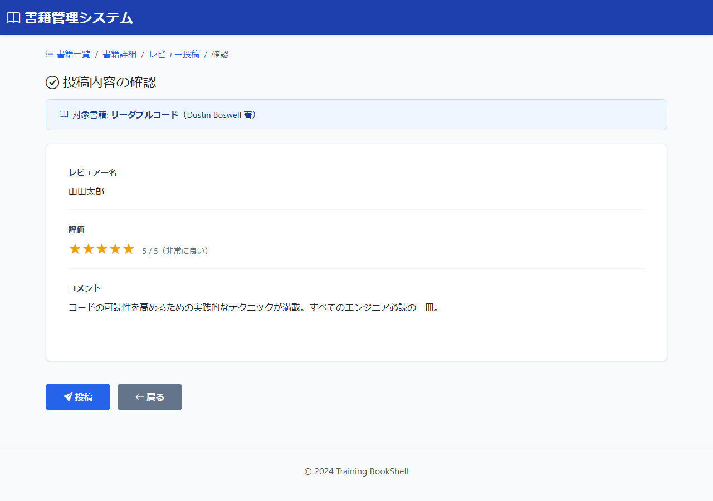

# BK12: レビュー投稿確認画面
## training-bookshelf

---

## 1. 画面概要

### 画面ID
BK12

### 画面名
レビュー投稿確認画面

### 概要
入力されたレビュー内容を確認する画面。投稿実行または入力画面へ戻ることができる。

### URL
`/books/{bookId}/reviews/confirm`

---

## 2. 画面項目定義

### 画面イメージ


### 2.1 書籍サマリエリア

| 項目名 | 項目ID | 型 | 備考 |
|--------|--------|-----|------|
| 対象書籍タイトル | bookTitle | text | 表示のみ |
| 対象書籍著者 | bookAuthor | text | 表示のみ |

---

### 2.2 確認内容エリア

| 項目名 | 項目ID | 型 | 備考 |
|--------|--------|-----|------|
| レビュアー名 | reviewerName | text | 表示のみ |
| 評価 | rating | text | 表示のみ、星アイコンで表示 |
| コメント | comment | text | 表示のみ、未入力の場合は空欄 |

---

### 2.3 ボタンエリア

| 項目名 | 項目ID | 型 | 備考 |
|--------|--------|-----|------|
| 投稿ボタン | btnPost | button | レビューを登録し完了画面(BK13)へ遷移 |
| 戻るボタン | btnBack | button | 入力画面(BK11)へ遷移（入力内容保持） |

---

## 3. 処理機能定義

### 3.1 初期表示処理

#### INPUT

| 項目名 | 取得元 | 備考 |
|--------|--------|------|
| 書籍ID | リクエスト | URLパラメータ |
| レビュアー名 | session | なければBK11へリダイレクト |
| 評価 | session | なければBK11へリダイレクト |
| コメント | session | なければBK11へリダイレクト |

#### 処理内容

1. URLパラメータから書籍IDを取得する
2. セッションからレビュー入力値を取得する
3. セッションに値がない場傈は入力画面(BK11)へリダイレクトする
4. 書籍テーブルから書籍情報を取得して書籍サマリを表示する
5. セッションの入力値を確認内容として表示する

```sql
SELECT 書籍ID, タイトル, 著者
FROM 書籍テーブル
WHERE 書籍ID = :書籍ID
```

#### OUTPUT

| 項目名 | セット先 | 備考 |
|--------|--------|------|
| 書籍タイトル | DTO | DBから取得 |
| 書籍著者 | DTO | DBから取得 |
| レビュアー名 | DTO | セッションから取得 |
| 評価 | DTO | セッションから取得 |
| コメント | DTO | セッションから取得 |

---

### 3.2 投稿ボタン押下時

#### INPUT

| 項目名 | 取得元 | 備考 |
|--------|--------|------|
| 書籍ID | session | - |
| レビュアー名 | session | - |
| 評価 | session | - |
| コメント | session | - |

#### 処理内容

1. セッションからレビュー入力値を取得する
2. トランザクション開始
3. レビューテーブルにINSERTする（投稿日時に現在日時を設定）
4. 登録成功時はコミット・セッション削除後、完了画面(BK13)へ遷移する（書籍IDをパラメータで渡す）
5. 登録失敗時はロールバックしてエラーメッセージを表示する

```sql
INSERT INTO レビューテーブル (
    書籍ID, レビュアー名, 評価, コメント, 投稿日時
) VALUES (
    :書籍ID, :レビュアー名, :評価, :コメント, :現在日時
)
```

#### OUTPUT（正常時）

| 項目名 | セット先 | 備考 |
|--------|--------|------|
| レビュアー名 | セッション | BK13表示用として保持 |
| 評価 | セッション | BK13表示用として保持 |

※ 書籍ID・コメントはセッションから削除。リダイレクト: BK13（`/books/{bookId}/reviews/complete`）

#### OUTPUT（エラー時）

| 項目名 | セット先 | 備考 |
|--------|--------|------|
| エラーメッセージ | DTO | DB登録失敗のエラー内容 |

---

### 3.3 戻るボタン押下時

#### INPUT

| 項目名 | 取得元 | 備考 |
|--------|--------|------|
| (なし) | - | - |

#### 処理内容

1. 入力画面(BK11)へ遷移する
2. セッションの入力値は保持する

#### OUTPUT

リダイレクト: BK11（`/books/{bookId}/reviews/new`、セッションは保持）

---

## 4. バリデーション

### セッションチェック
- セッションにレビュー入力値が存在しない場合は入力画面(BK11)へリダイレクト

---

## 5. メッセージ

### 画面表示メッセージ

| メッセージ本文 | 表示タイミング |
|--------------|---------------|
| メッセージID: `bk12.message.confirm`<br>以下の内容でレビューを投稿します。よろしいですか? | 初期表示時 |

### エラーメッセージ

| メッセージ本文 | 表示タイミング |
|--------------|---------------|
| メッセージID: `common.session.timeout`<br>セッションが切れました。最初からやり直してください。 | セッション切れ時 |
| メッセージID: `db.error.insert`<br>データの登録に失敗しました | DB登録失敗時 |

---

## 6. エラーハンドリング

### セッション切れ
- 入力画面(BK11)へリダイレクト
- エラーメッセージ: `common.session.timeout`

### データベースエラー
- 確認画面に留まる
- エラーメッセージ: `db.error.insert`
- ログに記録

---

## 7. 改訂履歴

| 版数 | 日付 | 改訂内容 | 作成者 |
|------|------|----------|--------|
| 1.0 | 2024-12-15 | 初版作成 | - |
