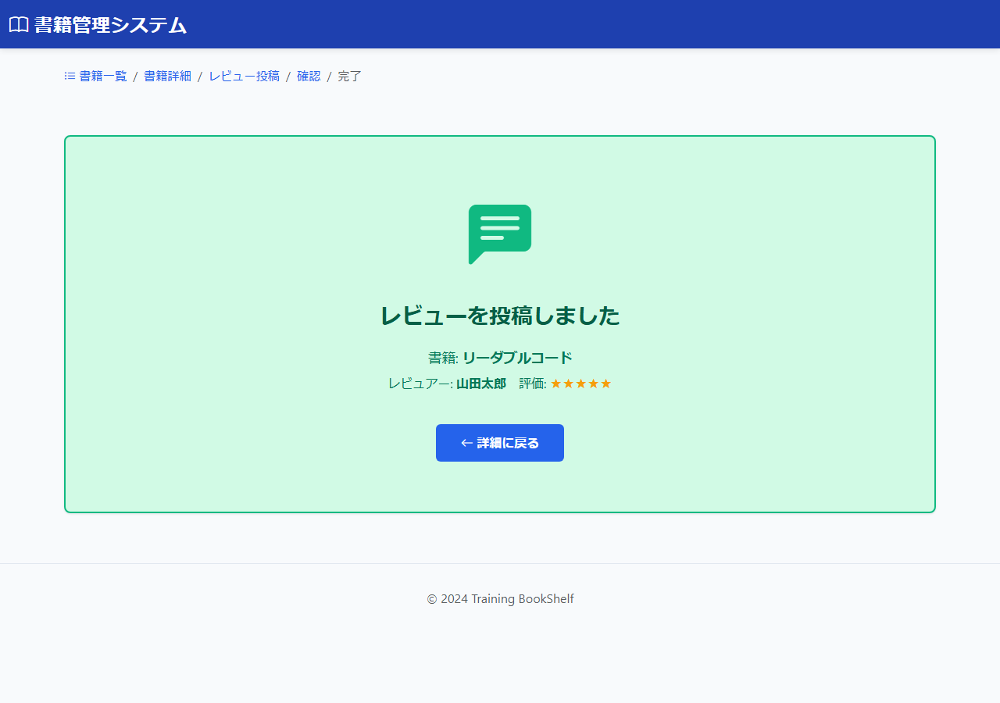

# BK13: レビュー投稿完了画面
## training-bookshelf

---

## 1. 画面概要

### 画面ID
BK13

### 画面名
レビュー投稿完了画面

### 概要
レビューの投稿が完了したことを表示する画面。書籍詳細画面へ戻ることができる。

### URL
`/books/{bookId}/reviews/complete`

---

## 2. 画面項目定義

### 画面イメージ

| 項目名 | 項目ID | 型 | 備考 |
|--------|--------|-----|------|
| 完了メッセージ | message | text | "レビューを投稿しました" |
| 対象書籍タイトル | bookTitle | text | 表示のみ |
| レビュアー名 | reviewerName | text | 表示のみ |
| 評価 | rating | text | 表示のみ、星アイコンで表示 |
| 詳細に戻るボタン | btnDetail | button | 書籍詳細画面(BK02)へ遷移 |

---

## 3. 処理機能定義

### 3.1 初期表示処理

#### INPUT

| 項目名 | 取得元 | 備考 |
|--------|--------|------|
| 書籍ID | リクエスト | URLパラメータ |
| レビュアー名 | session | 完了画面表示用 |
| 評価 | session | 完了画面表示用 |

#### 処理内容

1. URLパラメータから書籍IDを取得する
2. 書籍テーブルから書籍情報を取得する
3. セッションから登録完了したレビュー情報（レビュアー名・評価）を取得して表示する
4. 完了メッセージを表示する

#### OUTPUT

| 項目名 | セット先 | 備考 |
|--------|--------|------|
| 書籍タイトル | DTO | DBから取得 |
| 書籍著者 | DTO | DBから取得 |
| レビュアー名 | DTO | セッションから取得 |
| 評価 | DTO | セッションから取得 |

※ 表示後、セッション（レビュー完了情報）を削除する

---

### 3.2 詳細に戻るボタン押下時

#### INPUT

| 項目名 | 取得元 | 備考 |
|--------|--------|------|
| 書籍ID | リクエスト | URLパラメータ |

#### 処理内容

1. 書籍IDを取得する
2. 書籍詳細画面(BK02)へ遷移する

#### OUTPUT

リダイレクト: BK02（`/book/detail/{bookId}`）

---

## 4. バリデーション

### パラメータチェック
- bookId: 必須、数値、正の整数

---

## 5. メッセージ

### 画面表示メッセージ

| メッセージ本文 | 表示タイミング |
|--------------|---------------|
| メッセージID: `bk13.message.success` レビューの投稿が完了しました | 初期表示時 |

---

## 6. エラーハンドリング

### bookIdが不正な場合
- 一覧画面(BK01)へリダイレクト
- エラーメッセージ: `common.system.error`

---

## 7. 改訂履歴

| 版数 | 日付 | 改訂内容 | 作成者 |
|------|------|----------|--------|
| 1.0 | 2024-12-15 | 初版作成 | - |
