# 結合テスト結果: SC01 書籍登録フロー

## 実施環境
| 項目 | 内容 |
|------|------|
| 実施日時 | 2026-05-17 00:37:46 |
| URL | http://localhost:8080 |
| データ | data.sql 投入済み（アプリ再起動で初期化） |
| 実行手段 | ローカルPlaywright(Chromium) / tools/ita-executor |

---

## SC01-001: 正常登録（一覧→入力→確認→完了→一覧）（観点: 正常系）
**判定: OK**
**前提条件**: 共通事前準備の通り

| 手順No | 操作 | 入力値 | 期待結果 | 実際の結果 | 判定 | スクショ |
|--------|------|--------|---------|-----------|------|---------|
| 1 | BK01で新規登録ボタン押下 | - | BK03(/book/create)へ遷移 | http://localhost:8080/book/create;jsessionid=6D39C710C01F288CE40D112C1AF047D2 | OK |  |
| 2 | 全必須項目入力し確認画面へ押下 | {"title":"結合テスト書籍","author":"テスト太郎","publisher":"テスト社","publishedDate":"2020-01-01","isbn":"9990000000001","categoryId":3,"price":1500,"description":"説明"} | BK04へ遷移・入力値表示・確認メッセージ | url=http://localhost:8080/book/create/confirm | OK |  |
| 3 | 登録ボタン押下 | - | BK05へ遷移・「書籍の登録が完了しました」 | url=http://localhost:8080/book/create/complete?bookId=51 | OK | 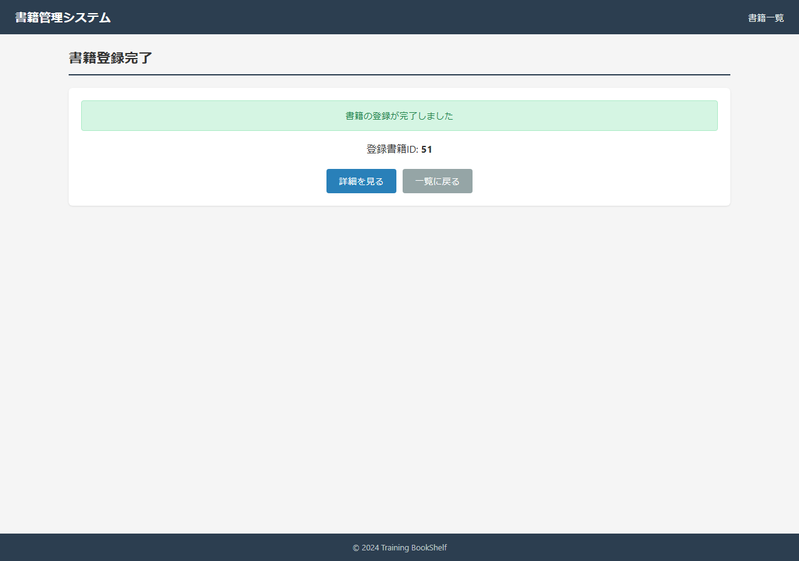 |
| 4 | 一覧に戻る→登録書籍を検索 | searchTitle=結合テスト書籍 | 一覧に登録書籍が表示（DB反映） | 検索結果に含まれる | OK | 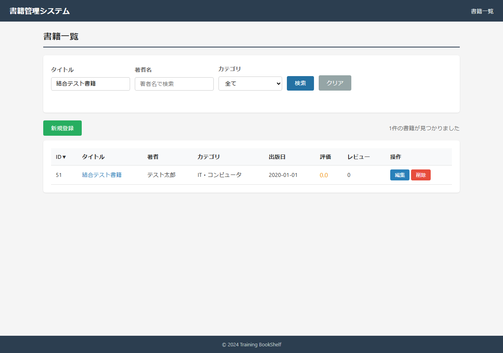 |

### スクリーンショット

---

## SC01-002: 完了画面から詳細へ遷移（観点: 正常系）
**判定: OK**
**前提条件**: 登録完了しBK05表示

| 手順No | 操作 | 入力値 | 期待結果 | 実際の結果 | 判定 | スクショ |
|--------|------|--------|---------|-----------|------|---------|
| 1 | 登録完了(BK05) | - | BK05表示 | http://localhost:8080/book/create/complete?bookId=52 | OK |  |
| 2 | 詳細を見るボタン押下 | - | BK02へ遷移・登録書籍の詳細表示 | url=http://localhost:8080/book/detail/52 | OK | 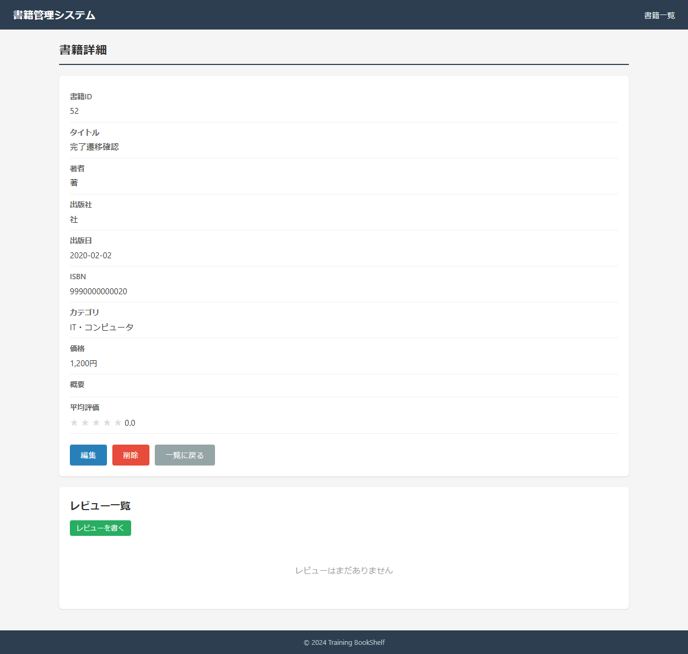 |

### スクリーンショット

---

## SC01-003: 確認画面から戻り入力値保持（観点: セッション）
**判定: OK**
**前提条件**: 共通事前準備の通り

| 手順No | 操作 | 入力値 | 期待結果 | 実際の結果 | 判定 | スクショ |
|--------|------|--------|---------|-----------|------|---------|
| 1 | BK03入力→確認画面へ | {"title":"保持確認","author":"著者A","publisher":"社A","publishedDate":"2019-05-05","isbn":"9990000000002","categoryId":5,"price":999,"description":"メモ"} | BK04へ遷移 | http://localhost:8080/book/create/confirm | OK |  |
| 2 | BK04で戻るボタン押下 | - | 入力値が全項目復元(title=保持確認,price=999,cat=5) | title=保持確認,price=999,cat=5 | OK | 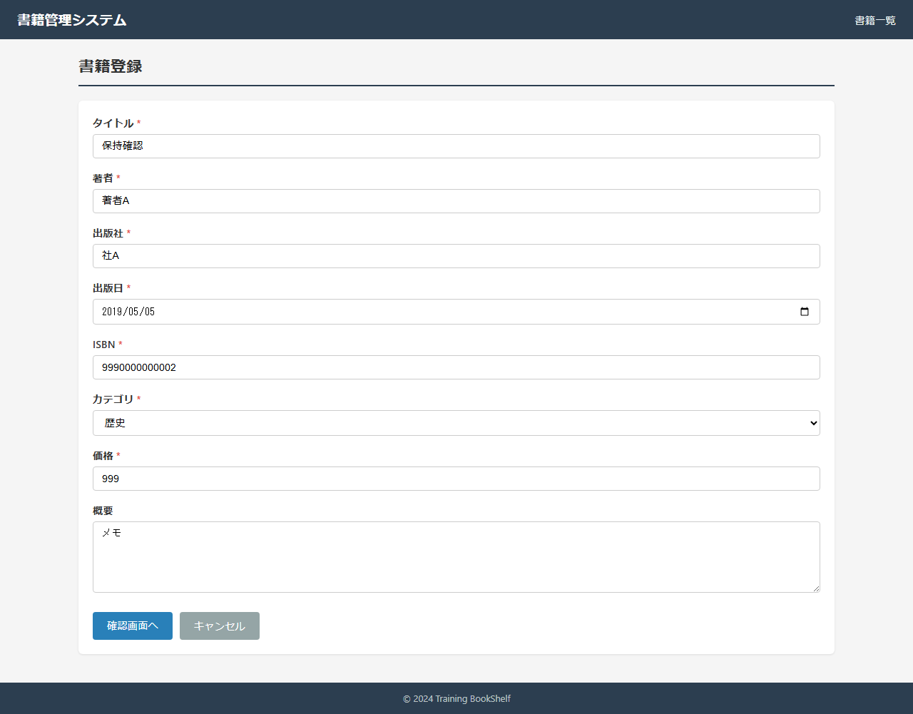 |
| 3 | 値変更し再度確認画面へ | title=保持確認2 | BK04に変更後の値で表示 | body確認 | OK | 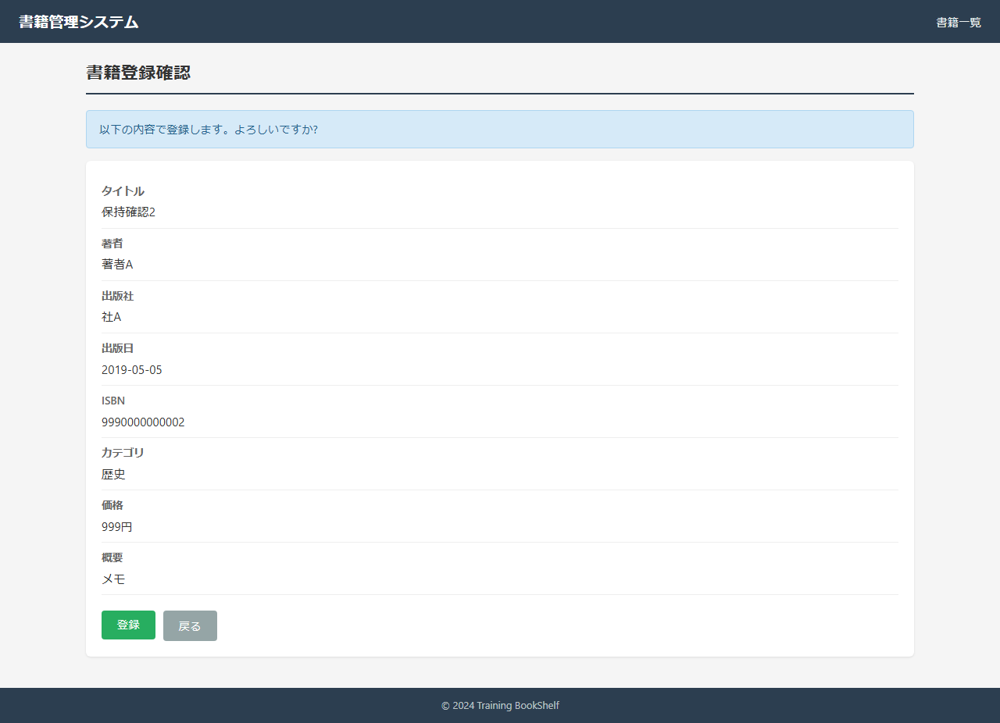 |

### スクリーンショット

---

## SC01-004: キャンセルで一覧へ戻りセッションクリア（観点: セッション）
**判定: OK**
**前提条件**: 共通事前準備の通り

| 手順No | 操作 | 入力値 | 期待結果 | 実際の結果 | 判定 | スクショ |
|--------|------|--------|---------|-----------|------|---------|
| 1 | BK03で項目入力 | title=破棄予定 | BK03入力状態 | input set | OK | 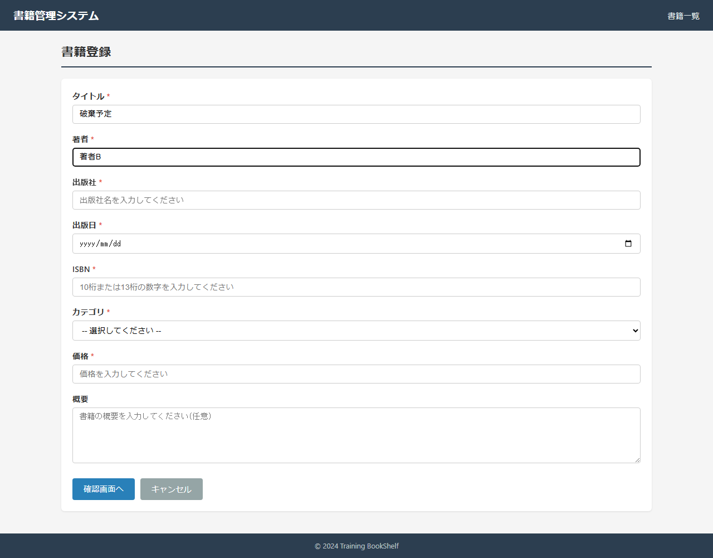 |
| 2 | キャンセルボタン押下 | - | BK01へ遷移 | http://localhost:8080/book/list | OK | 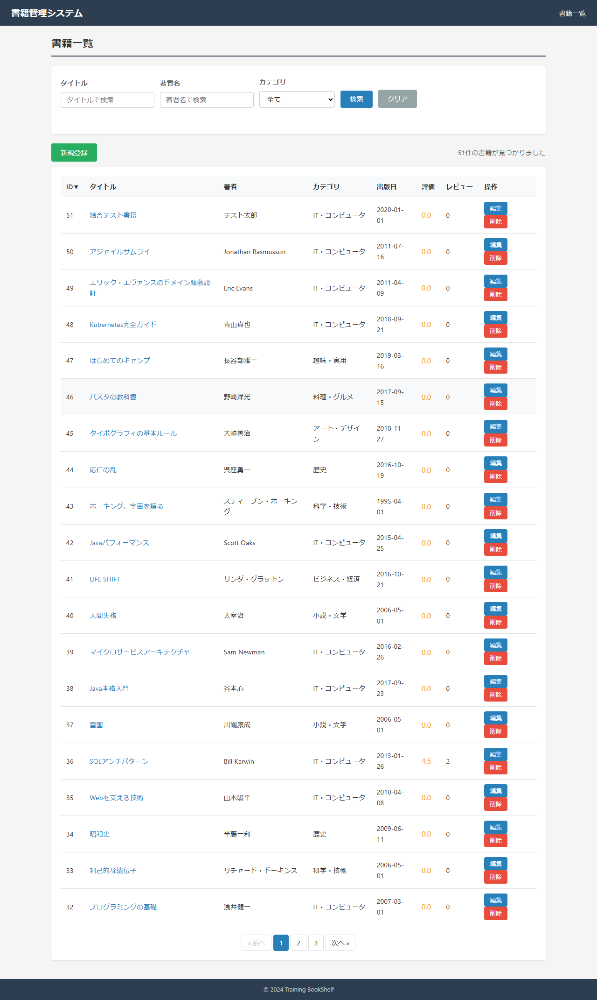 |
| 3 | 再度BK03表示 | - | フォームが空(セッションクリア) | title="" | OK |  |

### スクリーンショット

---

## SC01-005: 必須項目未入力でバリデーションエラー（観点: 異常系）
**判定: OK**
**前提条件**: 共通事前準備の通り

| 手順No | 操作 | 入力値 | 期待結果 | 実際の結果 | 判定 | スクショ |
|--------|------|--------|---------|-----------|------|---------|
| 1 | 全必須項目空で確認画面へ | (全項目空) | BK03に留まり必須エラー(「○○は必須です」)表示 | inputForm=true err=true | OK | 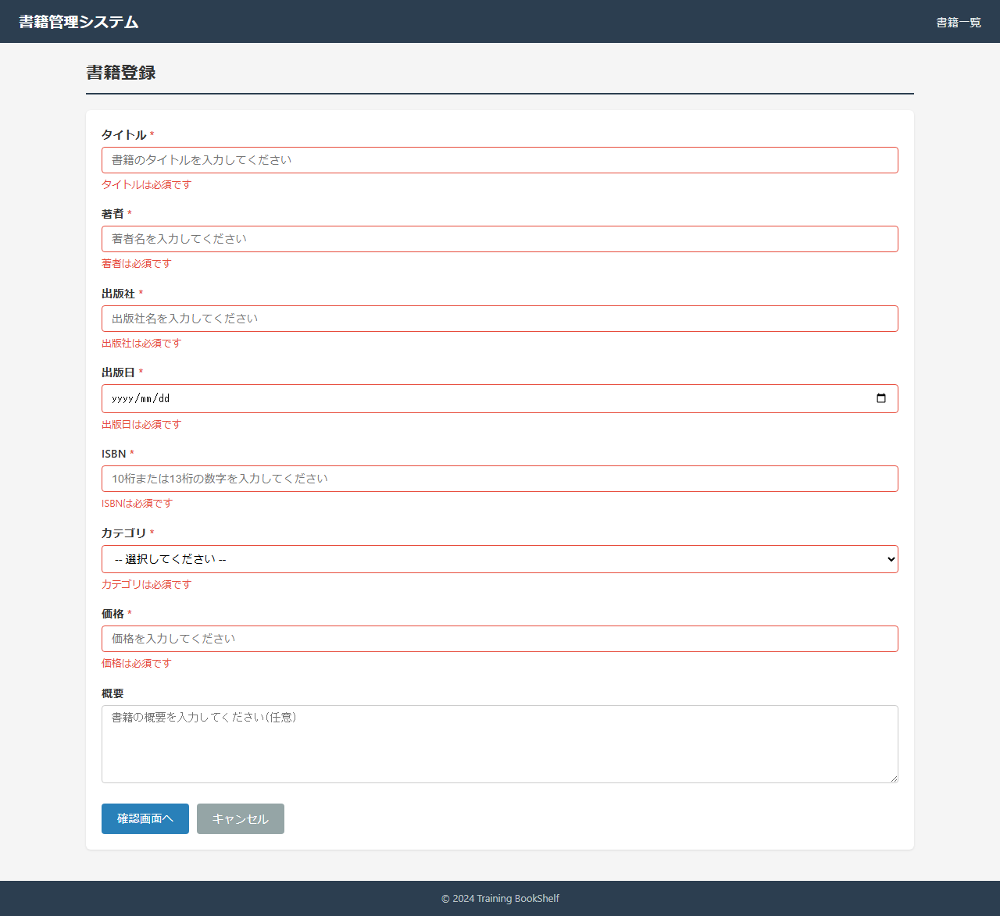 |
| 2 | タイトルのみ入力し再送信 | title=部分入力 | BK03継続・タイトル値保持・他必須エラー継続 | title=部分入力 stay=true | OK | 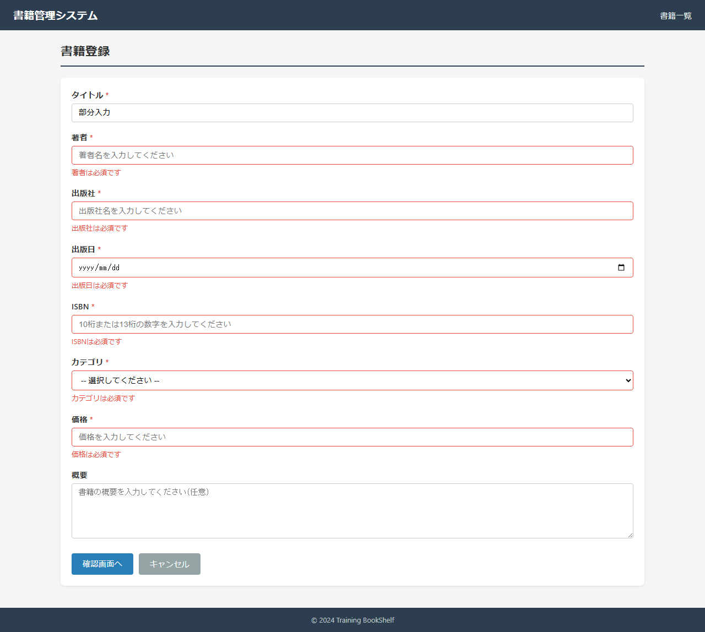 |

### スクリーンショット

---

## SC01-006: 桁数・形式・未来日付・数値の境界／異常（観点: 境界値）
**判定: OK**
**前提条件**: BK03表示中

| 手順No | 操作 | 入力値 | 期待結果 | 実際の結果 | 判定 | スクショ |
|--------|------|--------|---------|-----------|------|---------|
| 1 | タイトルに101文字入力を試行 | title=101字入力 | maxlength=100で100文字に制限（桁数上限を入力で担保） | maxlength=100, 実入力長=100 | OK | 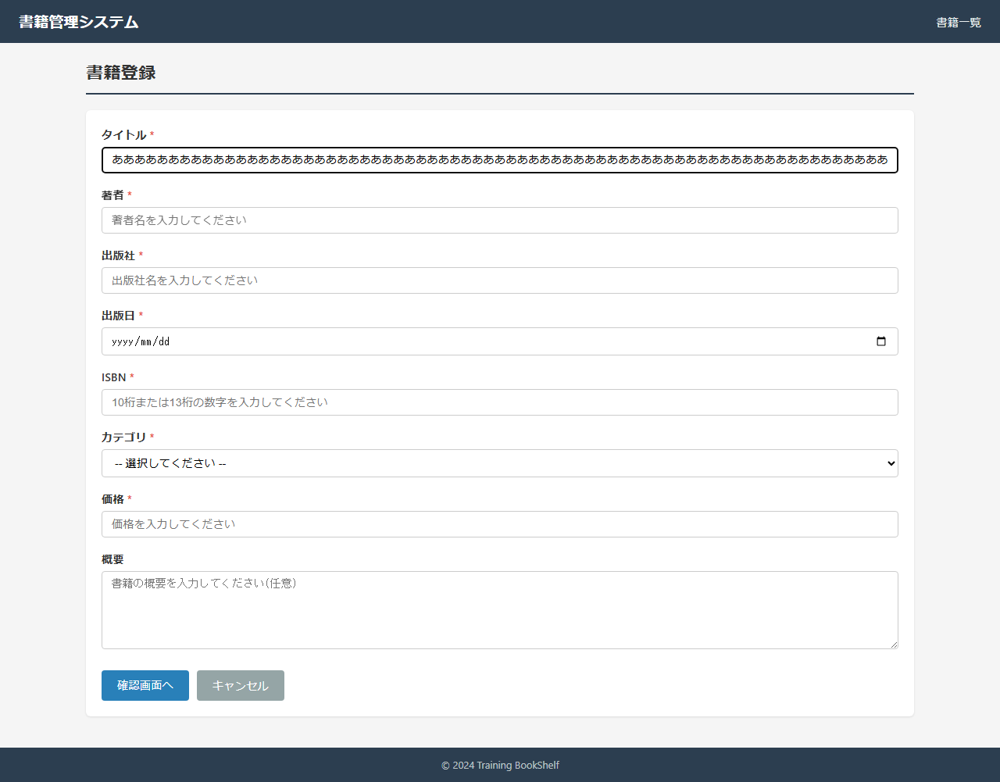 |
| 2 | タイトル100文字ちょうど | title=100字 | BK04へ遷移(許容) | confirm=true | OK | 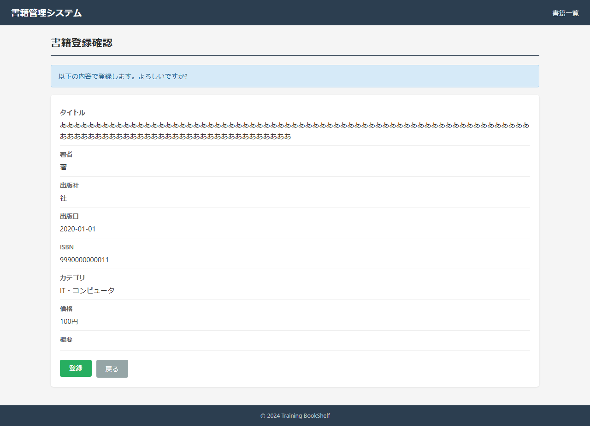 |
| 3 | 出版日に未来日付 | publishedDate=2999-12-31 | BK03に留まり未来日付エラー | stay=true | OK | 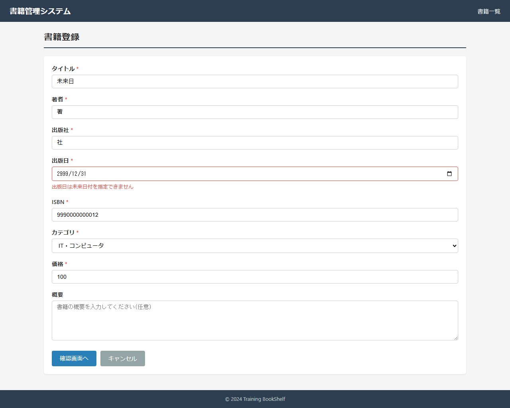 |
| 4 | ISBN9桁で送信 | isbn=123456789 | BK03に留まりISBN形式エラー | stay=true | OK | 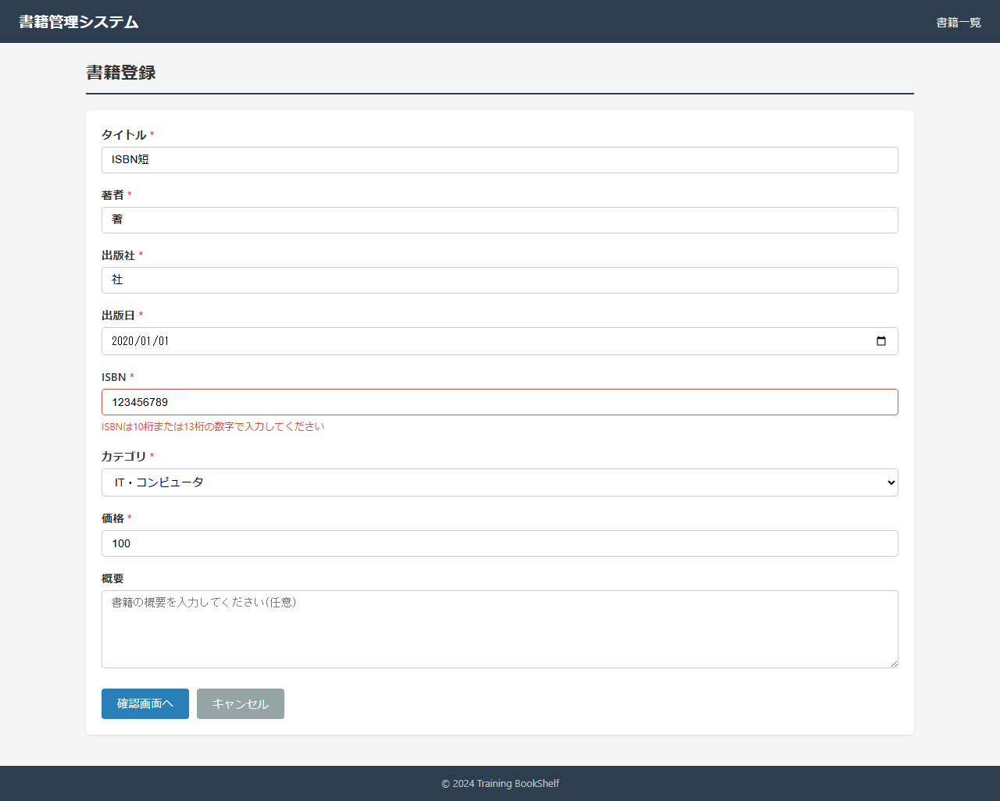 |
| 5 | 価格に負数で送信 | price=-1 | BK03に留まり数値エラー | stay=true | OK | 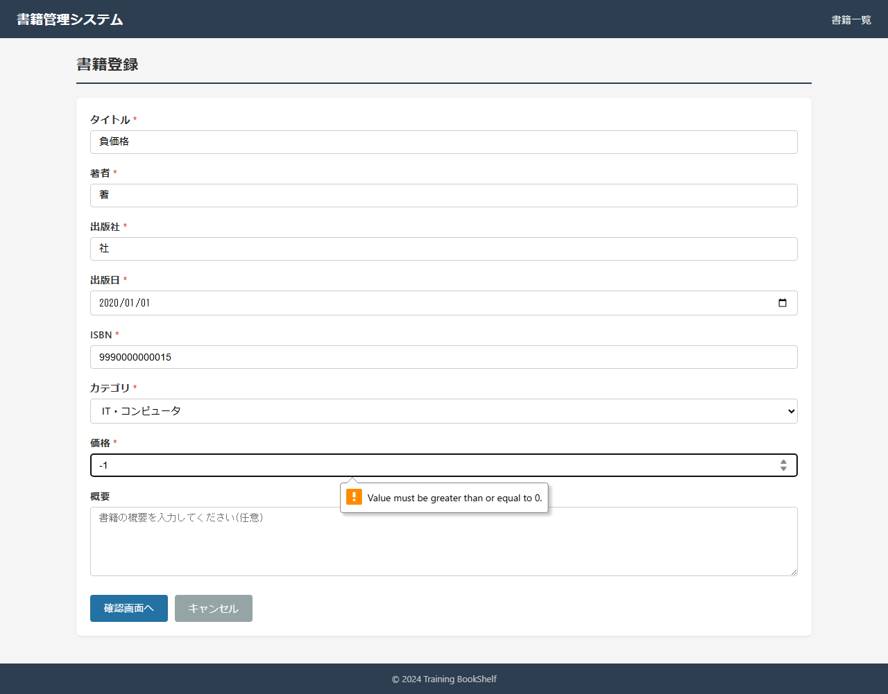 |
| 6 | 価格0で送信 | price=0 | BK04へ遷移(0は許容) | confirm=true | OK |  |

### スクリーンショット

---

## SC01-007: ISBN重複エラー（観点: 異常系）
**判定: OK**
**前提条件**: book_id=1 が ISBN 9784873115658 で登録済み

| 手順No | 操作 | 入力値 | 期待結果 | 実際の結果 | 判定 | スクショ |
|--------|------|--------|---------|-----------|------|---------|
| 1 | 既存ISBNで確認画面へ | isbn=9784873115658 | BK04へ遷移(入力時はOK) | http://localhost:8080/book/create/confirm | OK | 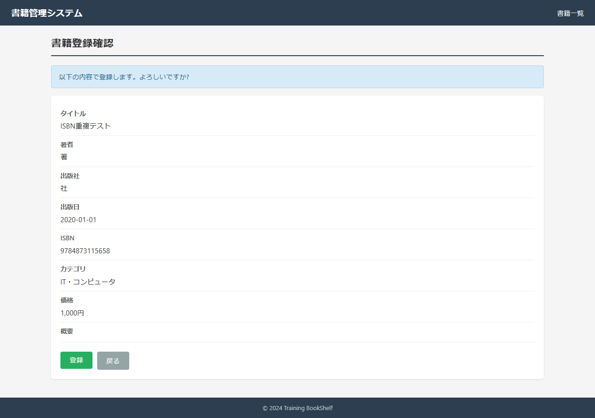 |
| 2 | 登録ボタン押下 | - | BK04に留まりISBN重複メッセージ・INSERTされない | url=http://localhost:8080/book/create/register | OK | 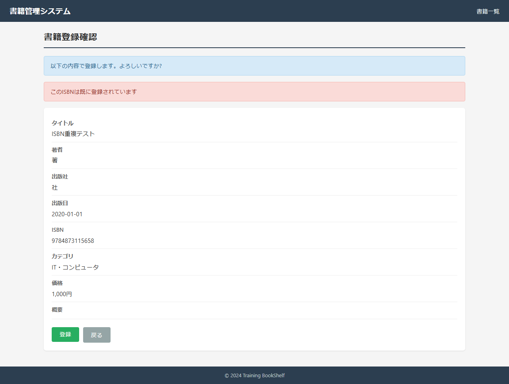 |

### スクリーンショット

---

## SC01-008: 確認画面 直接アクセス時のセッションガード（観点: セッション）
**判定: OK**
**前提条件**: セッションに入力値なし

| 手順No | 操作 | 入力値 | 期待結果 | 実際の結果 | 判定 | スクショ |
|--------|------|--------|---------|-----------|------|---------|
| 1 | BK04へ直接アクセス | - | BK03へリダイレクト | http://localhost:8080/book/create;jsessionid=E85A8A199ABD0905EDC1B4D175A44D45 | OK |  |

### スクリーンショット

---

