# 結合テスト結果: SC02 書籍編集フロー

## 実施環境
| 項目 | 内容 |
|------|------|
| 実施日時 | 2026-05-17 00:56:20 |
| URL | http://localhost:8080 |
| データ | data.sql 投入済み（アプリ再起動で初期化） |
| 実行手段 | ローカルPlaywright(Chromium) / tools/ita-executor |

---

## SC02-001: 正常編集（一覧→入力→確認→完了→詳細）（観点: 正常系）
**判定: OK**
**前提条件**: book_id=1 が存在

| 手順No | 操作 | 入力値 | 期待結果 | 実際の結果 | 判定 | スクショ |
|--------|------|--------|---------|-----------|------|---------|
| 1 | 一覧でbook_id=1の編集ボタン押下 | - | BK06へ遷移・既存値初期表示(title=リーダブルコード) | title=リーダブルコード | OK |  |
| 2 | 項目変更し確認画面へ | title=リーダブルコード 改訂版,price=3000 | BK07へ遷移・変更値・「更新します」 | body確認 | OK | 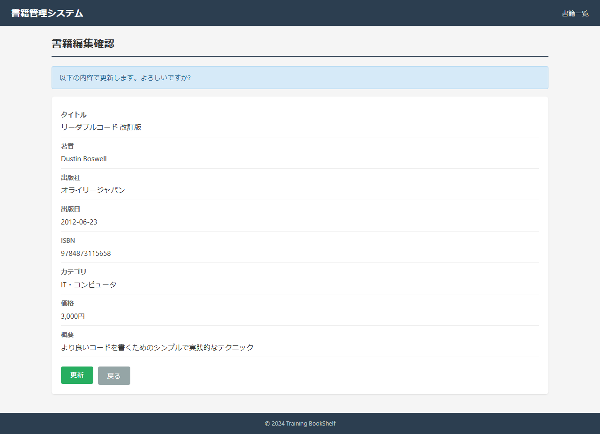 |
| 3 | 更新ボタン押下 | - | BK08へ遷移・「更新が完了」 | url=http://localhost:8080/book/edit/complete?bookId=1 | OK |  |
| 4 | 詳細を見るボタン押下 | - | BK02で更新後の値(title=改訂版,price=3,000) | body確認 | OK | 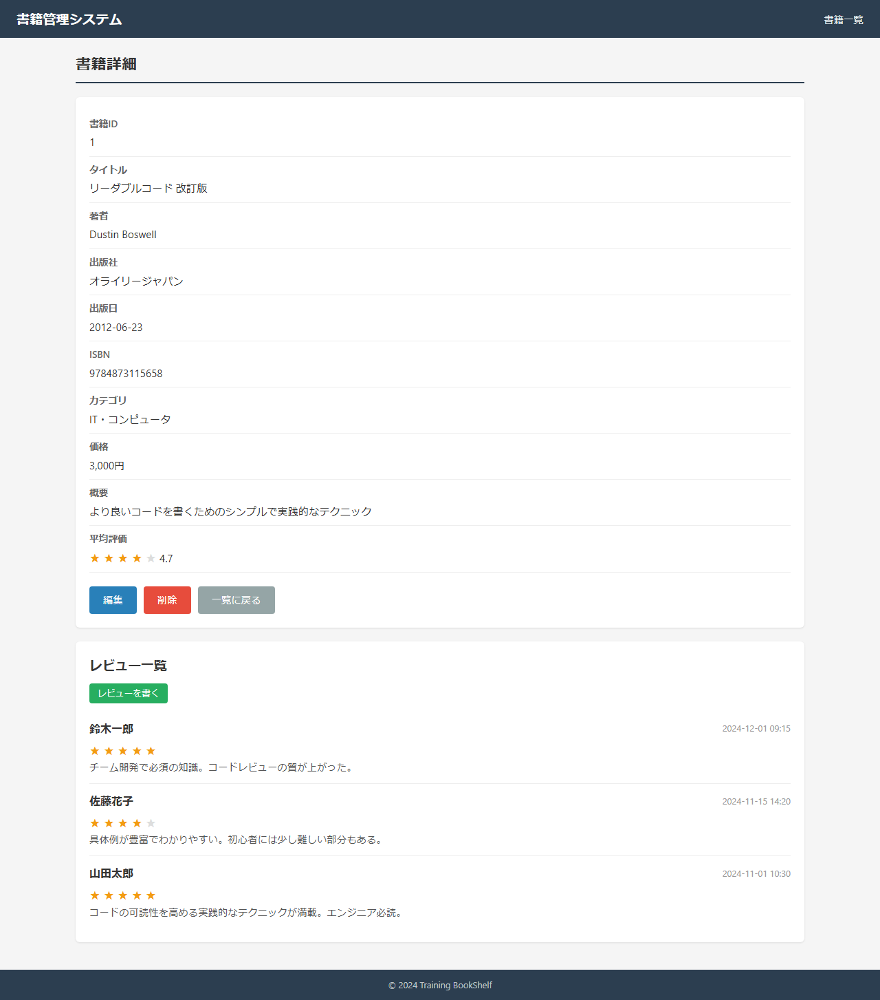 |

### スクリーンショット

---

## SC02-002: 詳細画面から編集（観点: 正常系）
**判定: OK**
**前提条件**: book_id=1 が存在

| 手順No | 操作 | 入力値 | 期待結果 | 実際の結果 | 判定 | スクショ |
|--------|------|--------|---------|-----------|------|---------|
| 1 | BK02→編集ボタン押下 | - | BK06へ遷移・既存値表示 | url=http://localhost:8080/book/edit/1 | OK |  |
| 2 | 著者変更し確認→更新 | author=D. Boswell | BK08・「更新が完了」 | body確認 | OK |  |

### スクリーンショット

---

## SC02-003: 確認画面から戻り入力値保持（観点: セッション）
**判定: OK**
**前提条件**: book_id=1 が存在

| 手順No | 操作 | 入力値 | 期待結果 | 実際の結果 | 判定 | スクショ |
|--------|------|--------|---------|-----------|------|---------|
| 1 | BK06変更し確認画面へ | title=保持テスト編集,price=2222 | BK07へ遷移 | confirm=true | OK |  |
| 2 | BK07で戻る押下 | - | 変更後入力値が復元(title=保持テスト編集,price=2222) | title=保持テスト編集,price=2222 | OK |  |
| 3 | 再度確認画面へ | - | BK07に保持値表示 | body確認 | OK |  |

### スクリーンショット

---

## SC02-004: キャンセルで詳細へ戻りセッションクリア（観点: セッション）
**判定: OK**
**前提条件**: book_id=1 が存在

| 手順No | 操作 | 入力値 | 期待結果 | 実際の結果 | 判定 | スクショ |
|--------|------|--------|---------|-----------|------|---------|
| 1 | BK06で値変更 | title=破棄編集 | BK06入力状態 | set | OK | 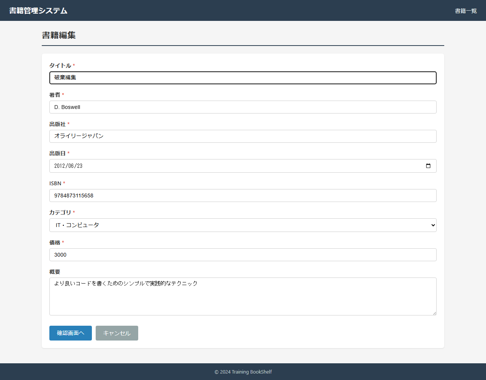 |
| 2 | キャンセル押下 | - | BK02へ遷移・book1未変更(元title表示) | url=http://localhost:8080/book/detail/1 | OK | 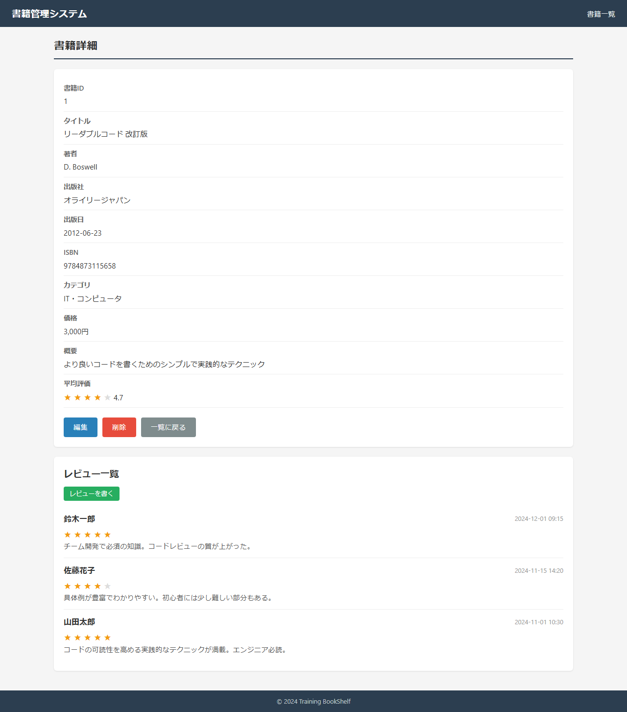 |
| 3 | 再度BK06表示 | - | DB既存値表示(破棄値は復元されない) | title=リーダブルコード 改訂版 | OK |  |

### スクリーンショット

---

## SC02-005: 必須・桁数・形式バリデーションエラー（観点: 異常系）
**判定: OK**
**前提条件**: book_id=1 が存在。BK06表示中

| 手順No | 操作 | 入力値 | 期待結果 | 実際の結果 | 判定 | スクショ |
|--------|------|--------|---------|-----------|------|---------|
| 1 | タイトルを空にして確認画面へ | title=空 | BK06に留まり必須エラー | stay=true | OK | 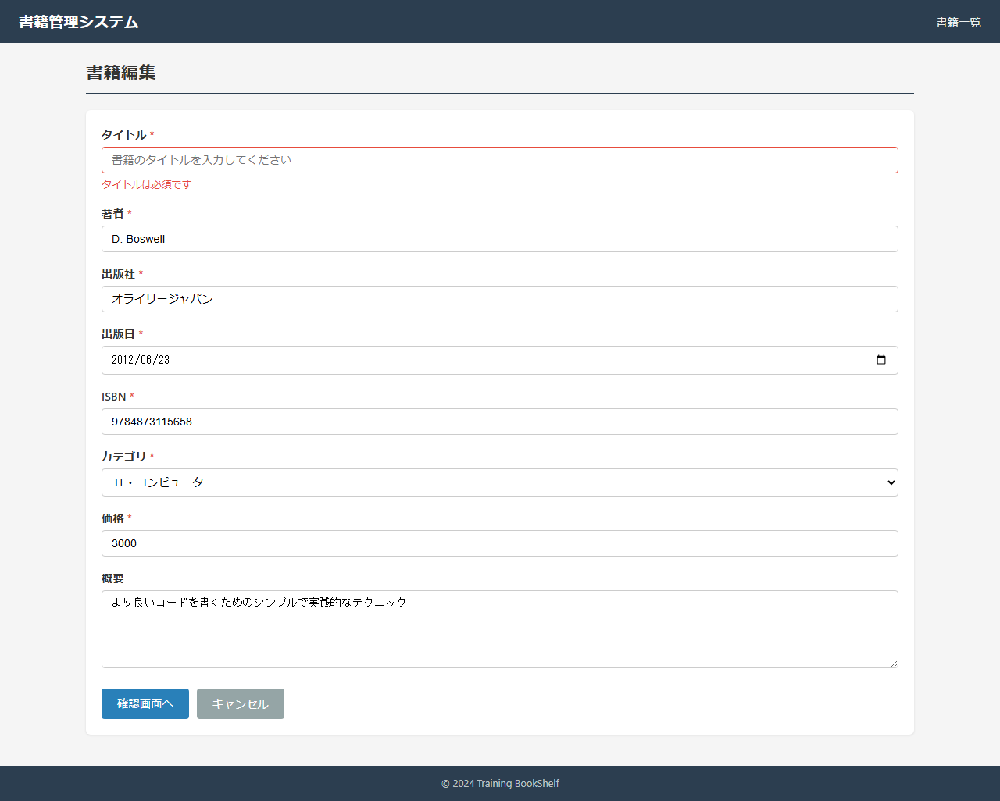 |
| 2 | ISBN不正形式で送信 | isbn=ABC123 | BK06に留まりISBN形式エラー | stay=true | OK | 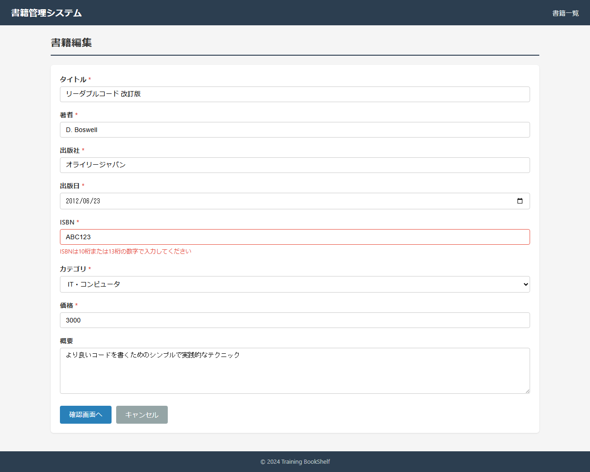 |
| 3 | 出版日に未来日付 | publishedDate=2999-01-01 | BK06に留まり未来日付エラー | stay=true | OK | 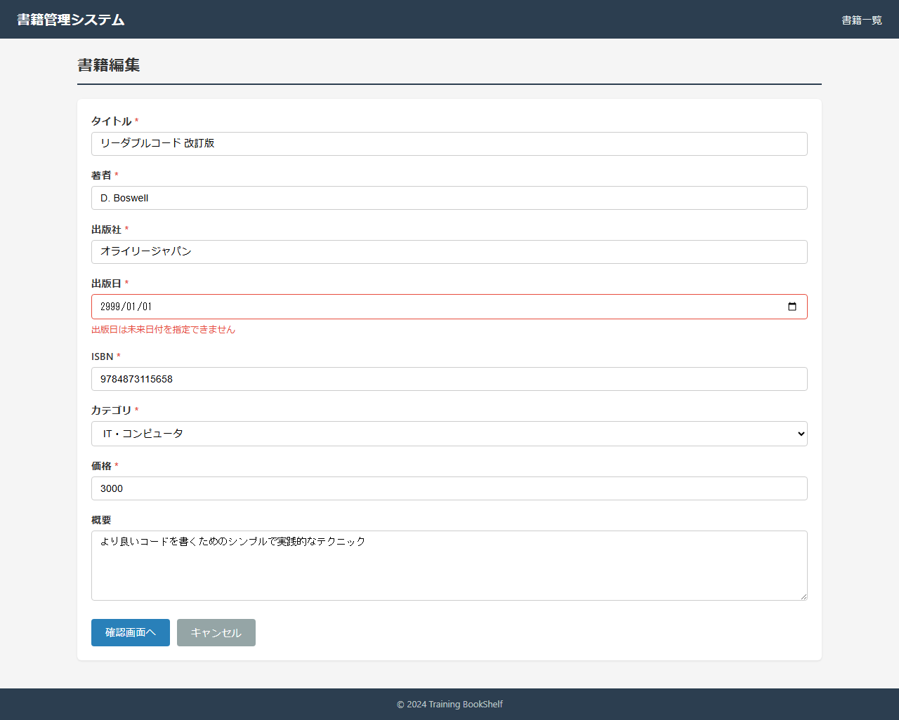 |

### スクリーンショット

---

## SC02-006: ISBN重複エラー（自書籍は除外）（観点: 異常系）
**判定: OK**
**前提条件**: book_id=1(9784873115658), book_id=2(9784422100517)

| 手順No | 操作 | 入力値 | 期待結果 | 実際の結果 | 判定 | スクショ |
|--------|------|--------|---------|-----------|------|---------|
| 1 | book2のISBNに変更し更新 | isbn=9784422100517 | BK07に留まりISBN重複・book1未更新 | url=http://localhost:8080/book/edit/1/update | OK | 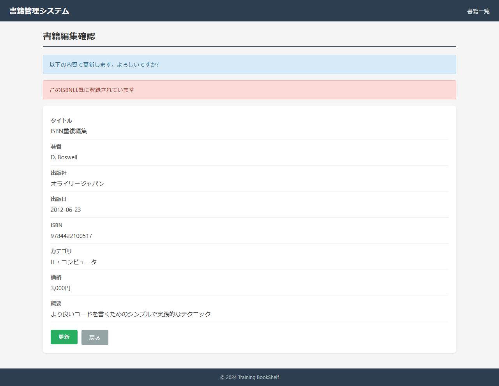 |
| 2 | 自分の元ISBNのまま他項目変更し更新 | isbn=9784873115658(自書籍),title=自ISBN維持更新 | 重複にならず正常更新(BK08) | url=http://localhost:8080/book/edit/complete?bookId=1 初期isbn=9784873115658 | OK |  |

### スクリーンショット

---

## SC02-007: 楽観的ロックエラー（同時更新）（観点: 異常系）
**判定: OK**
**前提条件**: book_id=1。2セッションで同時編集

| 手順No | 操作 | 入力値 | 期待結果 | 実際の結果 | 判定 | スクショ |
|--------|------|--------|---------|-----------|------|---------|
| 1 | セッションA: BK06(book1)を開く | - | BK06表示(updated_at保持) | url=http://localhost:8080/book/edit/1 | OK | 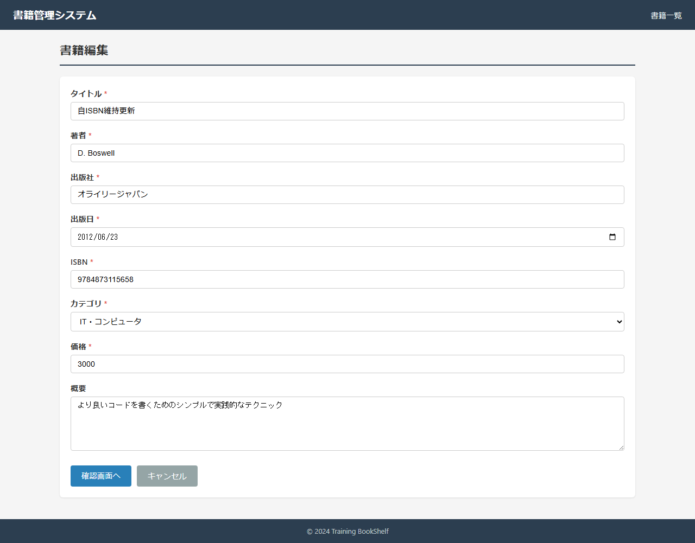 |
| 2 | セッションB: 先に更新し更新日時変更 | title=先行更新 | book1がB更新で更新日時変化 | url=http://localhost:8080/book/edit/complete?bookId=1 | OK | 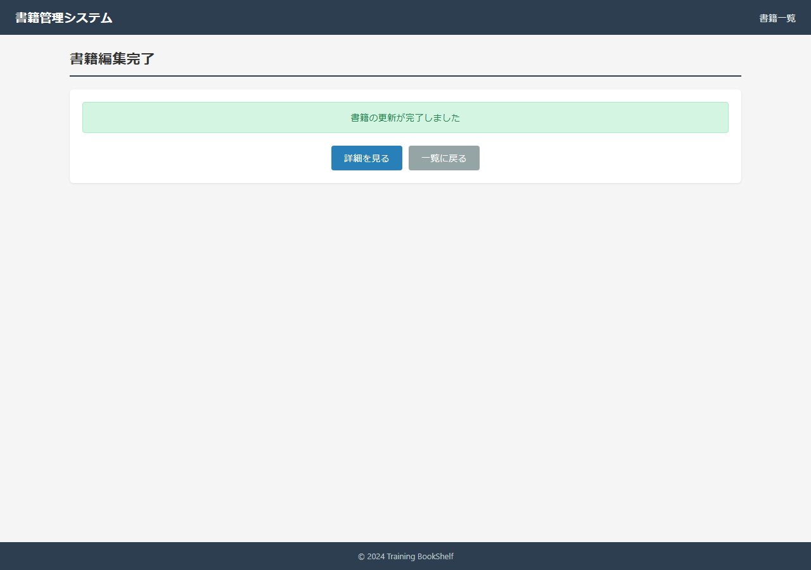 |
| 3 | セッションA: 手順1の画面から更新 | title=後発更新 | 楽観ロック不一致・「他のユーザーによって更新」表示/BK02遷移 | url=http://localhost:8080/book/edit/1/update hasMsg=true | OK | 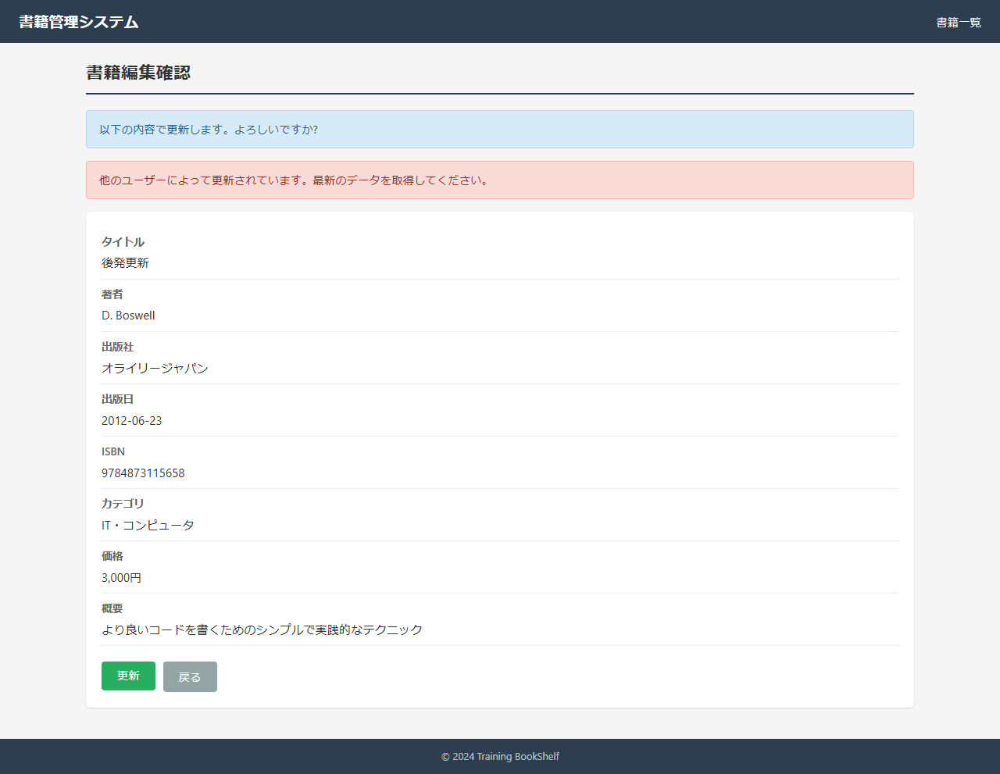 |

### スクリーンショット

---

## SC02-008: 存在しない書籍IDで編集アクセス（観点: 異常系）
**判定: OK**
**前提条件**: book_id=999999 は存在しない

| 手順No | 操作 | 入力値 | 期待結果 | 実際の結果 | 判定 | スクショ |
|--------|------|--------|---------|-----------|------|---------|
| 1 | BK06(/book/edit/999999)へアクセス | - | 「見つかりません」表示／一覧へ遷移 | url=http://localhost:8080/book/edit/999999 | OK |  |

### スクリーンショット

---

## SC02-009: 確認画面 直接アクセス時のセッションガード（観点: セッション）
**判定: OK**
**前提条件**: セッションに編集値なし

| 手順No | 操作 | 入力値 | 期待結果 | 実際の結果 | 判定 | スクショ |
|--------|------|--------|---------|-----------|------|---------|
| 1 | BK07(/book/edit/1/confirm)直接アクセス | - | BK06(/book/edit/1)へリダイレクト | url=http://localhost:8080/book/edit/1;jsessionid=3B4F0EC4CEA5F8D421DC3BDD9A795BE5 | OK | 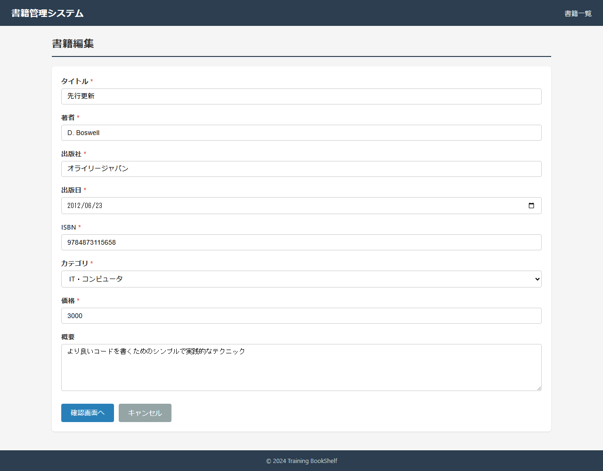 |

### スクリーンショット

---

