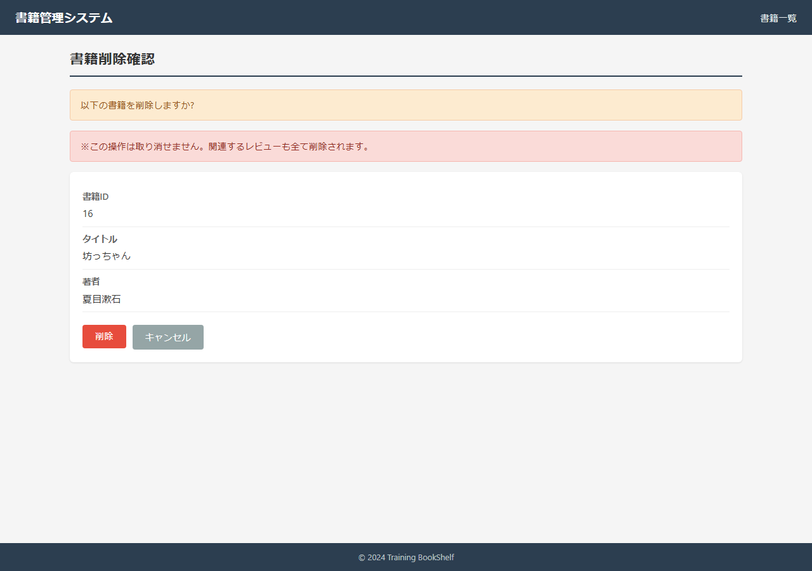
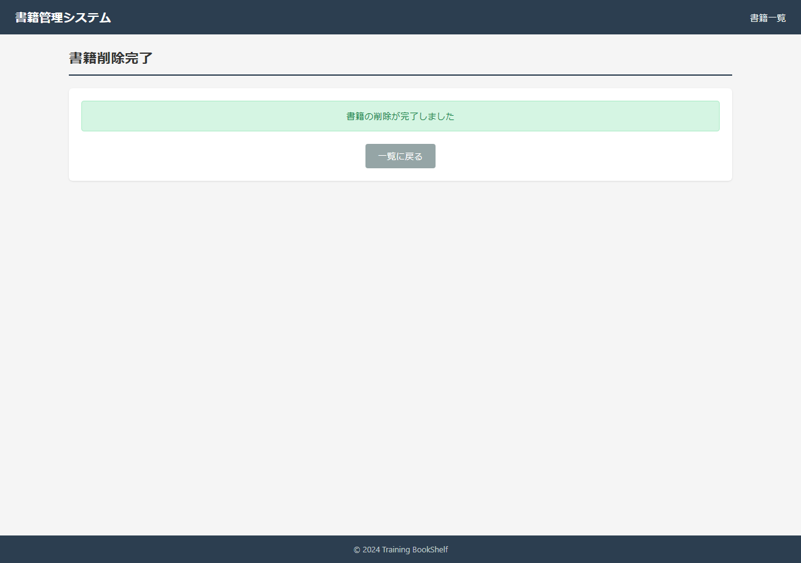
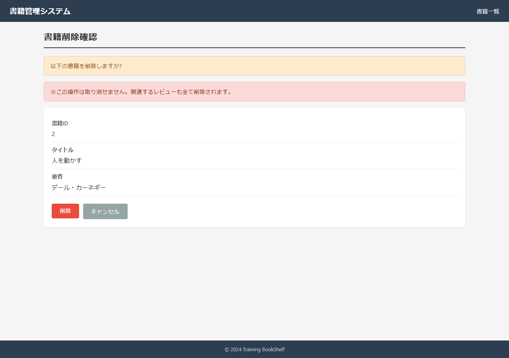
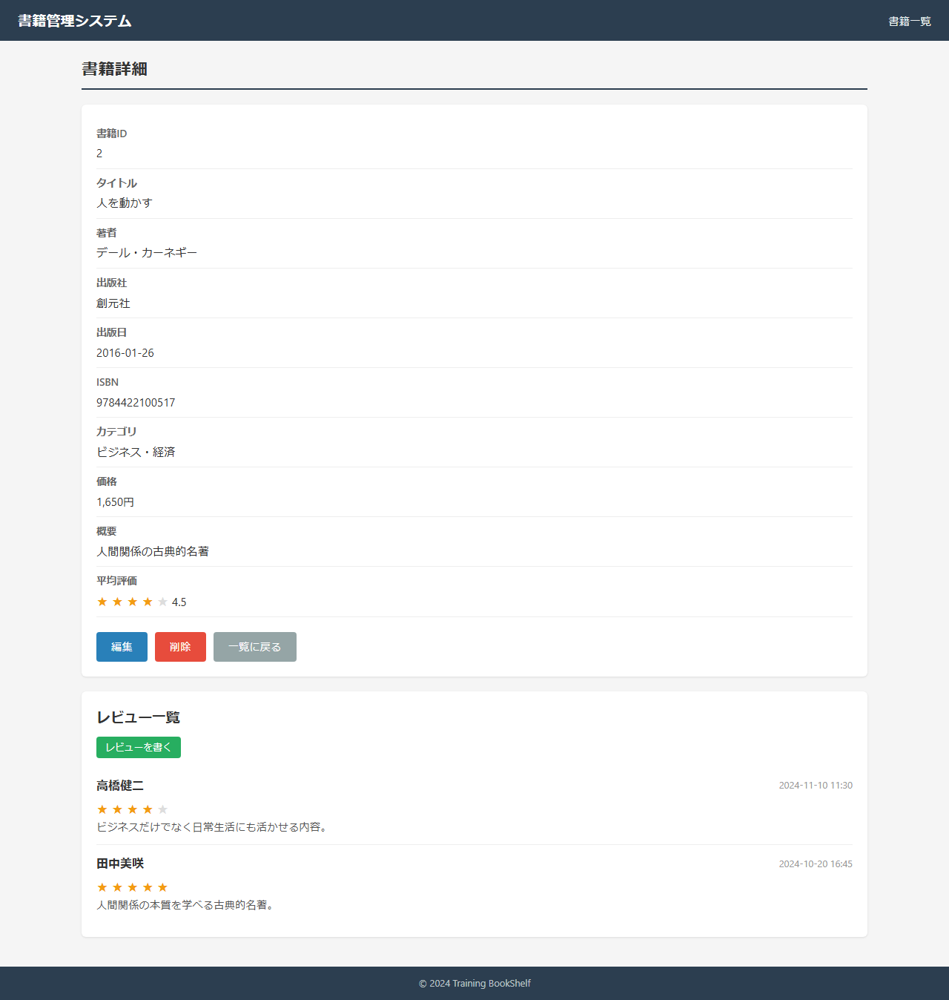

# 結合テスト結果: SC03 書籍削除フロー

## 実施環境
| 項目 | 内容 |
|------|------|
| 実施日時 | 2026-05-17 00:38:29 |
| URL | http://localhost:8080 |
| データ | data.sql 投入済み（アプリ再起動で初期化） |
| 実行手段 | ローカルPlaywright(Chromium) / tools/ita-executor |

---

## SC03-001: 正常削除（一覧→確認→完了→一覧）（観点: 正常系）
**判定: OK**
**前提条件**: book_id=16 が存在(レビュー0件)

| 手順No | 操作 | 入力値 | 期待結果 | 実際の結果 | 判定 | スクショ |
|--------|------|--------|---------|-----------|------|---------|
| 1 | book_id=16の削除確認画面 | - | BK09表示・確認/警告メッセージ | body確認 | OK |  |
| 2 | 削除ボタン押下 | - | BK10へ遷移・「削除が完了」 | url=http://localhost:8080/book/delete/complete | OK |  |
| 3 | book_id=16の詳細を確認 | - | 削除済み(見つからない/一覧へ) | url=http://localhost:8080/book/detail/16 | OK |  |

### スクリーンショット

---

## SC03-002: 詳細画面から削除（観点: 正常系）
**判定: OK**
**前提条件**: book_id=15 が存在

| 手順No | 操作 | 入力値 | 期待結果 | 実際の結果 | 判定 | スクショ |
|--------|------|--------|---------|-----------|------|---------|
| 1 | BK02→削除ボタン押下 | - | BK09(/book/delete/confirm/15)へ遷移 | url=http://localhost:8080/book/delete/confirm/15 | OK |  |
| 2 | 削除ボタン押下 | - | BK10・「削除が完了」・book15削除 | url=http://localhost:8080/book/delete/complete | OK |  |

### スクリーンショット

---

## SC03-003: レビュー連動削除（CASCADE）（観点: DB整合）
**判定: OK**
**前提条件**: book_id=1 にレビュー3件

| 手順No | 操作 | 入力値 | 期待結果 | 実際の結果 | 判定 | スクショ |
|--------|------|--------|---------|-----------|------|---------|
| 1 | 削除前: book1のレビュー件数確認 | - | レビュー3件存在 | reviews=3 | OK |  |
| 2 | book1を削除 | - | BK10・「削除が完了」 | url=http://localhost:8080/book/delete/complete | OK |  |
| 3 | book1詳細を再確認 | - | book1削除・紐づくレビューもCASCADE削除 | url=http://localhost:8080/book/detail/1 | OK |  |

### スクリーンショット

---

## SC03-004: キャンセルで詳細へ戻る（削除されない）（観点: 正常系）
**判定: OK**
**前提条件**: book_id=2 が存在

| 手順No | 操作 | 入力値 | 期待結果 | 実際の結果 | 判定 | スクショ |
|--------|------|--------|---------|-----------|------|---------|
| 1 | BK09(/book/delete/confirm/2)表示 | - | BK09表示 | url=http://localhost:8080/book/delete/confirm/2 | OK |  |
| 2 | キャンセル押下 | - | BK02(detail/2)へ遷移・book2未削除 | url=http://localhost:8080/book/detail/2 | OK |  |

### スクリーンショット

---

## SC03-005: 存在しない書籍IDで削除確認アクセス（観点: 異常系）
**判定: OK**
**前提条件**: book_id=999999 は存在しない

| 手順No | 操作 | 入力値 | 期待結果 | 実際の結果 | 判定 | スクショ |
|--------|------|--------|---------|-----------|------|---------|
| 1 | BK09(/book/delete/confirm/999999)アクセス | - | 「見つかりません」表示／一覧へ | url=http://localhost:8080/book/delete/confirm/999999 | OK |  |

### スクリーンショット

---

