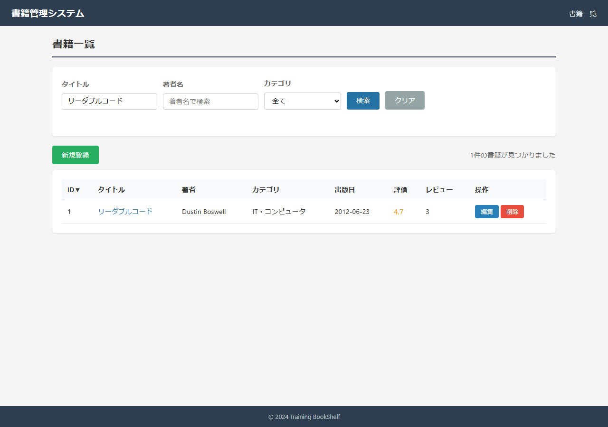
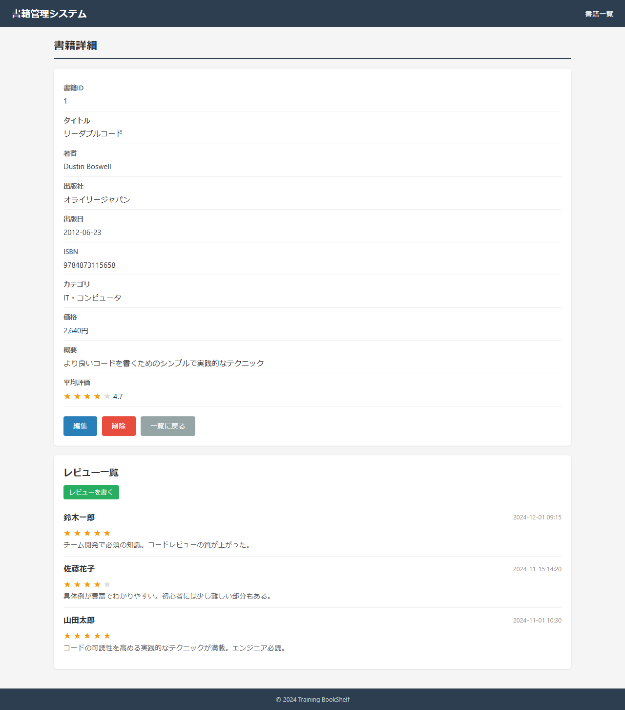
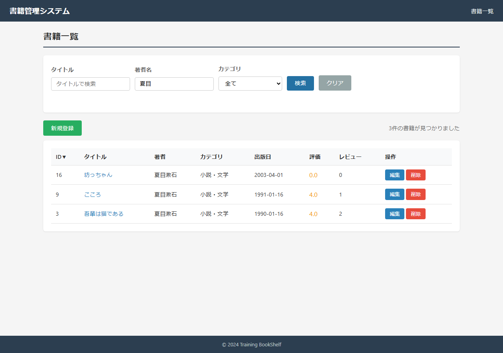
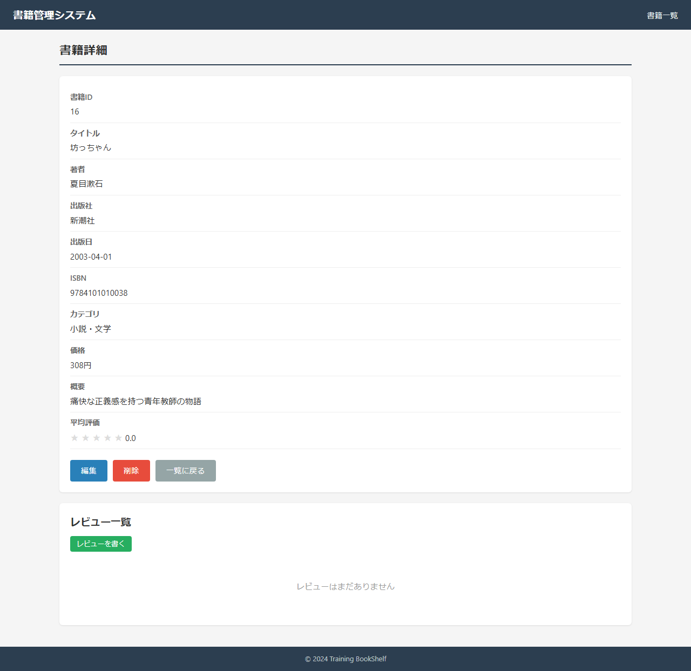
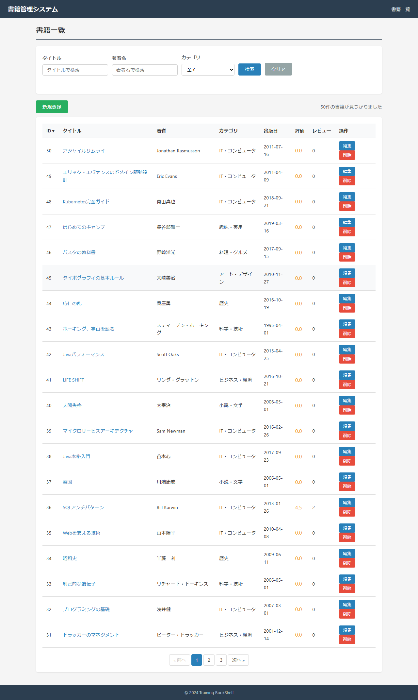
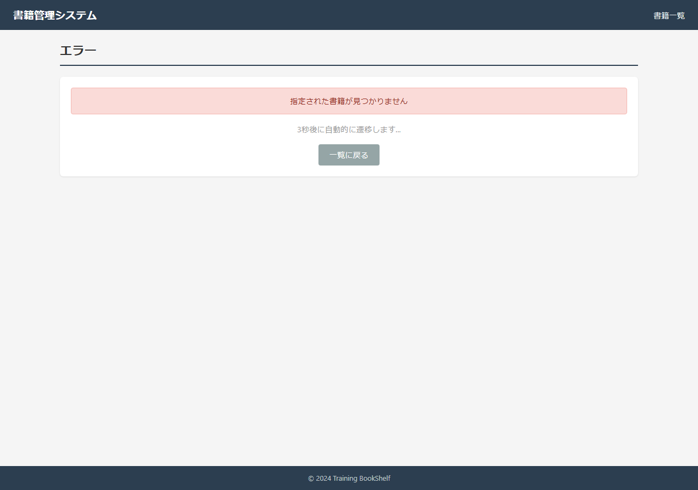
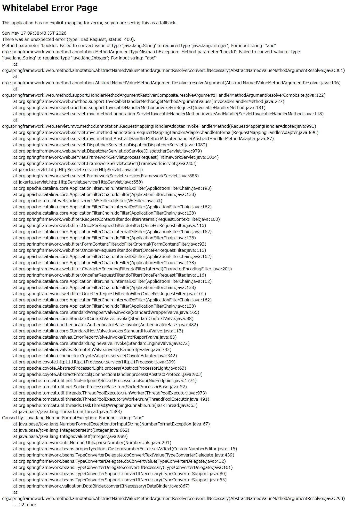

# 結合テスト結果: SC04 書籍閲覧フロー

## 実施環境
| 項目 | 内容 |
|------|------|
| 実施日時 | 2026-05-17 00:38:44 |
| URL | http://localhost:8080 |
| データ | data.sql 投入済み（アプリ再起動で初期化） |
| 実行手段 | ローカルPlaywright(Chromium) / tools/ita-executor |

---

## SC04-001: 一覧→詳細→一覧 基本閲覧（観点: 正常系）
**判定: OK**
**前提条件**: book_id=1 が存在

| 手順No | 操作 | 入力値 | 期待結果 | 実際の結果 | 判定 | スクショ |
|--------|------|--------|---------|-----------|------|---------|
| 1 | BK01表示(リーダブルコード検索) | - | 一覧表示 | rows=1 | OK |  |
| 2 | タイトルリンク押下 | - | BK02へ遷移・書籍情報表示 | url=http://localhost:8080/book/detail/1 | OK |  |
| 3 | レビュー/平均評価確認 | - | レビュー3件・平均評価4.7 | reviews=3 avg4.7=true | OK |  |
| 4 | 一覧に戻る押下 | - | BK01へ遷移 | url=http://localhost:8080/book/list | OK |  |

### スクリーンショット

---

## SC04-002: レビュー0件書籍の詳細表示（観点: 境界値）
**判定: OK**
**前提条件**: book_id=16(レビュー0件)

| 手順No | 操作 | 入力値 | 期待結果 | 実際の結果 | 判定 | スクショ |
|--------|------|--------|---------|-----------|------|---------|
| 1 | BK02(detail/16)表示 | - | 書籍情報表示・平均0・レビュー0件・エラーなし | reviews=0 坊っちゃん=true | OK |  |

### スクリーンショット

---

## SC04-003: 検索条件を保持したまま詳細往復（観点: セッション）
**判定: NG**
**前提条件**: 夏目漱石の書籍が複数存在

| 手順No | 操作 | 入力値 | 期待結果 | 実際の結果 | 判定 | スクショ |
|--------|------|--------|---------|-----------|------|---------|
| 1 | 著者「夏目」で検索 | searchAuthor=夏目 | 夏目漱石の書籍に絞り込み(3件) | rows=3 | OK |  |
| 2 | タイトルリンク→BK02 | - | 詳細表示 | url=http://localhost:8080/book/detail/16 | OK |  |
| 3 | BK02で一覧に戻る押下 | - | 前回検索条件(著者=夏目)復元・絞り込み再表示 | searchAuthor= rows=20 | NG |  |

### スクリーンショット

### NG詳細
- 手順3: 期待「前回検索条件(著者=夏目)復元・絞り込み再表示」/ 実際「searchAuthor= rows=20」

---

## SC04-004: 存在しない書籍IDで詳細アクセス（観点: 異常系）
**判定: OK**
**前提条件**: book_id=999999 は存在しない

| 手順No | 操作 | 入力値 | 期待結果 | 実際の結果 | 判定 | スクショ |
|--------|------|--------|---------|-----------|------|---------|
| 1 | BK02(detail/999999)アクセス | - | 「見つかりません」表示／一覧へ自動遷移 | url=http://localhost:8080/book/detail/999999 | OK |  |

### スクリーンショット

---

## SC04-005: 不正な書籍IDパラメータ（観点: 異常系）
**判定: OK**
**前提条件**: 共通事前準備の通り

| 手順No | 操作 | 入力値 | 期待結果 | 実際の結果 | 判定 | スクショ |
|--------|------|--------|---------|-----------|------|---------|
| 1 | BK02(detail/abc)アクセス(数値以外) | - | バリデーション違反をハンドリング・500で異常終了しない | httpStatus=400 | OK |  |

### スクリーンショット

---

