# 結合テスト結果: SC05 レビュー投稿フロー

## 実施環境
| 項目 | 内容 |
|------|------|
| 実施日時 | 2026-05-17 00:39:02 |
| URL | http://localhost:8080 |
| データ | data.sql 投入済み（アプリ再起動で初期化） |
| 実行手段 | ローカルPlaywright(Chromium) / tools/ita-executor |

---

## SC05-001: 正常投稿（詳細→入力→確認→完了→詳細）（観点: 正常系）
**判定: OK**
**前提条件**: book_id=1 が存在

| 手順No | 操作 | 入力値 | 期待結果 | 実際の結果 | 判定 | スクショ |
|--------|------|--------|---------|-----------|------|---------|
| 1 | BK02→レビューを書く押下 | - | BK11へ遷移・書籍サマリ表示 | url=http://localhost:8080/books/1/reviews/new | OK | 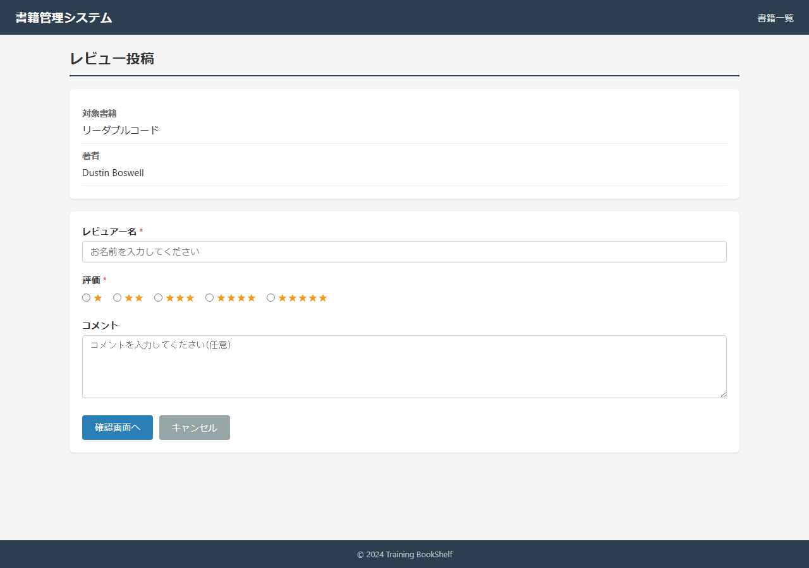 |
| 2 | レビュー入力し確認画面へ | reviewerName=結合テスト評者,rating=5 | BK12へ遷移・「投稿します」・入力値確認 | body確認 | OK | 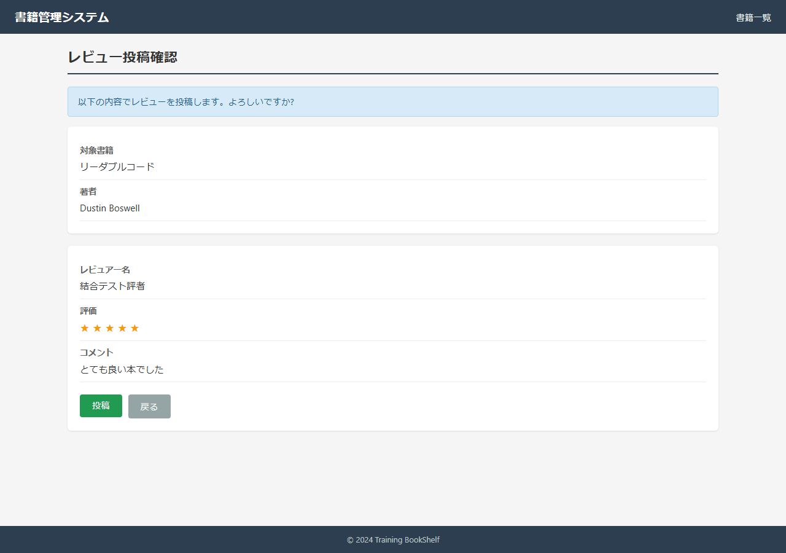 |
| 3 | 投稿ボタン押下 | - | BK13へ遷移・「投稿が完了」 | url=http://localhost:8080/books/1/reviews/complete | OK | 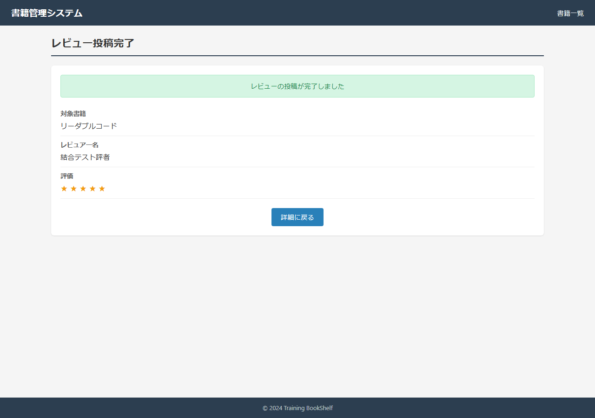 |
| 4 | 詳細に戻る押下 | - | BK02・投稿レビューが先頭表示・件数+1 | before=3 after=4 | OK | 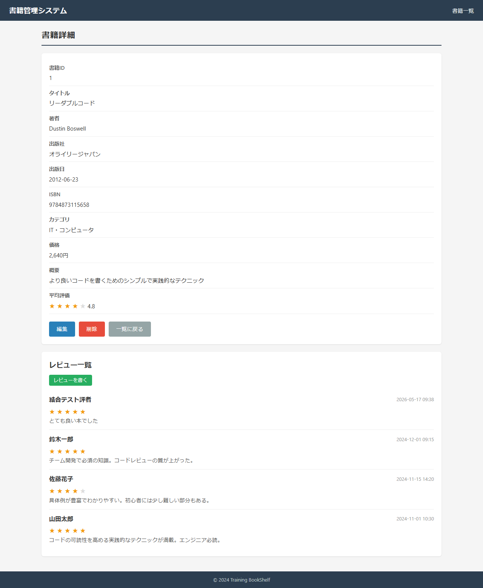 |

### スクリーンショット

---

## SC05-002: コメント未入力（任意）で投稿（観点: 境界値）
**判定: OK**
**前提条件**: book_id=1 が存在

| 手順No | 操作 | 入力値 | 期待結果 | 実際の結果 | 判定 | スクショ |
|--------|------|--------|---------|-----------|------|---------|
| 1 | レビュアー名・評価のみ入力(コメント空)で確認へ | comment=空 | BK12へ遷移・エラーなし | confirm=true | OK | 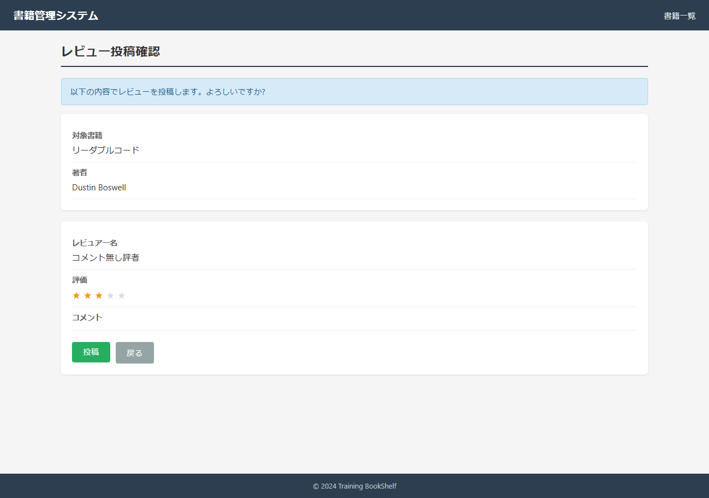 |
| 2 | 投稿ボタン押下 | - | BK13・「投稿が完了」・comment空で登録 | url=http://localhost:8080/books/1/reviews/complete | OK | 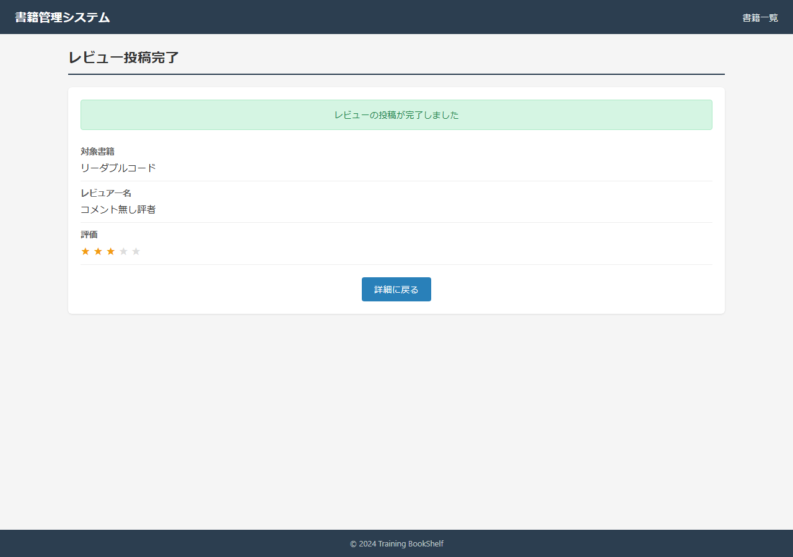 |

### スクリーンショット

---

## SC05-003: 確認画面から戻り入力値保持（観点: セッション）
**判定: OK**
**前提条件**: book_id=1 が存在

| 手順No | 操作 | 入力値 | 期待結果 | 実際の結果 | 判定 | スクショ |
|--------|------|--------|---------|-----------|------|---------|
| 1 | BK11入力し確認画面へ | reviewerName=保持評者,rating=4 | BK12へ遷移 | confirm=true | OK | 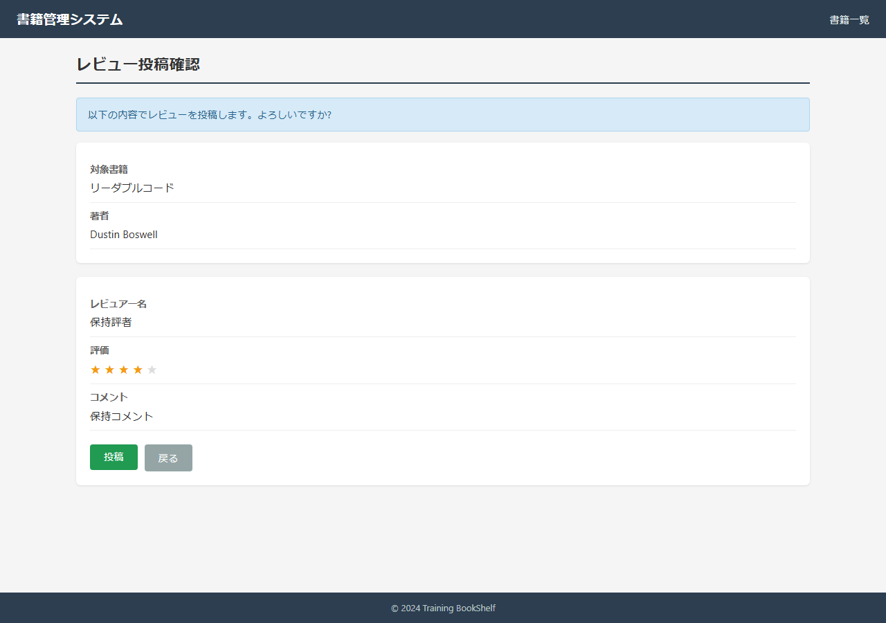 |
| 2 | BK12で戻る押下 | - | 入力値復元(保持評者/4/保持コメント) | name=保持評者,rating=4,comment=保持コメント | OK | 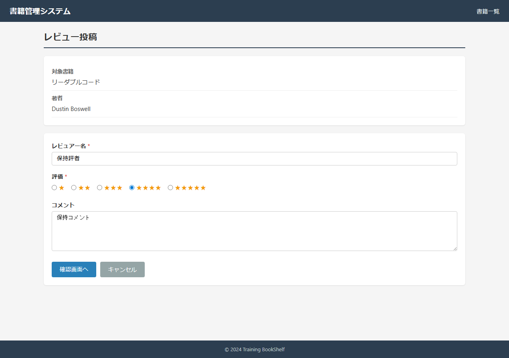 |

### スクリーンショット

---

## SC05-004: キャンセルで詳細へ戻りセッションクリア（観点: セッション）
**判定: OK**
**前提条件**: book_id=1 が存在

| 手順No | 操作 | 入力値 | 期待結果 | 実際の結果 | 判定 | スクショ |
|--------|------|--------|---------|-----------|------|---------|
| 1 | BK11で入力 | reviewerName=破棄評者,rating=1 | BK11入力状態 | set | OK | 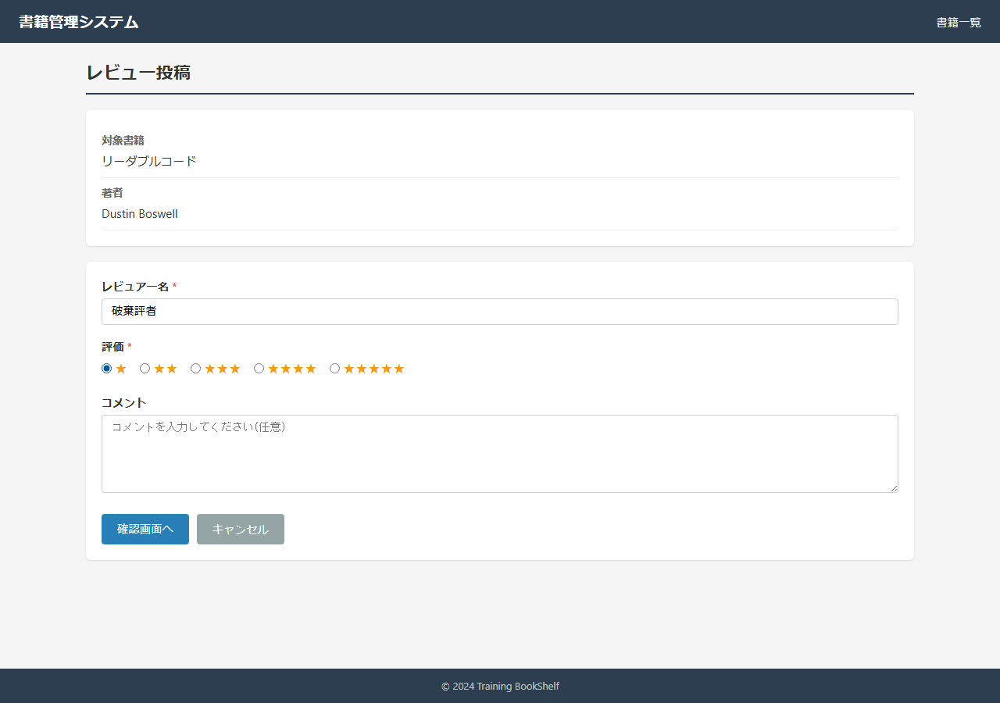 |
| 2 | キャンセル押下 | - | BK02(detail/1)へ遷移・未投稿 | url=http://localhost:8080/book/detail/1 | OK | 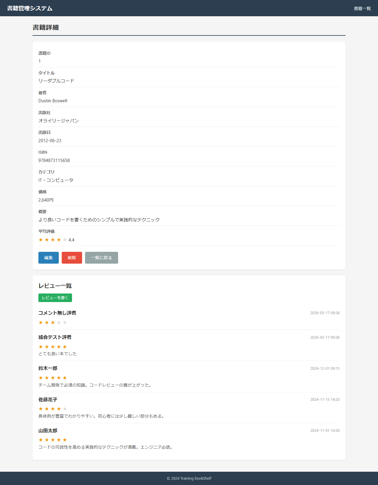 |
| 3 | 再度BK11表示 | - | フォームが空(セッションクリア) | name="" | OK |  |

### スクリーンショット

---

## SC05-005: 必須・桁数・範囲バリデーションエラー（観点: 異常系）
**判定: OK**
**前提条件**: book_id=1 が存在。BK11表示中

| 手順No | 操作 | 入力値 | 期待結果 | 実際の結果 | 判定 | スクショ |
|--------|------|--------|---------|-----------|------|---------|
| 1 | レビュアー名・評価空で確認画面へ | (空) | BK11に留まり必須エラー | stay=true | OK | 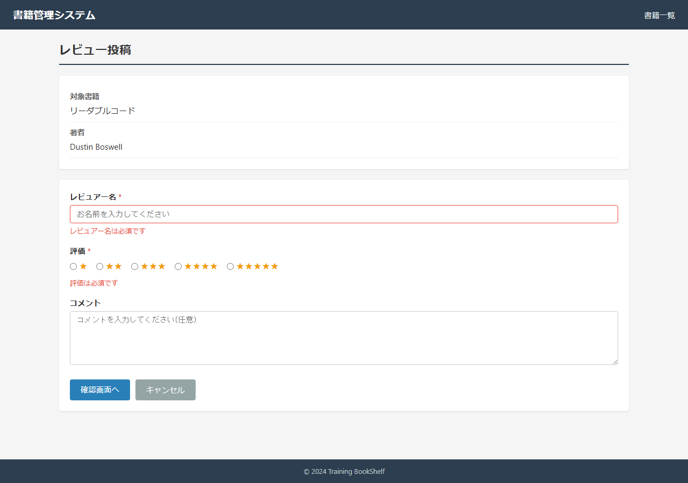 |
| 2 | レビュアー名51文字で送信 | reviewerName=51字 | maxlength=50で制限 or 文字数エラー | maxlength=50,実長=50,confirm=true | OK | 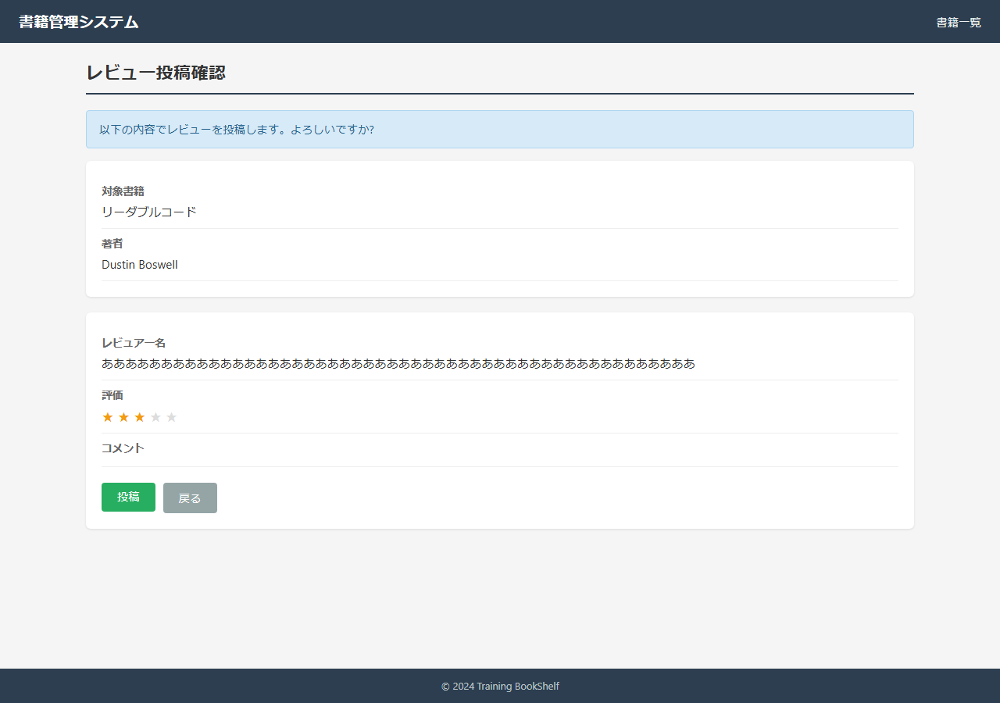 |
| 3 | レビュアー名50文字ちょうど | reviewerName=50字 | BK12へ遷移(許容) | confirm=true | OK |  |
| 4 | 評価の選択肢確認 | - | 評価は1〜5のみ(範囲外はUI選択不可で担保) | rating values=1,2,3,4,5 | OK | 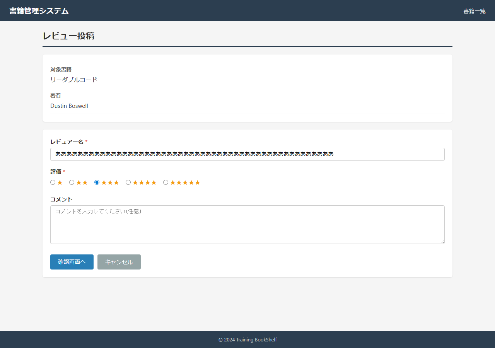 |

### スクリーンショット

---

## SC05-006: 存在しない書籍IDでレビュー入力アクセス（観点: 異常系）
**判定: OK**
**前提条件**: book_id=999999 は存在しない

| 手順No | 操作 | 入力値 | 期待結果 | 実際の結果 | 判定 | スクショ |
|--------|------|--------|---------|-----------|------|---------|
| 1 | BK11(/books/999999/reviews/new)アクセス | - | 一覧へリダイレクト/システムエラー表示 | url=http://localhost:8080/book/list;jsessionid=DD45E769417F396F4DCC717A8FA031ED | OK |  |

### スクリーンショット

---

## SC05-007: 確認画面 直接アクセス時のセッションガード（観点: セッション）
**判定: OK**
**前提条件**: セッションにレビュー入力値なし

| 手順No | 操作 | 入力値 | 期待結果 | 実際の結果 | 判定 | スクショ |
|--------|------|--------|---------|-----------|------|---------|
| 1 | BK12(/books/1/reviews/confirm)直接アクセス | - | BK11(/books/1/reviews/new)へリダイレクト | url=http://localhost:8080/books/1/reviews/new;jsessionid=D7B16A21CCB240706CA04D94852C6327 | OK |  |

### スクリーンショット

---

