# 結合テスト結果: SC06 一覧画面の検索・ソート・ページング

## 実施環境
| 項目 | 内容 |
|------|------|
| 実施日時 | 2026-05-17 00:39:22 |
| URL | http://localhost:8080 |
| データ | data.sql 投入済み（アプリ再起動で初期化） |
| 実行手段 | ローカルPlaywright(Chromium) / tools/ita-executor |

---

## SC06-001: 初期表示（デフォルトソート・ページング）（観点: 正常系）
**判定: OK**
**前提条件**: books 50件登録済み

| 手順No | 操作 | 入力値 | 期待結果 | 実際の結果 | 判定 | スクショ |
|--------|------|--------|---------|-----------|------|---------|
| 1 | BK01表示 | - | 1ページ20件・カテゴリ10option・3ページ | rows=20 opts=10 hasPage2=true | OK | 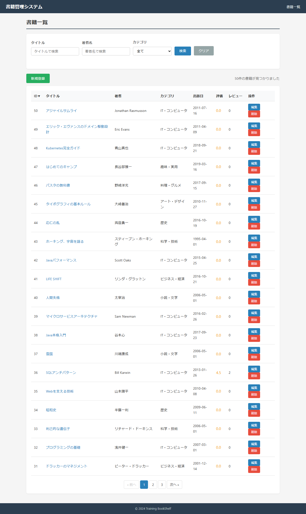 |
| 2 | デフォルトソート確認 | - | 書籍ID降順(先頭が最大ID付近) | firstHref=/book/detail/50;jsessionid=5C2087020C550822E6393E9F87DA8A8C | OK |  |

### スクリーンショット

---

## SC06-002: ページ遷移と最終ページ端数（観点: 境界値）
**判定: OK**
**前提条件**: books 50件(3ページ:20/20/10)

| 手順No | 操作 | 入力値 | 期待結果 | 実際の結果 | 判定 | スクショ |
|--------|------|--------|---------|-----------|------|---------|
| 1 | 2ページ目へ移動 | page=1 | 20件表示 | rows=20 | OK | 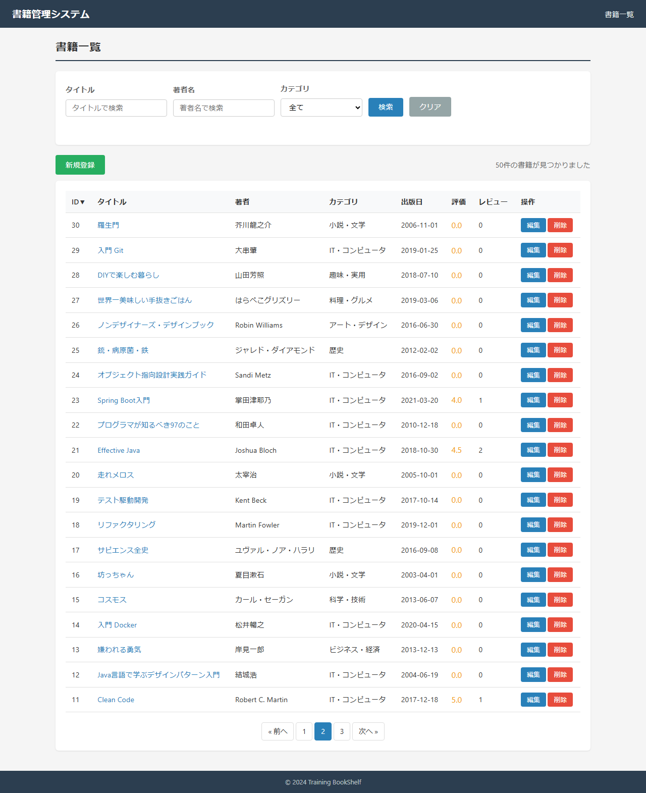 |
| 2 | 最終ページ(3ページ目) | page=2 | 残り10件(端数) | rows=10 | OK | 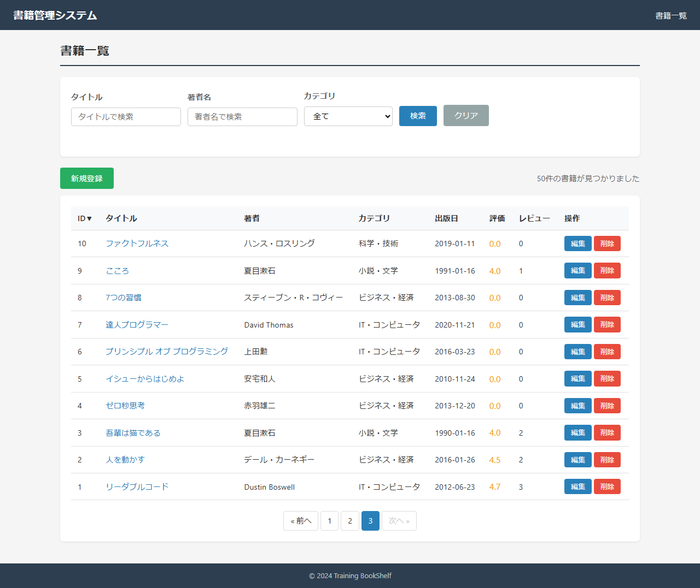 |
| 3 | 1ページ目に戻る | page=0 | 先頭20件 | rows=20 | OK |  |

### スクリーンショット

---

## SC06-003: タイトル部分一致検索（観点: 正常系）
**判定: OK**
**前提条件**: タイトルにJavaを含む書籍が存在

| 手順No | 操作 | 入力値 | 期待結果 | 実際の結果 | 判定 | スクショ |
|--------|------|--------|---------|-----------|------|---------|
| 1 | タイトル「Java」で検索 | searchTitle=Java | Java含む書籍のみ・件数メッセージ | rows=4 | OK |  |

### スクリーンショット

---

## SC06-004: 著者部分一致＋カテゴリ完全一致 複合検索（観点: 正常系）
**判定: OK**
**前提条件**: 夏目漱石×小説・文学が存在

| 手順No | 操作 | 入力値 | 期待結果 | 実際の結果 | 判定 | スクショ |
|--------|------|--------|---------|-----------|------|---------|
| 1 | 著者「夏目」+カテゴリ「小説・文学」 | searchAuthor=夏目,cat=1 | 該当書籍のみ(3件) | rows=3 | OK | 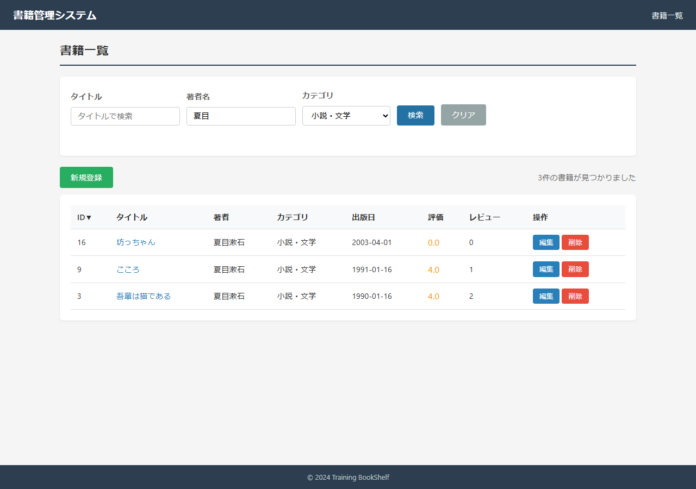 |
| 2 | カテゴリのみ「IT・コンピュータ」 | cat=3 | カテゴリ3の書籍のみ(1ページ20件表示) | rows=20 | OK | 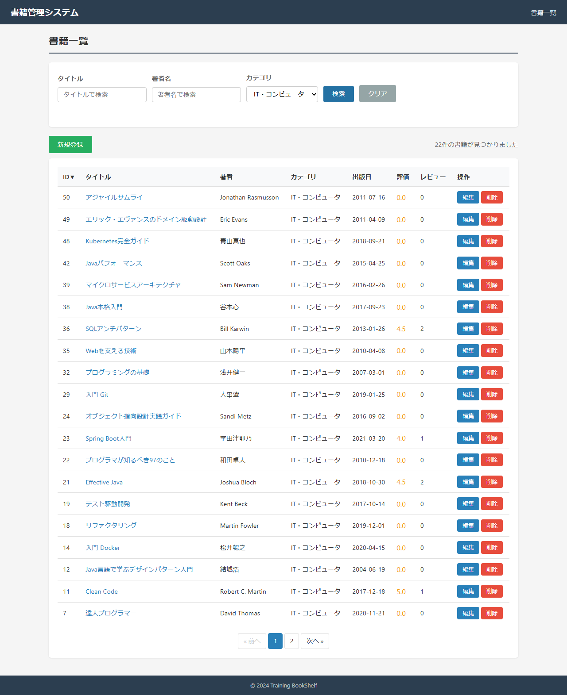 |

### スクリーンショット

---

## SC06-005: 検索結果0件（観点: 境界値）
**判定: OK**
**前提条件**: 該当しない検索語

| 手順No | 操作 | 入力値 | 期待結果 | 実際の結果 | 判定 | スクショ |
|--------|------|--------|---------|-----------|------|---------|
| 1 | 該当なし文字列で検索 | searchTitle=ZZZNOHIT999 | 0件・nodataメッセージ・エラーなし | rows=0 | OK |  |

### スクリーンショット

---

## SC06-006: クリアボタンで検索条件リセット（観点: セッション）
**判定: OK**
**前提条件**: 直前に検索条件入力済み

| 手順No | 操作 | 入力値 | 期待結果 | 実際の結果 | 判定 | スクショ |
|--------|------|--------|---------|-----------|------|---------|
| 1 | タイトルJavaで検索 | searchTitle=Java | 絞り込み表示 | rows=4 | OK | 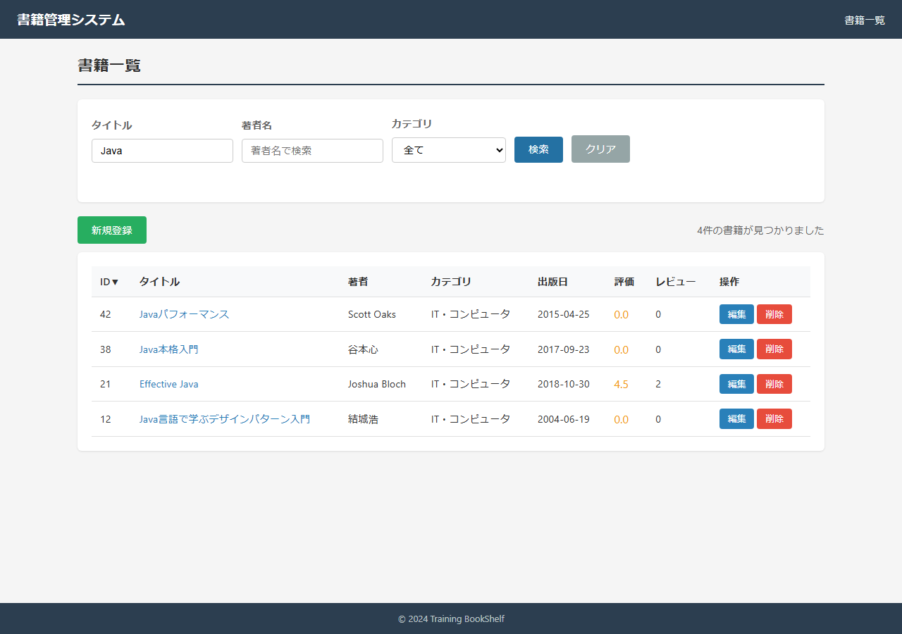 |
| 2 | クリアボタン押下 | - | 条件空・全件再表示(20件) | searchTitle="" rows=20 | OK |  |

### スクリーンショット

---

## SC06-007: ソート切替（昇順/降順トグル）（観点: 正常系）
**判定: OK**
**前提条件**: books 複数件

| 手順No | 操作 | 入力値 | 期待結果 | 実際の結果 | 判定 | スクショ |
|--------|------|--------|---------|-----------|------|---------|
| 1 | タイトル昇順ソート | sort=title&order=ASC | タイトル昇順で表示 | 先頭=7つの習慣 | OK | 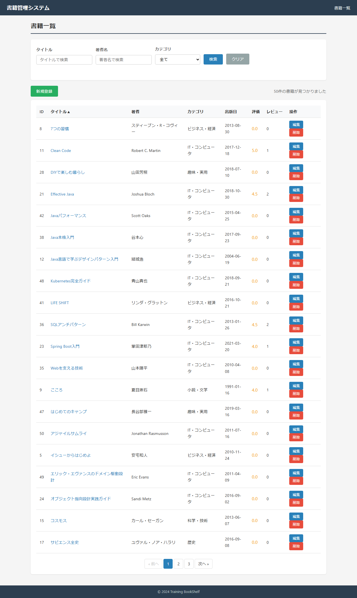 |
| 2 | タイトル降順に切替 | sort=title&order=DESC | 昇順と降順で先頭が変化 | 昇順先頭=7つの習慣 降順先頭=雪国 | OK | 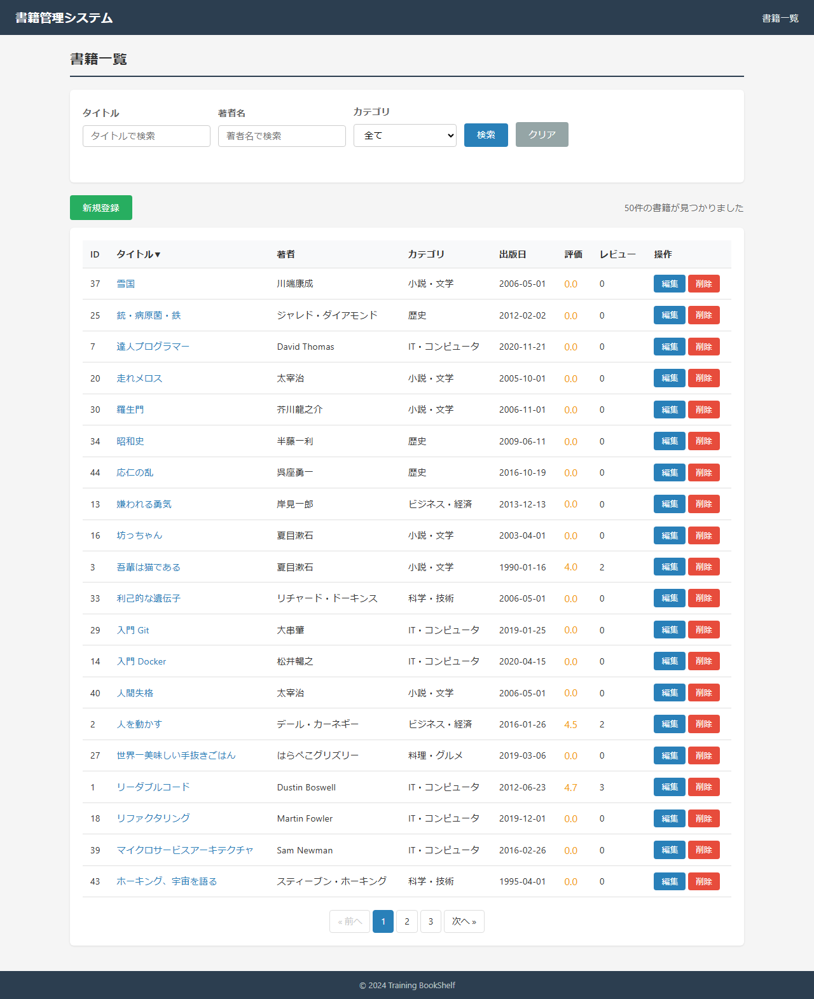 |
| 3 | 平均評価でソート | sort=avgRating | ソート動作(20件表示) | rows=20 | OK |  |

### スクリーンショット

---

## SC06-008: 検索条件維持したままソート・ページング（観点: 状態遷移）
**判定: OK**
**前提条件**: category_id=3 が21件以上

| 手順No | 操作 | 入力値 | 期待結果 | 実際の結果 | 判定 | スクショ |
|--------|------|--------|---------|-----------|------|---------|
| 1 | カテゴリ「IT・コンピュータ」で検索 | cat=3 | 絞り込み結果(22件→1ページ20件) | rows=20 | OK |  |
| 2 | タイトル列でソート | sort=title | 検索条件(cat=3)維持しソート | cat維持=3 | OK | 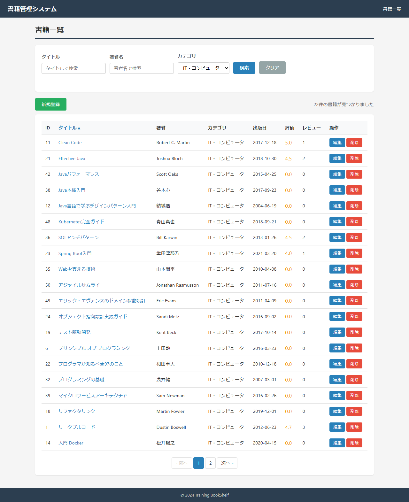 |
| 3 | 2ページ目へ移動 | page=1 | 検索条件・ソート維持し2ページ目(残り2件) | rows=2 cat=3 | OK | 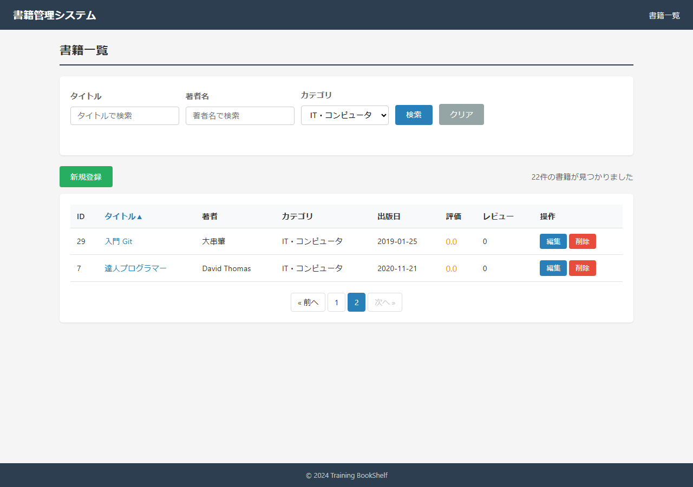 |

### スクリーンショット

---

## SC06-009: 書籍0件時の表示（観点: 境界値）
**判定: OK**
**前提条件**: 0件状態(検索0件で代替)

| 手順No | 操作 | 入力値 | 期待結果 | 実際の結果 | 判定 | スクショ |
|--------|------|--------|---------|-----------|------|---------|
| 1 | 0件相当の検索(代替実施) | searchTitle=ZZZNOHIT000 | nodataメッセージ・エラーなし・新規登録操作可 | rows=0 createBtn=1 | OK | 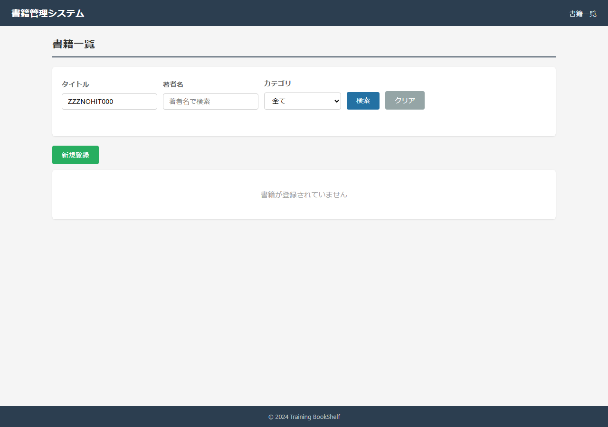 |

### スクリーンショット

---

