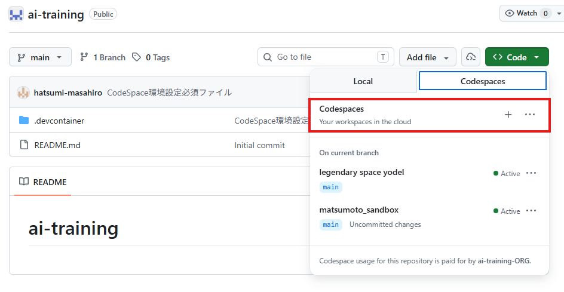
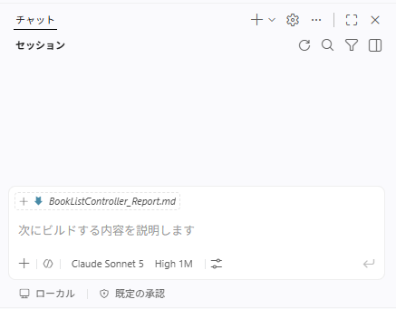
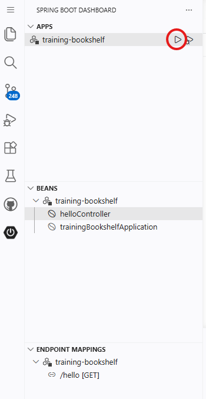
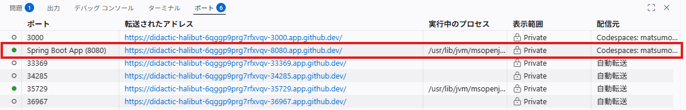

> **VS-CodeでMDを開いてCTRL+SHIFT+Vでプレビュー表示できます。**

# 02. 環境確認　9:30-10:00
> 先に [99.トレサポ.md](./99.トレサポ.md) の説明を実施する事

## 1. 実行環境の説明

## 2. GithubCodespacesに接続
[GithubCodespacesのURL](https://github.com/ai-training-ORG/ai-training) にアクセスする

## 3. VS Codeの起動
リポジトリを選んで起動させる

## 4. VS Codeへ資材配置

- ダウンロードした教材に特定フォルダをVSCode上にコピー

- javaプロジェクトのインポートを押下

## 5. GithubCopilotの起動

step1: サインイン確認  
- VS Code 右下のステータスバーにある Copilot アイコン（下図 丸部分 ）をクリックする  
- サインインしていない場合は「Sign in to use Copilot」を選択し、GitHub アカウントでサインインする  

step2: モデル設定  
- Copilot チャットパネルを開く（左アクティビティバーの Copilot アイコン、または `Ctrl+Alt+I`）  
- チャット入力欄下部に表示されているモデル選択ボタン（下図 四角部分 ）をクリックする  
- 「**Claude Sonnet 5**」を選択する（ワンクリックで選択肢に出ない場合は「その他のモデル」から探してください）
- チャット入力欄下部の思考量を「**High**」に設定する（デフォルトhighのままなので、そのまま変更しない）  

step3: Hello Copilot! と話しかける  

## 6. ApplicationServer起動
- サイドバーからSpringアイコンを選択
- training-bookshelfの起動ボタンを押下

サーバー起動の画面イメージ

- ローカルPCのブラウザで起動したサーバーのURLを入力して、「Hello, World!」が表示されることを確認する

**URLについて**  
GithubCodespaceで起動したアプリは、自動的に別URLに解決された状態で公開される。
以下コマンドでポートビューを開き、解決されたURLを確認しURL末尾に"/hello"を追加してアクセスしてください。
`Ctrl+Shift+P → Ports: Focus on Ports View`

URL例：https://didactic-halibut-6qggp9prg7rfxvqv-8080.app.github.dev/hello

ポートビューの画面イメージ

※ GithubCodespacesから本ファイルを開いて、以下リンクをクリックしてもブラウザ起動してもURL確認が可能
　http://localhost:8080/

> **注意（GitHub Codespaces 利用時）**  
> Spring Boot Dashboard のアイコンが表示されない／機能しない場合があります。  
> その際は以下のコマンドで解消する可能性があります。  
> `Ctrl+Shift+P` → `Spring Boot Dashboard: Refresh`
> コマンド起動する場合は以下手順を実施 

> **ApplicationServer起動（コマンドVer）**  
>- terminal起動
>- `cd training-bookshelf`
>- `chmod +x ./mvnw`
>- `mvn spring-boot:run` を実行
>- ローカルPCのブラウザで起動したサーバのURLを入力して、「Hello, World!」が表示されることを確認する

## 7. クロージング
ここまでで環境確認は完了です  
トレサポアプリの状態を更新してください  
