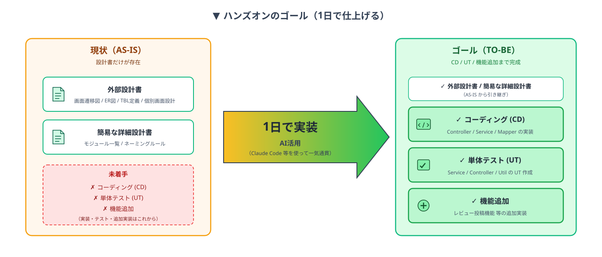
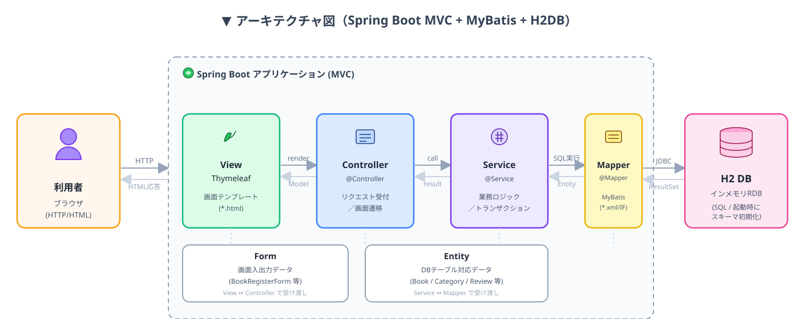
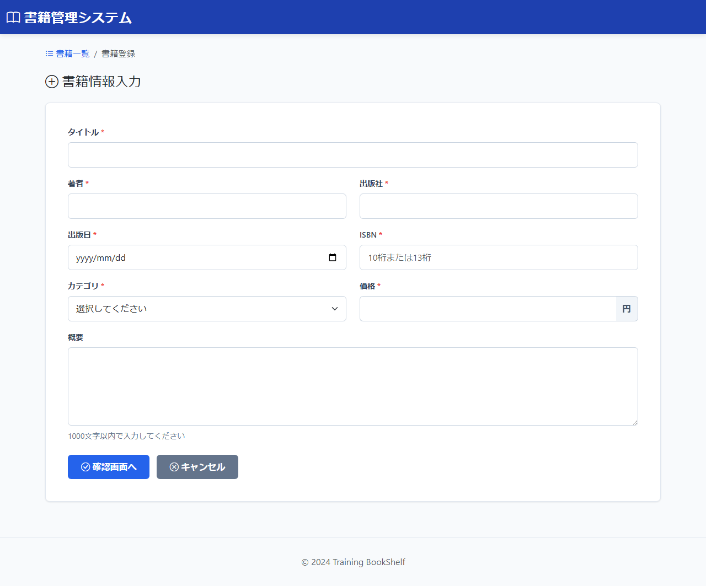
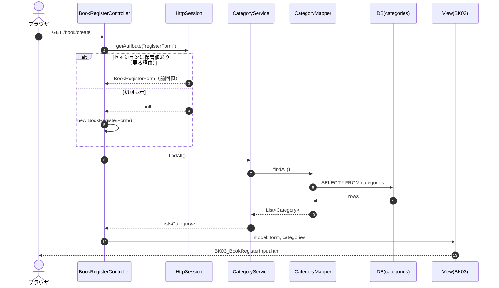
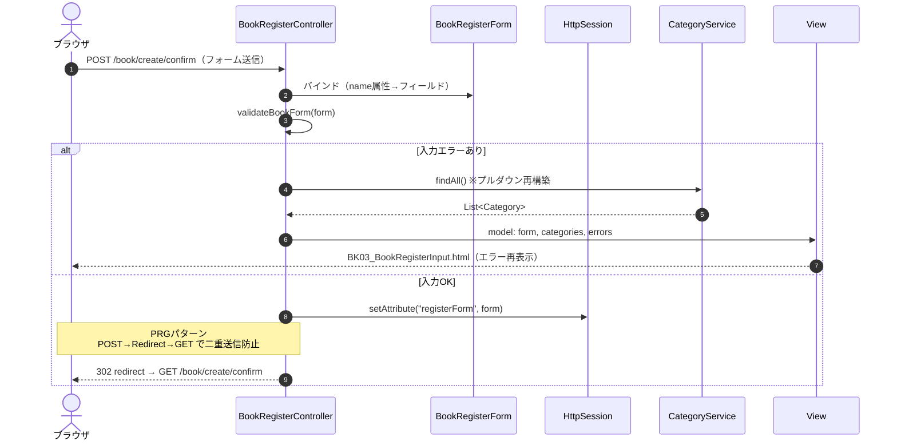
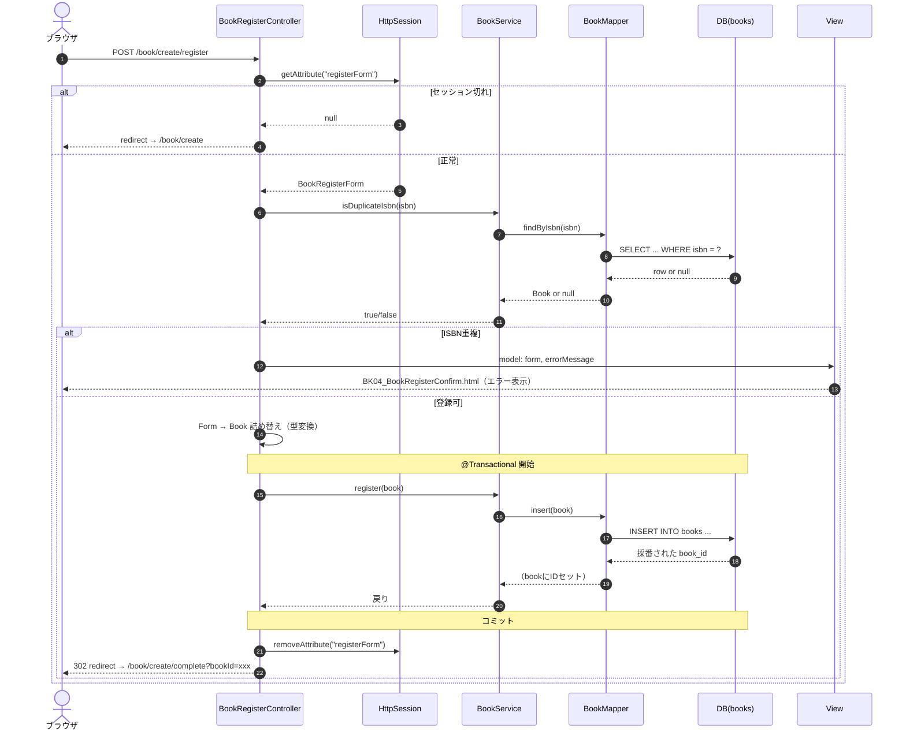

# 03.資材説明　10:00-10:30

## ターゲットのシステムについて

### 1.ハンズオンのゴール
現状は設計書と簡易な詳細設計書だけが存在してる、ここからCD/UTアップ・機能追加までを１日で仕上げる



### 2.アプリの内容
- 書籍管理システムについて  
開発対象のアプリは書籍を管理する社内システムです。  
書籍の登録、編集、削除、レビュー投稿などの機能があります


- 設計書について
主要な外部設計書は以下の通りです。
  - [画面一覧・遷移図](../Docsシステム/外部設計/02画面遷移図.md)
  - [ER図](../Docsシステム/外部設計/03ER図.md)
  - [テーブル定義](../Docsシステム/外部設計/04TBL定義.md)


> **ここで設計書確認タイムを設ける(10分)**

### 3.アーキテクチャ

- 研修では、下記のアーキテクチャを対象に、AIを活用した機能追加を行う



### 4.出来上がりソースのイメージ
AIが生成したコードを見たり・動かしたりする事が必要になります。
以下、書籍登録機能（BK03〜BK05）を例に、各レイヤーのサンプルを示します。

> **構成**
> `View(Thymeleaf)` ⇔ `Form` ⇔ `Controller` ⇔ `Service` ⇔ `Mapper(MyBatis)` ⇔ `DB`

---

#### 4-1. Controller（書籍登録コントローラー）

リクエストを受け取り、入力チェック → Service呼び出し → 画面遷移までを担当する。

対象画面：[BK03 書籍登録入力画面](../Docsシステム/外部設計/05個別画面設計/05個別画面設計_BK03_書籍登録入力画面.md)



```java
@Controller                       // ★ Spring MVCのコントローラーとして登録
@RequiredArgsConstructor          // ★ finalフィールドをコンストラクタインジェクション(Lombok)
@Slf4j
public class BookRegisterController {

  // ★ DIされるサービス。ロジックは Controller に書かず Service に委譲する
  private final BookService bookService;
  private final CategoryService categoryService;

  private static final String SESSION_REGISTER_FORM = "registerForm";

  /** BK03: 入力画面を表示（GET） */
  @GetMapping("/book/create")
  public String newForm(HttpSession session, Model model) {
    // ★ 確認画面から「戻る」ときの再表示用に、セッション保管値があれば復元
    BookRegisterForm form = (BookRegisterForm) session.getAttribute(SESSION_REGISTER_FORM);
    if (form == null) {
      form = new BookRegisterForm();
    }
    model.addAttribute("form", form);
    model.addAttribute("categories", categoryService.findAll()); // カテゴリのプルダウンリスト表示用
    return "book/BK03_BookRegisterInput";   // ★ 戻り値 = テンプレート名(Thymeleaf)
  }

  /** BK03→BK04: 入力チェック後、確認画面へリダイレクト（POST） */
  @PostMapping("/book/create/confirm")
  public String confirmRegister(BookRegisterForm form, HttpSession session, Model model) {
    // ★ 入力チェック：エラーがあれば入力画面に戻して再表示
    Map<String, String> errors = validateBookForm(form);
    if (!errors.isEmpty()) {
      model.addAttribute("form", form);
      model.addAttribute("categories", categoryService.findAll());
      model.addAttribute("errors", errors);
      return "book/BK03_BookRegisterInput";
    }
    // ★ 確認画面間でフォーム値を保持するためセッションに格納
    session.setAttribute(SESSION_REGISTER_FORM, form);
    // ★ PRGパターン（POST→Redirect→GET）でリロード時の二重送信を防止
    return "redirect:/book/create/confirm";
  }

  /** BK04: 登録実行（POST） */
  @PostMapping("/book/create/register")
  public String register(HttpSession session, Model model, RedirectAttributes ra) {
    BookRegisterForm form = (BookRegisterForm) session.getAttribute(SESSION_REGISTER_FORM);
    if (form == null) return "redirect:/book/create"; // セッション切れ対応

    // ★ 業務チェック（ISBN重複）はService経由でDB確認
    if (bookService.isDuplicateIsbn(form.getIsbn())) {
      model.addAttribute("errorMessage", MessageUtil.getMessage("validation.duplicate.isbn"));
      return "book/BK04_BookRegisterConfirm";
    }

    // ★ Form → Entity への詰め替え（型変換もここで実施）
    Book book = new Book();
    book.setTitle(form.getTitle());
    book.setIsbn(form.getIsbn());
    book.setPublishedDate(LocalDate.parse(form.getPublishedDate()));
    book.setPrice(Integer.parseInt(form.getPrice()));
    /* ...他項目セット... */

    bookService.register(book);                           // ★ Service呼び出し
    session.removeAttribute(SESSION_REGISTER_FORM);       // 登録完了後はセッション破棄
    return "redirect:/book/create/complete?bookId=" + book.getBookId();
  }
}
```

**ポイント**
- `@Controller` + `@GetMapping/@PostMapping` でURLとメソッドを紐づける
- 業務ロジックは書かず、**Service に委譲**するのが原則
- 入力チェックでエラー時は同じ画面に戻し、`Model` でフォーム値とエラーを渡す
- POST後は **`redirect:` でPRGパターン**にし、二重送信を防ぐ

---

#### 4-2. Form（画面項目とのバインド用クラス）

HTMLの `<input name="...">` と1:1で対応する、画面入力値を運ぶためのDTO。

```java
@Data   // ★ Lombokでgetter/setter/toString等を自動生成
public class BookRegisterForm {
  // ★ 画面の <input name="title"> と同じフィールド名でバインドされる
  private String title;
  private String author;
  private String publisher;
  // ★ 入力値はまずStringで受け取り、業務型(LocalDate/Integer)への変換はController/Serviceで行う
  private String publishedDate;
  private String isbn;
  private Integer categoryId;     // <select> で数値を直接受ける場合は数値型でOK
  private String price;
  private String description;
}
```

**ポイント**
- フィールド名 = HTML name属性 = Thymeleaf `${form.xxx}` で完全に対応
- **入力時点では `String` で受ける**ことで、型不一致でも入力画面に値を戻せる
- Entity（DB側）とは別物。混ぜない

---

#### 4-3. Service（業務ロジック層）

Controller から呼ばれ、トランザクション境界となる。Mapper を組み合わせて1つの業務単位を作る。

```java
@Service                        // ★ Spring の Service Bean として登録
@RequiredArgsConstructor
public class BookService {

  private final BookMapper bookMapper;   // ★ Mapper をDI

  /** ISBN重複チェック（業務的にユニーク制約をDBで確認） */
  public boolean isDuplicateIsbn(String isbn) {
    return bookMapper.findByIsbn(isbn) != null;
  }

  /** 書籍を登録する */
  @Transactional                 // ★ 例外発生時は自動ロールバック
  public void register(Book book) {
    bookMapper.insert(book);     // INSERT後、@Optionsで採番されたIDがbookに格納される
  }

  /** 書籍を更新する（楽観的ロック対応） */
  @Transactional
  public int update(Book book) {
    // ★ 戻り値が0なら他ユーザーが先に更新済み → Controllerで競合エラーとして扱う
    return bookMapper.update(book);
  }
}
```

**ポイント**
- `@Service` を付与し、**Mapper はコンストラクタインジェクション**で受け取る
- 更新系メソッドには `@Transactional` を付け、**例外時の整合性を確保**
- 一覧取得など複数Mapperにまたがる処理はここで組み立てる
- Controller側で `int` の戻り値（更新件数）を見て **楽観的ロック競合を判定**

---

#### 4-4. Mapper（DBアクセス層 / MyBatis）

SQL を直接書く層。単純なものは `@Select`/`@Insert` 等のアノテーション、動的SQLが必要なものは XML で記述する。

##### Mapper Interface（アノテーション方式）

```java
@Mapper                          // ★ MyBatis のMapperとしてスキャン対象
public interface BookMapper {

  /** ★ アノテーション方式：単純なSQLはここに直接書ける */
  @Select("""
      SELECT b.book_id, b.title, b.author, /* ... */, c.category_name
      FROM books b
      INNER JOIN categories c ON b.category_id = c.category_id
      WHERE b.book_id = #{bookId}
      """)
  Book findById(Integer bookId);

  /** INSERT後、自動採番されたIDをEntityに戻す */
  @Insert("""
      INSERT INTO books (title, author, isbn, /* ... */, created_at, updated_at)
      VALUES (#{title}, #{author}, #{isbn}, /* ... */, CURRENT_TIMESTAMP, CURRENT_TIMESTAMP)
      """)
  @Options(useGeneratedKeys = true, keyProperty = "bookId")  // ★ AUTO_INCREMENTのIDを取得
  void insert(Book book);

  /** ★ 楽観的ロック：updated_at が一致するときだけ更新（戻り値=更新件数） */
  @Update("""
      UPDATE books SET title=#{title}, /* ... */, updated_at=CURRENT_TIMESTAMP
      WHERE book_id=#{bookId} AND updated_at=#{updatedAt}
      """)
  int update(Book book);

  /** ★ XML方式：動的SQLが必要なメソッドはアノテーションを書かず、XML側に定義する */
  List<Book> findAll(
      @Param("searchTitle") String searchTitle,
      @Param("searchAuthor") String searchAuthor,
      @Param("searchCategoryId") Integer searchCategoryId,
      @Param("sortColumn") String sortColumn,
      @Param("sortOrder") String sortOrder,
      @Param("limit") int limit,
      @Param("offset") int offset);
}
```

##### Mapper XML（動的SQL方式）

`src/main/resources/jp/co/skig/training/bookshelf/mapper/BookMapper.xml`
（**Interfaceと同じパッケージ階層**にXMLを配置するのがMyBatisの規約）

```xml
<mapper namespace="jp.co.skig.training.bookshelf.mapper.BookMapper">
  <!-- ★ id="findAll" は Interface のメソッド名と一致させる -->
  <select id="findAll" resultType="jp.co.skig.training.bookshelf.entity.Book">
    SELECT b.book_id, b.title, /* ... */,
           COALESCE(AVG(r.rating), 0) AS avg_rating,
           COUNT(r.review_id)         AS review_count
    FROM books b
    INNER JOIN categories c ON b.category_id = c.category_id
    LEFT  JOIN reviews    r ON b.book_id = r.book_id
    <where>
      <!-- ★ 検索条件があるときだけWHERE句を追加（動的SQLの定番パターン） -->
      <if test="searchTitle != null and searchTitle != ''">
        AND b.title LIKE CONCAT('%', #{searchTitle}, '%')
      </if>
      <if test="searchCategoryId != null">
        AND b.category_id = #{searchCategoryId}
      </if>
    </where>
    GROUP BY b.book_id, /* ... */
    <!-- ★ ソート列はホワイトリスト方式：SQLインジェクション対策で choose で限定 -->
    <choose>
      <when test="sortColumn == 'title'">       ORDER BY b.title ${sortOrder} </when>
      <when test="sortColumn == 'avgRating'">   ORDER BY avg_rating ${sortOrder}</when>
      <otherwise>                                ORDER BY b.book_id DESC          </otherwise>
    </choose>
    LIMIT #{limit} OFFSET #{offset}
  </select>
</mapper>
```

**ポイント**
- `#{xxx}` は **プレースホルダ（バインド変数）** で SQLインジェクション安全
- `${xxx}` は **文字列置換**。ソート列など限定的な箇所のみで使い、必ず**ホワイトリストで検証**
- `<if>` `<where>` `<choose>` で動的SQLを構築
- 楽観的ロックは `WHERE updated_at = #{updatedAt}` で実現し、戻り値（更新件数）で判定

---

#### 4-5. View（Thymeleafテンプレート）

`src/main/resources/templates/book/BK03_BookRegisterInput.html`

```html
<!DOCTYPE html>
<!-- ★ xmlns:th を宣言することで th:* 属性が使える -->
<html xmlns:th="http://www.thymeleaf.org">
<head>
  <meta charset="UTF-8">
  <title>書籍登録</title>
  <!-- ★ @{...} はコンテキストパスを補完するURL記法 -->
  <link rel="stylesheet" th:href="@{/css/style.css}">
</head>
<body>
  <h2>書籍登録</h2>

  <!-- ★ th:action でPOST先URLを指定 -->
  <form th:action="@{/book/create/confirm}" method="post">

    <div class="form-group">
      <label for="title">タイトル</label>
      <!-- ★ name属性 = Form のフィールド名と一致させる -->
      <!-- ★ th:value で再表示時に入力値を復元 -->
      <input type="text" id="title" name="title" th:value="${form.title}" maxlength="100"
             th:classappend="${errors != null && errors.containsKey('title')} ? 'has-error'">
      <!-- ★ エラーがあるときだけ表示（th:if） -->
      <div class="error-message"
           th:if="${errors != null && errors.containsKey('title')}"
           th:text="${errors.get('title')}"></div>
    </div>

    <div class="form-group">
      <label for="categoryId">カテゴリ</label>
      <select id="categoryId" name="categoryId">
        <option value="">-- 選択してください --</option>
        <!-- ★ th:each でリストをループしてoptionを生成 -->
        <option th:each="cat : ${categories}"
                th:value="${cat.categoryId}"
                th:text="${cat.categoryName}"
                th:selected="${form.categoryId != null && form.categoryId == cat.categoryId}">
        </option>
      </select>
    </div>

    <div class="btn-group">
      <button type="submit" class="btn btn-primary">確認画面へ</button>
      <a th:href="@{/book/create/cancel}" class="btn btn-secondary">キャンセル</a>
    </div>
  </form>
</body>
</html>
```

**ポイント**
- `th:value="${form.title}"` で **Form の値を再表示**（バリデーションエラー時の入力保持に必須）
- `name` 属性は **Form のフィールド名と完全一致**させる（自動バインドの条件）
- `th:if` `th:each` `th:classappend` で **条件表示・繰り返し・動的class** を実現
- URLは必ず `@{...}` で書き、コンテキストパス変更に追従させる

---

#### 4-6. シーケンス図（エンドポイント別）

§4-1 で示した3つのエンドポイントの処理フローを示す。

##### ① `GET /book/create` ― 入力画面表示（BK03）



---

##### ② `POST /book/create/confirm` ― 入力チェック→確認画面へ（BK03→BK04）



---

##### ③ `POST /book/create/register` ― 登録実行（BK04→BK05）



---

#### 4-7. レイヤー間のデータの流れ（まとめ）

```
[ブラウザ]
    │  HTMLフォームPOST (name=title など)
    ▼
[View: BK03_BookRegisterInput.html] -- 値の表示／入力
    │
    ▼
[Form: BookRegisterForm]            -- 画面項目を受け取るDTO
    │
    ▼
[Controller: BookRegisterController]-- 入力チェック・遷移制御
    │
    ▼
[Service: BookService]              -- 業務ロジック・トランザクション
    │
    ▼
[Mapper: BookMapper(.xml)]          -- SQL発行
    │
    ▼
[DB: books / categories / reviews]
```

**ここで手洗い休憩(10分)**