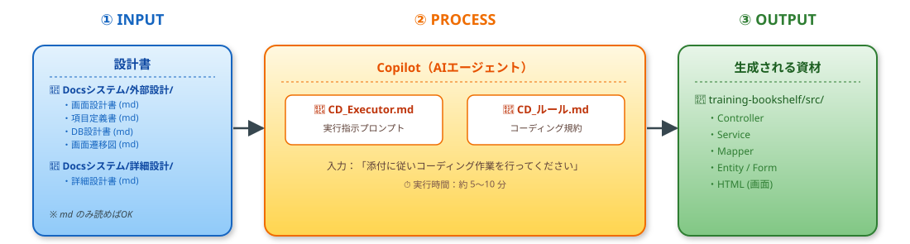
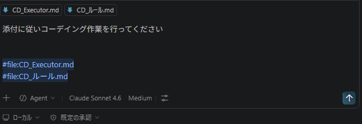

# 4. コーディング   11:00–12:30

## (1)　全体の流れ
- コーディング作業の流れを下図に示す


## (２)　コーディングプロンプトの説明
中核を担うCD_Executor.mdとCD_ルール.mdの説明を行う。  
今回のシステムであればこのぐらいの内容で十分対応可能。  
大規模・複雑なアプリの場合ももう少しルールを厳密化して適用するサンプルを増やすと良い  

- [CD_Executor.md](../prompt/01.CD/CD_Executor.md)（クリックで最新の内容を表示）

```markdown
# コーディング実行プロンプト

## アプリアーキ
- **バックエンド**: Spring Boot 3.5.8 (Java 21)
- **テンプレートエンジン**: Thymeleaf
- **データアクセス**: MyBatis
- **データベース**: H2 Database (開発環境)、MySQL 8.x (本番環境)
- **ビルドツール**: Maven
- **その他**: Lombok, Spring Boot DevTools

## 実行プロセス
- `Docsシステム/外部設計` 配下にある設計書(mdのみ読めばよい)
- `Docsシステム/外部設計/05個別画面設計/html` Thymeleafのテンプレートを作成する際は設計MockHTMLを参考
- `Docsシステム/詳細設計` 配下にある詳細設計書  
  両ドキュメントを元にCDを行って欲しい
- コーディングルールについては、CDルール.mdを参照すること

## 結果(output)
- src配下に格納する事。
- 最後にmvnコマンドを使用してビルドエラーが無い事を確認する。
　エラーがある場合は内容を確認して修正を試みる
- テストクラスの作成は行わなくて良い
```

- [CD_ルール.md](../prompt/01.CD/CD_ルール.md)（クリックで最新の内容を表示）

```markdown
# CDルール
このドキュメントでは、CD（コーディング実行）を行う際のルールや手順について説明します。

# クラス名・メソッド名
モジュール一覧.mdに記載されているクラス名・メソッド名を遵守してください。

# Sample処理
サンプルコードを下記にコンポーネント種類別に用意しています。  
実装パターンを参考にするとともに、クラスヘッダーやメソッドヘッダーのコメントの書きっぷりも参考にしてください  

## Controllerのサンプルコード :

```java
/**
 * 書籍削除コントローラー（BK09-BK10）
 */
@Controller
@RequiredArgsConstructor
@Slf4j
public class BookDeleteController {

  private final BookService bookService;

  // ========================================
  // BK09: 書籍削除確認画面
  // ========================================

  /**
   * 書籍削除確認画面を表示
   */
  @GetMapping("/book/delete/confirm/{bookId}")
  public String confirmDelete(@PathVariable Integer bookId, Model model) {
    Book book = bookService.findById(bookId);
    if (book == null) {
      model.addAttribute("errorMessage", MessageUtil.getMessage("error.notfound.book"));
      model.addAttribute("redirectUrl", "/book/list");
      return "book/error";
    }
    ...（以下略）

```
```

---

## (３)　コーディング作業
### 1. Copilotへ指示
- Copilotのチャットを開く
- ファイルを２つ添付する(#と入力するとファイルを添付できる、CD_ルール.mdとCD_Executor.md)
- チャット欄に添付に従いコーディング作業を行ってくださいと入力して実行する
- training-bookshelfの下にファイルが出来上がっていきます。
- 作成まで待つ(状況見て空いてる時間にAIの超基礎を説明)


   


## (４)　資材確認 
  - コーディングアウトプット資材の確認
    - src配下に格納されていること
      - controller, service, mapper, entity, formのコードを確認する  
      　 - 確認の仕方は設計書を見てもらいつつ、1イベント:Controller -> Service -> Mapper -> Entity -> html で追ってもらうと良い

  - 動作確認
    - 画面遷移図に従ってブラウザで画面を確認してもらう
      →URL末尾「/book/list」にて書籍一覧画面が表示

