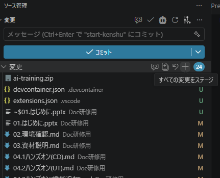
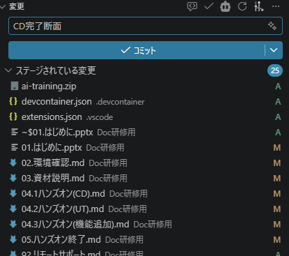
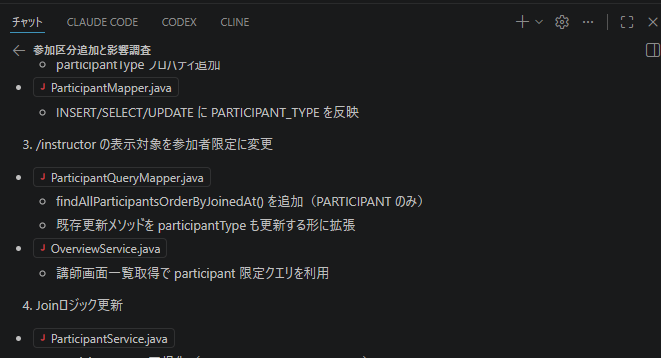
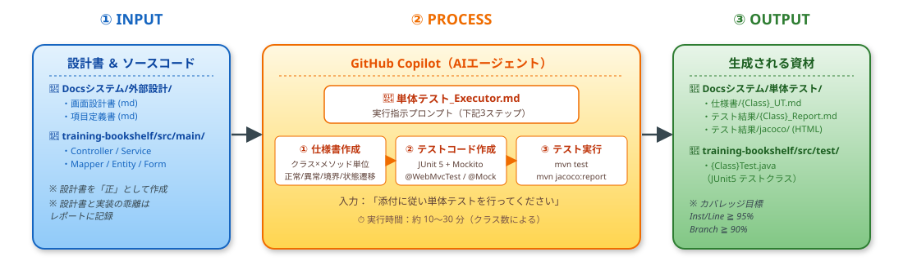
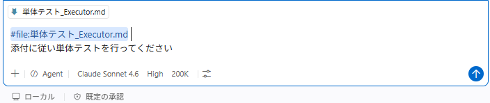

# 5. 単体テスト作業 13:30–14:30

> ⚠ **作業に入る前に一旦ここで Git Commit してください**（ロールバックポイント出来るように）  

1.全ての変更をステージング  
変更

2.コミット
コミットメッセージを適当に書いてコミットする


> １つのテーマ完了ごとにセッションは新しく開始することを推奨します（token使用量抑止・ノイズ除去）
右上の＋ボタンで新しいチャットを起こす



## (1)　単体テストの流れ説明
- 単体テスト作業の流れを下図に示す


  ① INPUT：設計書（外部設計の md）と CD 工程で作った Java ソースが入力。設計書を「正」とし、実装と乖離があればレポートに残す。  
  ② PROCESS：GitHub Copilot（AI エージェント）が `単体テスト_Executor.md` の指示に従って  
  　**①仕様書作成 → ②JUnit テストコード作成 → ③`mvn test` 実行＋JaCoCo レポート生成** の3ステップを順に実行。  
  ③ OUTPUT：仕様書・テストコード・テスト結果レポート（カバレッジ含む）の3種類が一気通貫で生成される。

- 主な成果物の置き場所
  - `Docsシステム/単体テスト/仕様書/` … テスト仕様書（クラス単位 `{ClassName}_UT.md`）
  - `training-bookshelf/src/test/java/` … JUnit テストクラス（`{ClassName}Test.java`）
  - `Docsシステム/単体テスト/テスト結果/` … テスト結果レポート（`{ClassName}_Report.md`）＋ JaCoCo HTML レポート

  ※ 説明する際は output を1つずつ開いてざっくり中身を見せると分かりやすい。  
  　 仕様書／テストコード／テスト結果レポートの **どこに何が書いてあるか** を実物で示すこと。

## (２)　単体テストプロンプトの説明
中核を担う `単体テスト_Executor.md` の説明を行う。  
CD では `CD_Executor.md` と `CD_ルール.md` の2ファイル構成だったが、UT は **Executor 1ファイルに「実行手順」と「テスト作成ルール」をまとめている**（仕様書テンプレ・コードサンプル・カバレッジ目標・レポートテンプレまで内包）。  
今回のシステム規模ならこの分量で十分。プロジェクトが大規模化する場合は仕様書テンプレやレポートテンプレを別ファイルに切り出す形でも良い。

- [単体テスト_Executor.md](../prompt/02.UT1/単体テスト_Executor.md)（クリックで最新の内容を表示）

```markdown
# 単体テストを行う

## 前提（アプリ／フレームワーク）
- **対象**: `training-bookshelf/src/main/java` 配下のJavaファイル
- **バックエンド**: Spring Boot 3.5.8 (Java 21)
- **テストフレームワーク**: JUnit 5 (Jupiter)
- **モック**: Mockito（Spring コンテキストを伴う場合は `@MockitoBean`、伴わない場合は `@Mock`/`@InjectMocks`）
- **MVC テスト**: `MockMvc` + `@WebMvcTest`
- **カバレッジ**: JaCoCo（Maven plugin）
- **ビルド**: Maven（`mvn test` / `mvn jacoco:report`）

## 1. 単体テスト仕様書を作成する
　- 入力：外部設計書（md）＋ 対象ソース
　- 出力：`Docsシステム/単体テスト/仕様書/<パッケージ階層>/{ClassName}_UT.md`
　- ルール：クラス単位×メソッド軸／正常系・異常系・境界値・状態遷移を網羅／設計書を正とする
　- 仕様書テンプレ・テストID 形式（例 `BK01-001`）を内包

## 2. 単体テストクラスを作成する
　- 入力：仕様書 ＋ 対象ソース
　- 出力：`training-bookshelf/src/test/java/.../{ClassName}Test.java`
　- ルール：
　　- テストID（`BK01-001`）と Java メソッド名（`BK01_001_xxx`）を1対1対応
　　- Controller は `@WebMvcTest` + `MockMvc` + `@MockitoBean`
　　- Service / Util は `@ExtendWith(MockitoExtension.class)` + `@Mock` / `@InjectMocks`
　　- Mapper は単体テスト対象外（結合テスト範囲）
　　- Given / When / Then 構造で記述／アサートは項目単位で値検証

## 3. テストを実行する
　- 実行：`mvn test` ＋ `mvn jacoco:report`
　- カバレッジ目標：Instruction ≧ 95% ／ Branch ≧ 90% ／ Line ≧ 95% ／ Method 100%
　- 出力：
　　- `Docsシステム/単体テスト/テスト結果/jacoco/`（HTML 一式）
　　- `Docsシステム/単体テスト/テスト結果/{ClassName}_Report.md`（カバレッジ・修正内容・設計書乖離を記載）
```

- 説明時に押さえてほしいポイント
  - **3ステップが1プロンプトに連結**していること（仕様書 → コード → 実行が中断なく走る）
  - **設計書を「正」とする**運用ルール（実装と乖離したらテスト側を歪めず、レポートに残す）
  - **テストID命名規約**（仕様書 `BK01-001` ⇔ Java メソッド名 `BK01_001_xxx` の対応）
  - **レイヤ別アノテーションの使い分け**（Controller=@WebMvcTest、Service=Mockito単体）
  - **Mapper は単体テスト対象外**（DB 接続込みの結合テストでカバーするため）

## (３)　単体テスト作業
### 1. GitHub Copilot へ指示
- **CD と同様、UT も GitHub Copilot を使う**。CD との違いはプロンプトファイル（Executor）のみである点を冒頭で明示する
- VSCode 左サイドバーから GitHub Copilot を開く
- 添付ファイルは **`単体テスト_Executor.md` の 1 ファイルのみ**（CD と違いルール.md は不要）
- チャット欄に「添付に従い単体テストを行ってください」と入力して実行
- 仕様書 → テストクラス → `mvn test` → JaCoCo の順で進む。クラス数によるが **約 10〜30 分** かかる
- 実行中、ファイル書き込みやコマンド実行の承認ダイアログが都度出るので **Approve** で進める（Auto-approve をオンにしておくとスムーズ）
- 待ち時間で AI の超基礎（GitHub Copilot のエージェントモードの仕組み、ツール呼び出し等）を補足説明する

   

### 2. UT 独自の注意点（実行前にひと言伝えておくと事故が減る）
- **設計書 ⇔ 実装の乖離**：見つかった場合はテストを実装に寄せるのではなく、仕様書どおりに書き、`{ClassName}_Report.md` の「設計書との乖離」セクションに残す
- **`MessageUtil` のような static ユーティリティはモック化しない**：実呼び出しのまま `messages.properties` を読ませる（モック化を試みて失敗するパターンが頻発するため）
- **テスト失敗時の修正優先順位**：① テストコードのバグ → ② 仕様書とテストの乖離 → ③ プロダクトコードの不具合（③の場合は修正内容をレポートに記載）
- **カバレッジ未到達は「理由」をレポートに残す**：到達不能な防御コード／フレームワーク要件で残しているコードなど、理由がある未到達は許容
- **Mapper のテストが生成されていなくても正常**（仕様外）

## (４)　資材確認
コーディング時と同じく、生成物を **1 つずつ開いて中身を見せる** と理解が早い。

### ① 仕様書の確認
- 配置：`Docsシステム/単体テスト/仕様書/<パッケージ階層>/{ClassName}_UT.md`
- 確認ポイント
  - クラス × メソッド単位で章立てされているか
  - テストID（`BK01-001` 形式）が振られているか
  - 観点として **正常系 / 異常系 / 境界値 / 状態遷移** が揃っているか
  - 設計書参照（画面ID・章番号）が書かれているか
- 参考サンプル：`Docsシステム/単体テスト/仕様書/controller/SampleController_UT.md`

### ② テストコードの確認
- 配置：`training-bookshelf/src/test/java/...`（プロダクションコードと同一パッケージ）
- 確認ポイント
  - 仕様書のテストID と Java メソッド名（`BK01_001_xxx`）が **1 対 1 で対応**しているか
  - レイヤ別アノテーションが正しく使い分けられているか
    - Controller → `@WebMvcTest({Controller}.class)` + `MockMvc`
    - Service / Util → `@ExtendWith(MockitoExtension.class)` + `@Mock` / `@InjectMocks`
  - **Given / When / Then** コメントで構造化されているか
  - アサートが **項目単位で値検証**されているか（`size()` だけで終わらせていないか）
  - テストデータ生成ヘルパー（`createBooks(n)` 等）で見通しが保たれているか

### ③ テスト結果レポートの確認
- クラス単位レポート：`Docsシステム/単体テスト/テスト結果/{ClassName}_Report.md`
  - **基本情報**（テスト件数 / ALL GREEN）
  - **カバレッジ**（Instruction / Branch / Line / Method）
  - **UT 時に修正した内容**（プロダクトコードの修正があった場合）
  - **設計書との乖離**（あった場合）
- JaCoCo HTML レポート：`Docsシステム/単体テスト/テスト結果/jacoco/index.html`
  - ブラウザで開いてヒートマップを見せる（赤＝未カバー、緑＝カバー済）
  - 未カバー行の理由がレポート md に書かれているかを突き合わせる

### ④ 動作確認
- 改めて `mvn test` を実行して **ALL GREEN** で完走することを確認

  ```bash
  cd training-bookshelf
  ./mvnw test
  ./mvnw jacoco:report
  ```

- カバレッジ目標達成の確認

  | 指標 | 目標 |
  |------|------|
  | Instruction | 95% 以上 |
  | Branch | 90% 以上 |
  | Line | 95% 以上 |
  | Method | 100%（除外理由がある場合のみ未到達可） |

- 未到達がある場合は **理由がレポートに記載されているか** を必ず確認する
