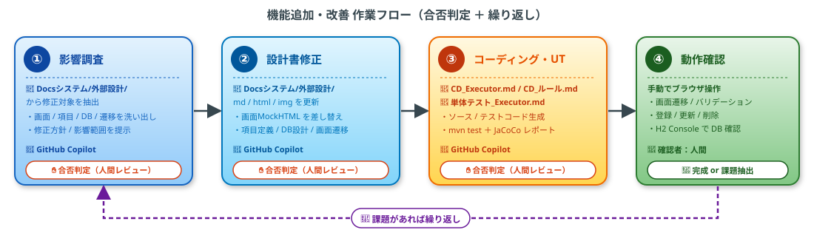

# 6. 機能追加・改善 14:30-16:30

> ⚠ **作業に入る前に一旦ここで Git Commit してください**（差分検証がしやすくなります）  
> １つのテーマ完了ごとにCommitすることを推奨します（テーマごとに差分が分かりやすくなります）
> １つのテーマ完了ごとにセッションは新しく開始することを推奨します（token使用量抑止・ノイズ除去）

## (1)　手順について
機能追加・改善は、CD と UT を組み合わせて以下の流れで行う。  
各ステップの最後に **合否判定（人間レビュー）** を挟み、課題が出れば前の工程に戻して繰り返す。



| # | ステップ | 主に動かすもの | 概要 |
|---|----------|----------------|------|
| ① | 影響調査 | GitHub Copilot | 修正対象の設計書を洗い出し、修正方針を提示 |
| ② | 設計書修正 | GitHub Copilot | `Docsシステム/外部設計/` 配下の md / html / img を更新 |
| ③ | コーディング・単体テスト | GitHub Copilot（`CD_Executor.md` / `単体テスト_Executor.md`） | ソース・テストコード・JaCoCo レポートを生成 |
| ④ | 動作確認 | 人間 | 画面操作 ＋ DB 確認 |
| 🔁 | 繰り返し | — | 課題が出れば前工程へ戻す |

---

## (2)　【例題】テーマ1：リコメンド（お勧め）フラグの機能追加

### 要件
- 画面に書籍の「お勧めフラグ」を追加する
- 入力や編集時に指定できるようにする
- お勧めフラグが ON の書籍は、書籍一覧画面でタイトルの横に「おすすめ」と表示されるようにする

> 💡 ここから下は **試しに書いた簡単なプロンプト**です。  

### 作業手順

#### 1. 影響調査
プロンプト例：
```markdown
# 影響調査

docs\外部設計 より要件を実現するために修正を要する設計書を列挙して内容を提示してください。

設計書の画面イメージも差し替える場合は下記の内容を含めること
 - HTML の修正：docs\外部設計\05個別画面設計\html\
 - MD に貼り付ける img を作成して貼り付ける：docs\外部設計\05個別画面設計\img

 以下に要件を貼り付ける
 {
    要件...
 }
 

```

→ ✋ **合否判定**：列挙された設計書と修正方針が妥当か確認

#### 2. 設計書修正
プロンプト例：
```markdown
下記影響調査の修正内容に応じて設計書の修正をお願いします。
設計書のみ直してください、コードはまだ直さないでください。

修正ルールは以下のmdを参照してください。
prompt\00.設計\設計_Executor.md

以下に影響調査の結果を貼り付ける
 {
    影響調査の結果...
 }

 最後に、修正した設計書の内容の詳細レポートを作成してください。
  - どの設計書をどのように修正したか
  - 何を目的に何を修正したのか
  - before / after の差分が分かるように説明すること
  - 結果はwork/機能追加・改善/テーマ１/設計書修正レポート.md に保存してください

```
→ ✋ **合否判定**：修正内容が要件を満たしているか確認


#### 3. コーディング・単体テスト

プロンプト例：
```markdown
設計書の修正内容に応じてCDとUTを行う。

修正内容は下記のmdを参照してください。
work/機能追加・改善/テーマ１/設計書修正レポート.md

- CD / UT を以下のプロンプトに従って行う
  - [`prompt\01.CD\CD_Executor.md`](../prompt/01.CD/CD_Executor.md)
  - [`prompt\02.UT1\単体テスト_Executor.md`](../prompt/02.UT1/単体テスト_Executor.md)

- CD・UT の作業内容をレポートにまとめる（**修正内容との差分が分かる形**で）
  結果は work/機能追加・改善/テーマ１/CD・UTレポート.md に保存してください


```

→ ✋ **合否判定**：レポートと差分を確認

#### 4. 動作確認
- 手動で画面をポチポチ操作して確認

---

## (3)　テーマ2〜9（任意）
以下は各参加者が選んで取り組むテーマ。  
作業手順は (2) と同じく **影響調査 → 設計書修正 → CD/UT → 動作確認** の流れで進める。

### テーマ2：カテゴリーメンテナンス機能の追加 ・難易度：3
**要件**
- 現状は DB に固定で設定されている「カテゴリー」のメンテナンス機能を追加する
- 遷移元は一覧画面からの「カテゴリー管理」ボタンとする
- カテゴリー管理画面では、カテゴリーの新規登録・編集・削除ができる
- カテゴリーの編集で修正できるのはカテゴリー名のみとする
- カテゴリーの削除については、既に登録されている書籍データがある場合は削除不可でよい

### テーマ3：出版社による検索機能の追加 ・難易度：2
**要件**
- 書籍の検索機能に「出版社による検索」を追加する
- 出版社はプルダウンで選択可能にする
- ただし出版社は DB でマスター管理するものではなく、既に登録されている書籍データより重複を排除してプルダウンに表示するものでよい

### テーマ4：マルチユーザー対応 ・難易度：4
**要件**
- 現状はシングルユーザーで動いているシステムだが、ユーザーの管理機能を追加する
- ユーザーは「一般ユーザー」と「管理ユーザー」の2種類とする
- 一般ユーザーは書籍の閲覧のみ可能とし、管理ユーザーは書籍の登録・編集・削除が可能とする
- 利用が社内に限定されるため認証機能は必要としないものとし、メールアドレス・名前のみでユーザーを管理するものとする
- トップ画面を一覧画面からユーザー選択画面（新設）に変更する
- ユーザー選択画面では、ユーザー名／ユーザーメールアドレスのプルダウンを選択し次の画面に遷移する
- レビュー画面のユーザー名は上記で選択したユーザー名を引き継ぎ、入力項目ではなく引継ぎ項目とする
- 当対応に伴い、楽観ロックチェックを導入する
  - メッセージ：「他のユーザーによって更新されました。最新の情報を確認してください。」
  - チェック対象：ユーザー名 ＋ 更新日時

### テーマ5：レビューの削除機能の追加 ・難易度：3
**要件**
- 書籍詳細画面のレビュー一覧に「削除」ボタンを追加する
- 削除ボタン押下で確認メッセージを表示した後、削除後は自分の画面に遷移する
- 削除完了後は書籍詳細画面に戻る
- **自分のレビューデータのみ削除できるよう制御**が必要

### テーマ6：書籍一覧の CSV ダウンロード機能の追加 ・難易度：2
**要件**
- 書籍一覧画面に「CSV ダウンロード」ボタンを追加する
- 現在の検索条件・ソート順を引き継いだデータを CSV 出力する
- 出力項目：書籍ID・タイトル・著者・出版社・カテゴリ・出版日・価格・平均評価・レビュー数
- ファイル名：`books_YYYYMMDD.csv`
- 文字コード：UTF-8（BOM 付き）— Excel で開けることを前提

### テーマ7：書籍貸出管理機能の追加 ・難易度：3
**要件**
- 書籍に「貸出中 / 在庫あり」の状態を持たせ、貸出・返却管理を行う機能を追加する
