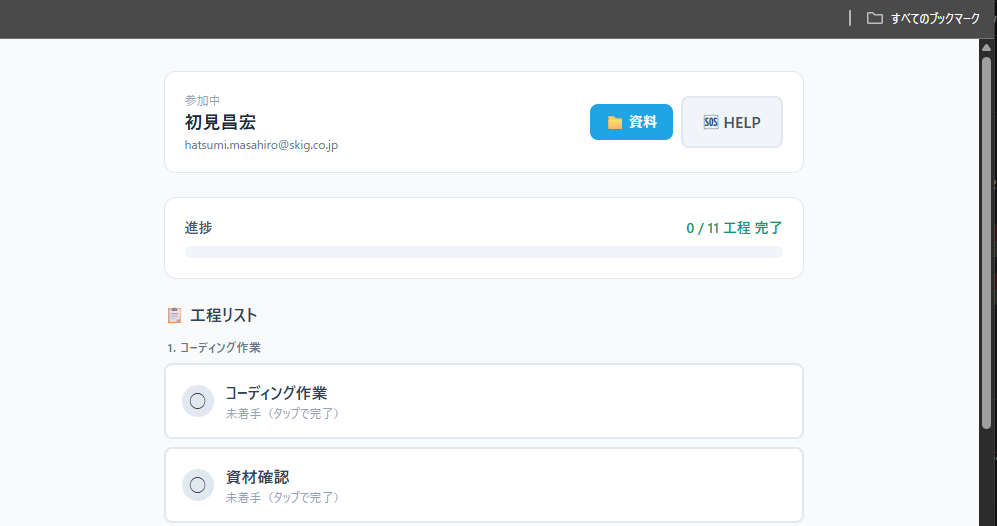
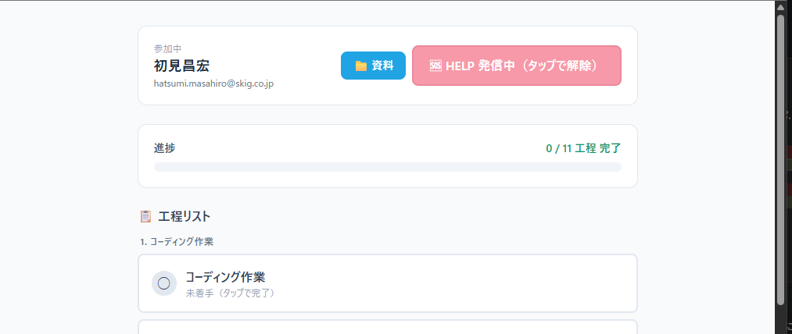
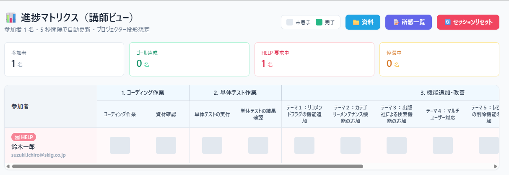
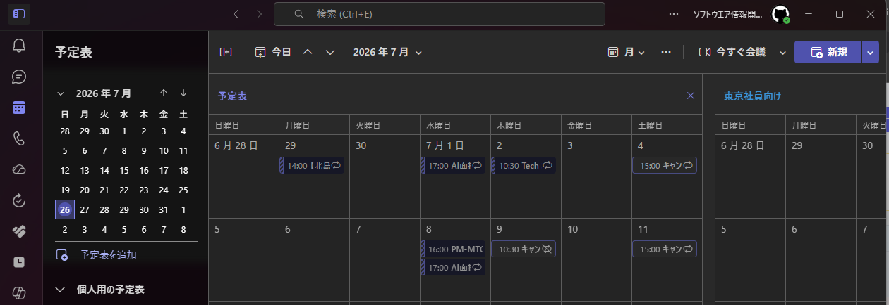
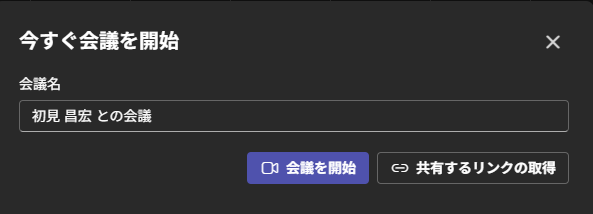
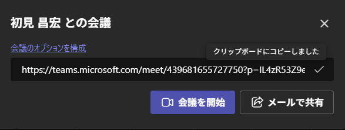
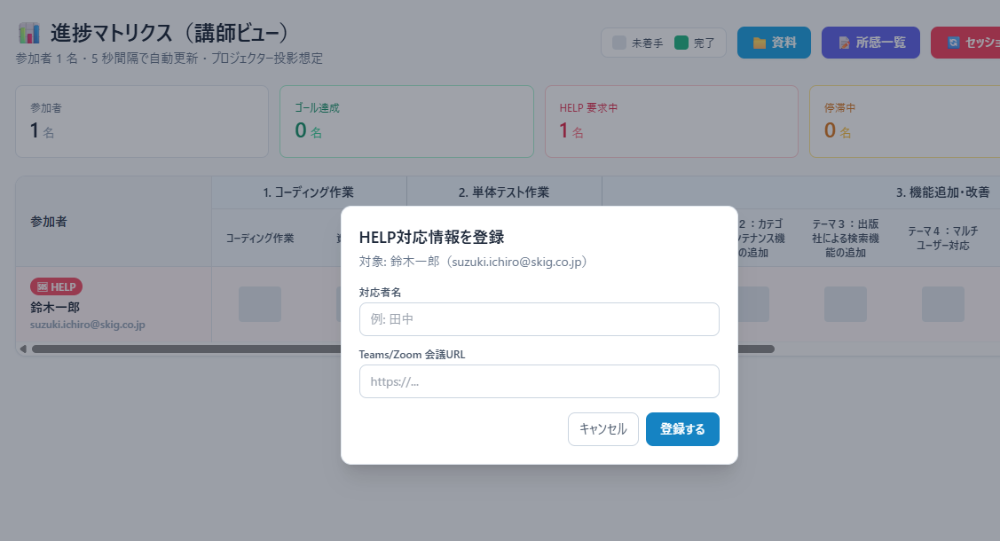
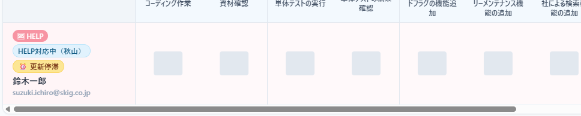
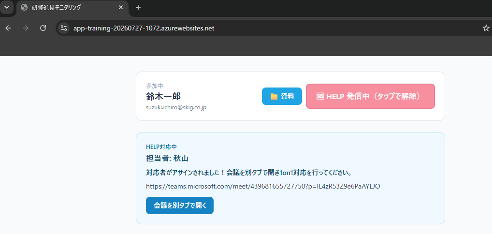

# リモートサポートの仕方
札幌メンバー・やむを得ず赤坂に来れないメンバーのためのリモートサポートを円滑に行うための手順をまとめます。
**オンサイトの人は自席に講師の方が来たらHelp解除してもらってOKです。**

# 1. Helpの依頼 (参加者)
通常と変わらずHelpボタンを押す

↓

# 2. Helpの依頼 (講師側)
講師者向けの画面でHelp依頼が来ていることを確認する

↓ メイン講師の人が声をかける(講師Aに依頼)  
↓ リモートで画面共有で解決に向けて動くのでTeamsを立ち上げてURLを取得する
↓予定を開いて今すぐ会議を選択。共有リンクを取得をクリック
  

↓URLをコピー&会議を開始

↓URLをコピー。サポートアプリに移動して名前の所に出てる**Help**をクリック
↓名前と会議URLを貼り付けて登録を押下

↓

↓
担当が一覧上アサインされる

# 3. Helpの依頼 (参加者)
担当がアサインされると、下記のように会議URLの案内が出る

↓会議を別タブで開くかURLをコピーしてブラウザーに張り付けてください

**無事に問題解決したらHelpボタンを再度押して解除して下さい**

