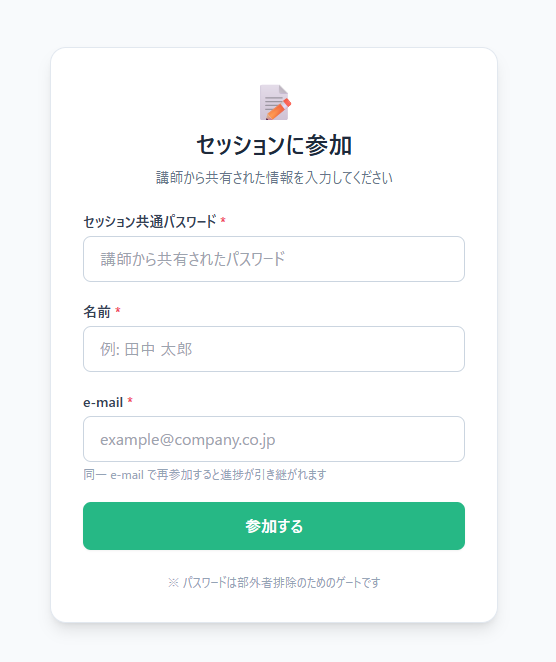
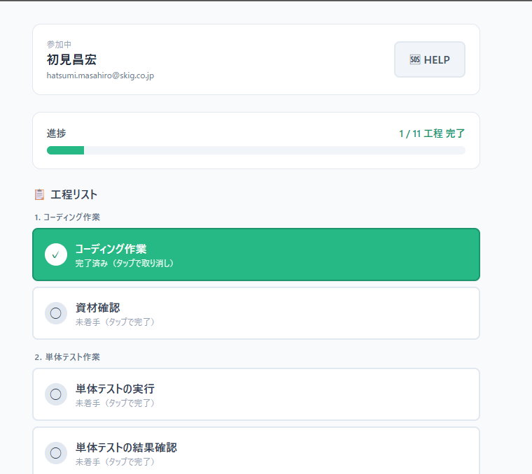
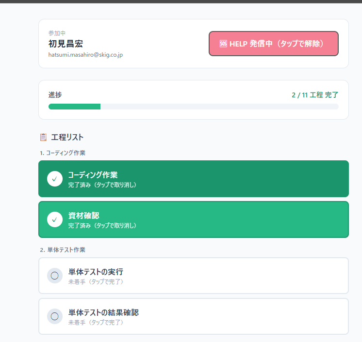
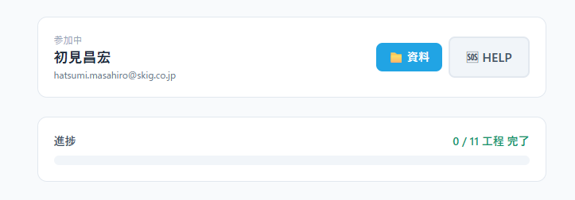
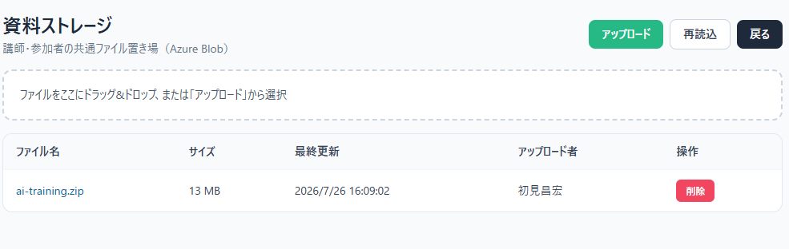

# トレサポ
ハンズオンの状況把握と参加者の皆様の **Help!** に対応するためのサポートツールです。

## 1.ログイン
[トップURL](https://app-training-20260727-1072.azurewebsites.net)
各自アクセスしてセッションに参加してください
URLは毎研修ごとに変わります。Teamsで案内します

  
セッション共有パスワード：training-2026  
mailは会社メールでお願いします

## 2.進捗
進捗はこのように見えます。  
対応するテーマが終わったら各自コースのボタンを押して下さい  

## 3.HELP
ハンズオン中に困ったことがあれば、HELP!ボタンを押してください。  
１日勝負の研修のため、エラーを深く追ってる時間はあまり無いと思います。  
サポートの為に５名ほど講師陣が待機してますので、遠慮なくHELP!を押して下さい。  

## 4.研修資材のダウンロード
**研修参加者は必ずダウンロードを行ってください**
研修資材をダウンロードしてください(資料をクイック->zipファイルをDL＆解凍)

↓

## 97.リモート参加者へのサポート
92.リモートサポート.mdの手順を参考とする  
Teams画面共有を用いて対応

## 98.講師陣へ
メインの状況確認画面のURLは下記になります
[講師陣URL](https://app-training-20260727-1072.azurewebsites.net/instructor) 

## 99.その他
**AzureAppServiceのURLは毎回変わる可能性あり**
ログインと講師陣URLは変更してください  
文中下記URLとなっていますが、最新のURLはTeamsで案内します
https://app-training-20260727-1072.azurewebsites.net
