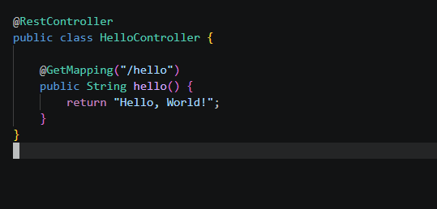
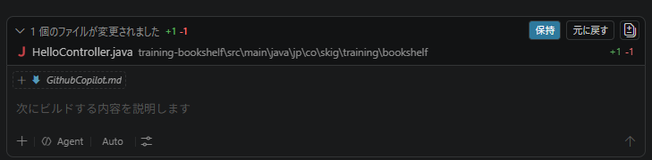
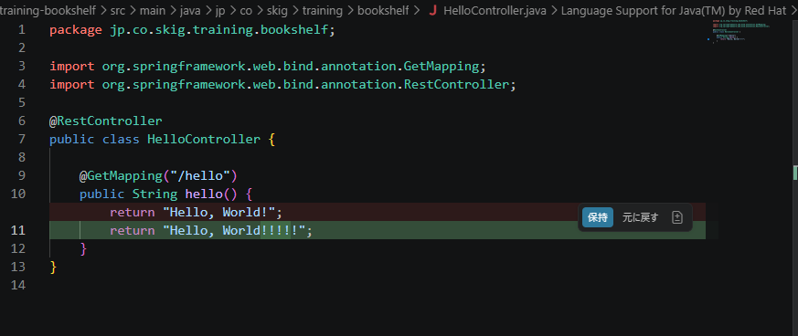
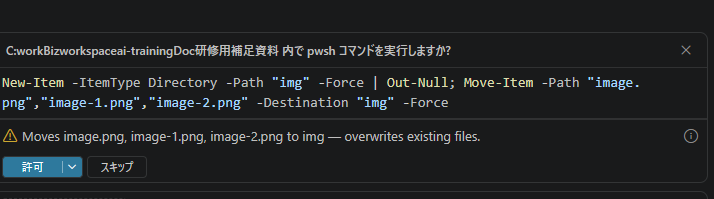

<style>
img {
	display: block;
	margin-left: 0;
	margin-right: auto;
}
</style>

# GitHub Copilot
研修を進行する上で必要最低限の内容をまとめました。

## 1. Agentがファイルを修正した際のGitHub Copilotの挙動

GitHub Copilotは、コードの補完や提案を行うAIツールですが、Agentがファイルを修正した際には、以下のような挙動が考えられます。

オリジナルソース


修正指示
```
HelloContorllerが返す文字列の変更
AsIs：return "Hello, World!";
↓
Tobe：return "Hello, World!!!!!";
```

右下


選択するとDiffが表示される


OKの場合は、「保持」を選択する。違う場合は「元に戻す」


## 2. Agentが確認してくるコマンドの実行
Agentは作業をする上で以下のような内容を行います
- ファイルの参照
- ファイルの作成/削除
- ファイルの移動
- mavenなどのビルドツールの実行
- テストの実行




これらはAIの機能というよりは元々あるコマンドをAgentが実行してるだけですが、  
Agentがこれらのコマンドを実行する際には、ユーザーに確認を求めることがあります。  
例えば、ファイルの削除や移動などの重要な操作を行う前に、ユーザーに確認を求めることで、誤操作を防ぐことができます。  

この作業は無許可で実施していいとか、駄目とかあると思います。  
設定をカスタマイズする事で、Agentがこれらのコマンドを実行する際の挙動を変更することができます。
